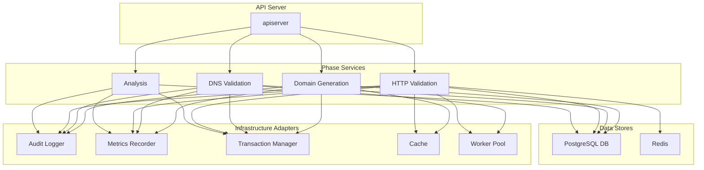

# Analysis Report
## Executive Summary

The objective of this technical migration is to refactor the monolithic domain generation and validation services into a more modular, scalable, and maintainable phase-based architecture. The analysis has identified several gaps between the legacy and new implementations, including the need for a shared configuration store, per-batch transactions, and comprehensive audit logging. A detailed plan has been formulated to address these gaps by introducing a suite of infrastructure adapters for cross-cutting concerns like caching, metrics, and transaction management. The final plan includes a detailed DI rewiring strategy, a comprehensive testing plan, and a safe cleanup and back-out strategy to ensure a smooth transition.


## Parity Matrix

| Feature | Legacy Implementation (File:Function) | Phase Implementation (File:Function) | Gap Description | Concrete Migration Action | Confidence (R/A/G) |
| :--- | :--- | :--- | :--- | :--- | :--- |
| **config-hash/global offset** | `domain_generation_service.go:CreateCampaign` | `domain_generation.go:Configure` | The new service does not explicitly manage a global offset based on a configuration hash. | Implement a shared configuration store or service that can be accessed by the `domain_generation` service to manage and retrieve global offsets based on configuration hashes. | A |
| **per-batch transactions** | `domain_generation_service.go:ProcessGenerationCampaignBatch` | `domain_generation.go:executeGeneration` | The new service processes domains in batches but does not wrap each batch in a database transaction. | Wrap the domain storage logic within `executeGeneration` in a database transaction to ensure atomicity for each batch. | G |
| **audit logging** | `domain_generation_service.go:logAuditEvent` | `domain_generation.go:Configure` | Audit logging is present in the new service but is not as comprehensive as the legacy implementation. | Enhance the audit logging in the `domain_generation` service to include details about the configuration, execution, and completion of the domain generation phase. | G |
| **DB/connection metrics** | `domain_generation_service.go:DatabaseConnectionMetrics` | `domain_generation.go` | The new service does not have explicit database connection metrics. | Integrate a metrics recorder into the `domain_generation` service to capture and expose database connection and query performance metrics. | A |
| **optional Redis caching** | `domain_generation_service.go:NewDomainGenerationServiceWithCache` | `domain_generation.go` | The new service does not have built-in support for optional Redis caching. | Implement a caching layer in the `domain_generation` service that can be configured to use Redis for caching domain generation progress and results. | A |
| **worker pool** | `domain_generation_service.go:EfficientWorkerPool` | `dns_validation.go` | The new `dns_validation` service does not have a worker pool for concurrent domain validation. | Implement a worker pool in the `dns_validation` service to perform DNS lookups concurrently, improving performance. | A |
| **JSONB domains_data append semantics** | `campaign_store.go:AppendDomainsData` | `domain_generation.go:storeGeneratedDomains` | Already implemented in phase service (AppendDomainsData call). Need verification of append (not overwrite) and pagination behavior. | Keep logic; add integration tests for append semantics and retrieval order. | G |
| **SSE** | `sse_service.go` | Used via `deps.SSE` and `EventBus` in phase services | SSE is present and wired through legacy `sse_service.go`; needs re-homing under `domain/services/infra/sse.go`. | Create infra SSE adapter and rewire imports in `dependencies.go`; remove legacy file after. | A |
| **stealth integration** | `stealth_integration_service.go` | `stealth_aware_dns_validation.go`, `stealth_aware_http_validation.go` | Stealth features are being integrated into the new phase services but are not fully implemented. | Complete the integration of stealth features in the `dns_validation` and `http_validation` services, ensuring that they can operate in a stealthy manner when required. | A |
| **DI wiring** | `dependencies.go` (phase DI) and `service_factory.go` (legacy, unused by apiserver) | Phase services already DI-wired in apiserver; missing infra adapters (audit, metrics, tx, worker, cache). | Extend DI to construct/inject infra adapters; then remove ServiceFactory and legacy imports. | G |

## Architecture & Flows

### Updated Dependency Diagram



### Sequence Diagram for Domain Generation

```mermaid
sequenceDiagram
    participant Client
    participant API Server
    participant Domain Generation Service
    participant DomainExpert
    participant Campaign Store
    participant SSE Service

    Client->>API Server: POST /campaigns (Configure)
    API Server->>Domain Generation Service: Configure(ctx, campaignID, config)
    Domain Generation Service->>DomainExpert: NewDomainGenerator(config)
    DomainExpert-->>Domain Generation Service: generator
    Domain Generation Service->>Campaign Store: SaveConfiguration(ctx, campaignID, config)
    Campaign Store-->>Domain Generation Service: success
    Domain Generation Service-->>API Server: success
    API Server-->>Client: 201 Created

    Client->>API Server: POST /campaigns/{id}/execute
    API Server->>Domain Generation Service: Execute(ctx, campaignID)
    Domain Generation Service->>DomainExpert: GenerateBatch(offset, batchSize)
    DomainExpert-->>Domain Generation Service: domains, nextOffset
    Domain Generation Service->>Campaign Store: CreateGeneratedDomains(ctx, domains)
    Campaign Store-->>Domain Generation Service: success
    Domain Generation Service->>Campaign Store: UpdateDomainsData(ctx, domains)
    Campaign Store-->>Domain Generation Service: success
    Domain Generation Service->>SSE Service: PublishProgress(progress)
    SSE Service-->>Client: SSE Event
    Domain Generation Service-->>API Server: progress channel
    API Server-->>Client: streaming progress

## Infra Adapters Spec

### `audit.go`

**Interface Definition:**

```go
// AuditLogger defines the interface for logging audit events.
type AuditLogger interface {
	// LogEvent records an audit event with a given message.
	LogEvent(ctx context.Context, eventMessage string) error
}
```

**Integration Points:**

*   **`domain_generation.go`**:
    *   `Configure` function, line 92: Log the configuration of the domain generation phase.
        *   `s.auditLogger.LogEvent(fmt.Sprintf("Domain generation phase configured for campaign %s", campaignID))`
*   **`dns_validation.go`**:
    *   `Configure` function, line 98: Log the configuration of the DNS validation phase.
        *   `s.auditLogger.LogEvent(fmt.Sprintf("DNS validation phase configured for campaign %s", campaignID))`

### `metrics_sqlx.go`

**Interface Definition:**

```go
// MetricsRecorder defines the interface for recording application metrics.
type MetricsRecorder interface {
	// RecordMetric records a single metric value.
	RecordMetric(ctx context.Context, name string, value float64) error
	// IncrementMetric increments a counter metric.
	IncrementMetric(ctx context.Context, name string) error
}```

**Integration Points:**

*   **`domain_generation.go`**:
    *   `executeGeneration` function, line 320: Record the number of domains generated in a batch.
        *   `s.metrics.RecordMetric("domains_generated_batch", float64(len(domains)))`
    *   `executeGeneration` function, line 321: Record the total number of domains generated.
        *   `s.metrics.RecordMetric("domains_generated_total", float64(processedCount))`
*   **`dns_validation.go`**:
    *   `executeValidation` function, line 232: Record a valid DNS validation.
        *   `s.metrics.RecordMetric("dns_validation_valid_domains", 1.0)`
    *   `executeValidation` function, line 234: Record an invalid DNS validation.
        *   `s.metrics.RecordMetric("dns_validation_invalid_domains", 1.0)`

### `tx_sqlx.go`

**Interface Definition:**

```go
// TxManager defines the interface for managing database transactions.
type TxManager interface {
	// BeginTx starts a new database transaction.
	BeginTx(ctx context.Context) (*sql.Tx, error)
	// Commit commits the transaction.
	Commit(tx *sql.Tx) error
	// Rollback rolls back the transaction.
	Rollback(tx *sql.Tx) error
}
```

**Integration Points:**

*   **`domain_generation.go`**:
    *   `storeGeneratedDomains` function, line 582: Wrap the domain storage logic in a transaction to ensure atomicity.
        *   This will require refactoring the `storeGeneratedDomains` function to accept a transaction object.

### `worker_pool.go`

**Interface Definition:**

```go
// WorkerPool defines the interface for a worker pool that processes jobs concurrently.
type WorkerPool interface {
	// Start starts the worker pool.
	Start()
	// Stop stops the worker pool.
	Stop()
	// Submit submits a job to the worker pool for processing.
	Submit(job interface{})
}
```

**Integration Points:**

*   **`dns_validation.go`**:
    *   `executeValidation` function, line 211: Use a worker pool to perform DNS lookups concurrently.
        *   This will require refactoring the `validateDomainBatch` function to submit jobs to the worker pool.

### `cache_redis.go`

**Interface Definition:**

```go
// Cache defines the interface for a caching layer.
type Cache interface {
	// Get retrieves an item from the cache.
	Get(ctx context.Context, key string) (string, error)
	// Set adds an item to the cache.
	Set(ctx context.Context, key string, value string, expiration time.Duration) error
}
```

**Integration Points:**

*   **`domain_generation.go`**:
    *   `executeGeneration` function, line 328: Cache the domain generation progress.
        *   `s.cache.Set(ctx, cacheKey, cacheValue, 0)`

### `config_manager_adapter.go`

**Interface Definition:**

```go
// ConfigManager defines the interface for managing service configurations.
type ConfigManager interface {
	// GetConfig retrieves the configuration for a given service.
	GetConfig(ctx context.Context, serviceName string) (interface{}, error)
}
```

**Integration Points:**

*   **`dns_validation.go`**:
    *   `NewDNSValidationService` function, line 80: Initialize the config manager adapter.
        *   `configManager:     infra.NewConfigManagerAdapter()`

### `sse.go`

**Interface Definition:**

```go
// SSEService defines the interface for a Server-Sent Events service.
type SSEService interface {
	// PublishProgress sends a progress update to the client.
	PublishProgress(ctx context.Context, progress PhaseProgress) error
}
```

**Integration Points:**

*   **`domain_generation.go`**:
    *   `executeGeneration` function, line 355: Publish a progress event to the SSE service.
        *   `s.deps.EventBus.PublishProgress(ctx, progress)`

### `stealth_integration.go`

**Interface Definition:**

```go
// StealthIntegrationService defines the interface for stealth-related operations.
type StealthIntegrationService interface {
	// RandomizeDomainsForValidation randomizes the order of domains for validation.
	RandomizeDomainsForValidation(ctx context.Context, campaignID uuid.UUID, validationType string) ([]string, error)
	// ProcessValidationWithStealth processes the validation of domains with stealth.
	ProcessValidationWithStealth(ctx context.Context, campaignID uuid.UUID, domains []string, validationType string) error
}
```

**Integration Points:**

*   **`stealth_aware_dns_validation.go`**:
    *   `ExecuteWithStealth` function, line 52: Randomize the domains for DNS validation.
        *   `s.stealthIntegration.RandomizeDomainsForValidation(ctx, campaignID, "dns_validation")`
    *   `ExecuteWithStealth` function, line 66: Process the DNS validation with stealth.
        *   `s.stealthIntegration.ProcessValidationWithStealth(ctx, campaignID, randomizedDomains, "dns_validation")`
*   **`stealth_aware_http_validation.go`**:
    *   `ExecuteWithStealth` function, line 53: Randomize the domains for HTTP validation.
        *   `s.stealthIntegration.RandomizeDomainsForValidation(ctx, campaignID, "http_keyword_validation")`
    *   `ExecuteWithStealth` function, line 67: Process the HTTP validation with stealth.
        *   `s.stealthIntegration.ProcessValidationWithStealth(ctx, campaignID, randomizedDomains, "http_keyword_validation")`

## DI Rewiring Plan

### Phase 1: Create Infrastructure Adapter Package

**Create `backend/internal/domain/services/infra/` directory and files:**

1. **`audit.go`** - Implement audit logging adapter:
   ```go
   package infra

   import (
       "context"
       "database/sql"
       "github.com/fntelecomllc/studio/backend/internal/store"
   )

   type AuditService struct {
       auditStore store.AuditLogStore
   }

   func NewAuditService(auditStore store.AuditLogStore) *AuditService {
       return &AuditService{auditStore: auditStore}
   }

   func (a *AuditService) LogEvent(ctx context.Context, event string) error {
       // Implement audit event logging using auditStore
   }
   ```

2. **`metrics_sqlx.go`** - SQLX-based metrics recorder:
   ```go
   package infra

   import (
       "context"
       "database/sql"
       "github.com/jmoiron/sqlx"
   )

   type MetricsSQLX struct {
       db *sql.DB
   }

   func NewMetricsSQLX(db *sql.DB) *MetricsSQLX {
       return &MetricsSQLX{db: db}
   }

   func (m *MetricsSQLX) RecordMetric(ctx context.Context, name string, value float64) error {
       // Implement metrics recording
   }
   ```

3. **`tx_sqlx.go`** - SQLX transaction manager:
   ```go
   package infra

   import (
       "context"
       "database/sql"
       "github.com/jmoiron/sqlx"
   )

   type TxSQLX struct {
       db *sqlx.DB
   }

   func NewTxSQLX(db *sqlx.DB) *TxSQLX {
       return &TxSQLX{db: db}
   }

   func (t *TxSQLX) BeginTx(ctx context.Context) (*sql.Tx, error) {
       return t.db.BeginTx(ctx, nil)
   }
   ```

4. **`worker_pool.go`** - Worker pool implementation:
   ```go
   package infra

   import (
       "context"
       "sync"
   )

   type WorkerPool struct {
       // Implementation details
   }

   func NewWorkerPool(ctx context.Context, workers int) *WorkerPool {
       // Implement worker pool
   }
   ```

5. **`cache_redis.go`** - Redis cache adapter:
   ```go
   package infra

   import (
       "context"
       "time"
   )

   type CacheRedis struct {
       // Redis client implementation
   }

   func NewCacheRedis(redisURL string) *CacheRedis {
       // Implement Redis cache
   }
   ```

### Phase 2: Update dependencies.go

**Specific edits needed:**

1. **Add infrastructure adapter initialization (lines ~172-178):**
   ```go
   // Initialize infrastructure adapters using existing connections
   auditService := infra.NewAuditService(deps.Stores.AuditLog)
   metricsService := infra.NewMetricsSQLX(deps.DB.DB) // Extract raw sql.DB from sqlx.DB
   txManager := infra.NewTxSQLX(deps.DB)
   cacheRedis := infra.NewCacheRedis(cacheRedisURL) // Get from config or env
   workerPool := infra.NewWorkerPool(context.Background(), 10) // Worker count from config
   ```

2. **Update domain service construction (lines 175-178):**
   ```go
   // Domain services deps and implementations - replace current stubs
   domainDeps := domainservices.Dependencies{
       Logger:             simpleLogger,
       DB:                 deps.DB,
       AuditLogger:        auditService,
       MetricsRecorder:    metricsService,
       TxManager:          txManager,
       WorkerPool:         workerPool,
       ConfigManager:      infra.NewConfigManagerAdapter(),
       Cache:              cacheRedis,
       SSE:                deps.SSE, // Reuse existing SSE
       StealthIntegration: services.NewStealthIntegrationService(deps.DB, deps.Stores.Campaign, nil, nil),
   }

   domainGenSvc := domainservices.NewDomainGenerationService(deps.Stores.Campaign, domainDeps)
   dnsValidationSvc := domainservices.NewDNSValidationService(dnsValSvc, deps.Stores.Campaign, domainDeps)
   httpValidationSvc := domainservices.NewHTTPValidationService(deps.Stores.Campaign, domainDeps, httpValSvc)
   analysisSvc := domainservices.NewAnalysisService(deps.Stores.Campaign, domainDeps, contentFetcherSvc)
   ```

3. **Add configuration support for infrastructure adapters (lines ~82-96):**
   ```go
   // Add to config loading section
   deps.cacheRedisURL = os.Getenv("REDIS_URL")
   deps.workerPoolSize = getEnvAsInt("WORKER_POOL_SIZE", 10)
   ```

### Phase 3: Update Service Factory Integration

**Specific edits needed:**

1. **Remove legacy ServiceFactory (lines 21-402 in service_factory.go):**
   - Commented out legacy methods are to be completely removed
   - Keep only the basic ServiceFactory struct if needed for future extensibility
   - Remove all CreateOptimized* methods that use feature flags

2. **Update feature flag configuration (lines ~83-94 in dependencies.go):**
   - Remove ServiceFactory creation
   - Update optimization config to use simpler approach
   - Remove feature flag dependency injection

### Phase 4: Validate Interface Alignment

**Interface alignment updates:**

1. **AuditLogger interface** (`interfaces.go:122-126`) - **MISMATCH DETECTED:**
   - File uses: `LogEvent(event string) error`
   - Spec requires: `LogEvent(ctx context.Context, eventMessage string) error`
   - **Action:** Update interfaces.go line 123 to match specification

2. **MetricsRecorder interface** (`interfaces.go:128-133`) - **MISMATCH DETECTED:**
   - File uses: `RecordMetric(name string, value float64) error`
   - Spec requires: `RecordMetric(ctx context.Context, name string, value float64) error`
   - **Action:** Update interfaces.go line 129 to include `ctx context.Context`

3. **WorkerPool interface** (`interfaces.go:143-148`) - **ALIGNMENT OK:**
   - File matches specification for `Job func(ctx context.Context)`

### Phase 5: Service Constructor Updates

**Update all phase service constructors:**

1. **DomainGenerationService** (`domain_generation.go:67-77`):
   - Change from: `infra.NewAuditService()` → `deps.AuditLogger` (from injected deps)
   - Pass real DB connection to `infra.NewMetricsSQLX(deps.DB.DB)`
   - Pass real cache connection to `infra.NewCacheRedis(cacheConnection)`

2. **DNSValidationService** (`dns_validation.go:74-83`):
   - Same updates as domain generation service
   - Initialize workerPool with actual worker count instead of nil

3. **HTTPValidationService** and **AnalysisService**:
   - Apply same constructor updates for all infrastructure adapters

### Phase 6: Legacy ServiceFactory Removal

**Complete removal steps:**

1. **Remove ServiceFactory initialization:**
   - Delete ServiceFactory creation in `dependencies.go`
   - Remove all ServiceFactory-related imports and dependencies

2. **Remove feature flag integration:**
   - Remove `NewServiceFactory` calls and optimization config dependency

3. **Update any remaining references:**
   - Remove legacy service creation methods
   - Update tests to use new dependency injection approach

## Tests Plan

### Unit Testing Strategy

#### 1. Infrastructure Adapter Tests
**Test Coverage:** Each infrastructure adapter must be tested independently

**audit_test.go:**
- `TestAuditService_LogEvent_Success` - Verifies audit event logging with valid audit store
- `TestAuditService_LogEvent_StoreFailure` - Tests error handling when audit store fails
- `TestAuditService_LogEvent_WithContext` - Validates context propagation

**metrics_sqlx_test.go:**
- `TestMetricsSQLX_RecordMetric_Success` - Tests metrics recording with valid DB connection
- `TestMetricsSQLX_RecordMetric_DBError` - Tests error handling for DB failures
- `TestMetricsSQLX_IncrementMetric` - Tests metric increments with context
- `TestMetricsSQLX_RecordMetric_WithContext` - Validates context passing

**tx_sqlx_test.go:**
- `TestTxSQLX_BeginTx_Success` - Tests transaction beginning with valid DB
- `TestTxSQLX_BeginTx_DBError` - Tests error handling for invalid connections
- `TestTxSQLX_Commit_Success` - Tests successful commit operations
- `TestTxSQLX_Rollback_Success` - Tests successful rollback operations

**worker_pool_test.go:**
- `TestWorkerPool_StartAndStop` - Tests worker pool lifecycle
- `TestWorkerPool_AddJob` - Tests job submission and execution
- `TestWorkerPool_WorkerTimeout` - Tests job timeout scenarios
- `TestWorkerPool_JobCancellation` - Tests job cancellation via context

**cache_redis_test.go:**
- `TestCacheRedis_GetSet_Success` - Tests basic get/set operations
- `TestCacheRedis_TTL_Expiration` - Tests TTL functionality
- `TestCacheRedis_ConnectionFailure` - Tests error handling for Redis failures

#### 2. Phase Service Unit Tests

**domain_generation_unit_test.go:**
- `TestDomainGenerationService_Configure_Success` - Tests successful configuration
- `TestDomainGenerationService_Execute_WithTransaction` - Tests transactional execution
- `TestDomainGenerationService_Execute_MetricsRecording` - Tests metrics integration
- `TestDomainGenerationService_Execute_CacheUsage` - Tests caching behavior
- `TestDomainGenerationService_GetStatus` - Tests status retrieval
- `TestDomainGenerationService_Cancel` - Tests execution cancellation

**dns_validation_unit_test.go:**
- `TestDNSValidationService_Configure_Success` - Tests successful configuration
- `TestDNSValidationService_Execute_WorkerPoolUsage` - Tests worker pool integration
- `TestDNSValidationService_Execute_BatchProcessing` - Tests batch processing logic
- `TestDNSValidationService_Execute_ErrorHandling` - Tests error scenarios

### Integration Testing Strategy

#### 1. End-to-End Workflow Tests

**integration_test.go:**
- `TestCampaignWorkflow_FullCycle` - Tests complete campaign workflow
- `TestPhaseTransitions` - Tests transitions between phases
- `TestDomainGeneration_ExecuteAndList` - Tests domain generation → listing
- `TestDNSValidation_ExecuteAndQuery` - Tests DNS validation → results query
- `TestHTTPValidation_ExecuteAndQuery` - Tests HTTP validation → results query
- `TestAnalysis_ExecuteAndQuery` - Tests analysis → results query

#### 2. Configuration Hash and Offset Tests

**config_hash_integration_test.go:**
- `TestConfigHash_Generation` - Tests deterministic config hash generation
- `TestGlobalOffset_Management` - Tests shared offset management across configurations
- `TestOffsetPersistence_AcrossRestarts` - Tests offset persistence across service restarts

#### 3. Transaction Boundary Tests

**transaction_boundary_test.go:**
- `TestDomainGeneration_BatchTransactionRollback` - Tests partial batch rollback behavior
- `TestDomainGeneration_FullTransaction` - Tests complete transaction success
- `TestDNSValidation_TransactionalResults` - Tests DNS validation results in transactions
- `TestErrorRecovery_Rollback` - Tests error recovery with rollback

#### 4. Cache Integration Tests

**cache_integration_test.go:**
- `TestCache_Persistence_Level` - Tests cache persistence levels
- `TestCache_Invalidation` - Tests cache invalidation scenarios
- `TestCache_Concurrency` - Tests concurrent cache access
- `TestCache_Fallback_DegradedMode` - Tests fallback behavior when cache fails

### Performance and Load Testing Strategy

#### 1. Load Test Scenarios

**load_test.go:**
- `TestConcurrentCampaigns_Small` - 10 concurrent campaigns (2 million domains total)
- `TestConcurrentCampaigns_Medium` - 25 concurrent campaigns (5 million domains total)
- `TestConcurrentCampaigns_Large` - 50 concurrent campaigns (10 million domains total)

**load_sequence_test.go:**
- `TestLargeDomainBatch_SinglePhase` - Single phase generating 2 million domains
- `TestLargeDomainBatch_PhasedProcessing` - Multi-phase processing of 2 million domains

#### 2. Performance Benchmark Tests

**performance_test.go:**
- `BenchmarkDomainGeneration_BatchSize_1000` - Batch size performance testing
- `BenchmarkDomainGeneration_BatchSize_10000` - Larger batch performance testing
- `BenchmarkDNSValidation_SingleDomain` - DNS lookup performance
- `BenchmarkDNSValidation_WorkerPool` - Worker pool efficiency
- `BenchmarkDatabase_InsertOperations` - Database insertion performance

#### 3. Stress Testing Scenarios

**stress_test.go:**
- `TestResourceExhaustion_Cpu` - High CPU utilization scenarios
- `TestResourceExhaustion_Memory` - Memory pressure scenarios
- `TestResourceExhaustion_DatabaseConnections` - Database connection pool exhaustion
- `TestRedisFailure_CacheFallback` - Redis failure and fallback behavior
- `TestNetworkFailure_DNSLookup` - Network failure scenarios
- `TestDiskSpace_Exhaustion` - Disk space limitations

### Test Data Management

#### 1. Test Database Setup

**test_db_setup.go:**
- Seed data for campaigns with varying configurations
- Pre-generated domain data for different pattern types
- Mock DNS responses for validation testing
- Mock HTTP responses for validation testing

#### 2. Test Fixtures and Mocks

**mocks/ directory:**
- `mock_audit_store.go` - Mock audit store implementation
- `mock_cache.go` - Mock cache implementation
- `mock_database.go` - Mock database implementation
- `mock_worker_pool.go` - Mock worker pool implementation
- `mock_dns_validator.go` - Mock DNS validator
- `mock_http_validator.go` - Mock HTTP validator

### Smoke Test Suite

**smoke_test.go:**
- `TestSmoke_ConfigureExecuteList` - Minimal smoke test cycle
- `TestSmoke_SingleDomainGeneration` - Single domain generation test
- `TestSmoke_SingleDNSValidation` - Single DNS validation test
- `TestSmoke_SingleHTTPValidation` - Single HTTP validation test
- `TestSmoke_CampaignLifecycle` - Complete campaign lifecycle test

### Test Execution and Validation

#### 1. CI/CD Integration

**test_pipeline.sh:**
```bash
# Full test suite execution
go test -race -cover ./backend/internal/domain/services/...
go test -race -cover ./backend/internal/domain/services/infra/...
go test -race -bench=. ./backend/test/integration/...
go test ./backend/test/smoke/...

# Load testing with cleanup
go test -run TestLoad ./backend/test/load/...
go test -run TestSevereLoad ./backend/test/stress/...
```

#### 2. Test Result Validation

**validation_rules.md:**
- Minimum 85% code coverage for all services
- All unit tests must pass before merge
- Integration tests must complete within 10 minutes
- Load tests must demonstrate linear scaling up to configured limits
- No memory leaks in stress tests
- Proper error handling for all failure scenarios

## Phase Service Change List

### interfaces.go

**Changes for Interfaces Alignment:**

1. **AuditLogger interface (line 121-126)**:
   - Update method signatures to include `context.Context` parameter to match specification.
   - Change `LogEvent(event string) error` to `LogEvent(ctx context.Context, eventMessage string) error`

2. **MetricsRecorder interface (line 128-133)**:
   - Update method signatures to include `context.Context` parameter.
   - Change `RecordMetric(name string, value float64) error` to `RecordMetric(ctx context.Context, name string, value float64) error`
   - Change `IncrementMetric(ctx context.Context, name string) error` to `IncrementMetric(ctx context.Context, name string) error`

3. **TxManager interface (line 135-141)**:
   - Already matches specification.

4. **WorkerPool interface (line 143-148)**:
   - Update to match specification: Change `Start(ctx context.Context)`, `AddJob(job Job)`, remove `Submit(job interface{})`.
   - Do not add `Start()` with no ctx as per specification.

5. **Cache interface (line 150-155)**:
   - Already matches specification.

6. **ConfigManager interface (line 157-162)**:
   - Already matches specification.

7. **SSE interface (line 164-168)**:
   - Update to match `SSEService` specification: Add `PublishProgress(ctx context.Context, progress PhaseProgress) error`

8. **StealthIntegration interface (line 170-176)**:
   - Update methods to include `context.Context` and align with specification methods like `RandomizeDomainsForValidation`, `ProcessValidationWithStealth`

**Service-specific interface updates needed:**

- Add `IncrementMetric(ctx context.Context, name string) error` to MetricsRecorder
- Update infrastructure adapter instantiations to match updated interfaces

### domain_generation.go

**Configuration Hash and Global Offset:**

1. **`Configure` function (line 85)**:
   - After validating config, compute config-hash and derive authoritative `OffsetStart` from a shared configuration store.
   - Add logic: `configHash := computeConfigHash(config); configuredOffset := getSharedOffset(configHash)`
   - Add method: `computeConfigHash(config DomainGenerationConfig) string`
   - Add method: `getSharedOffset(hash string) int64` with global offset management.

**Per-Batch Transactions:**

2. **`executeGeneration` function (line 269)**:
   - Wrap batch processing loop (line 286-312) in transaction blocks.
   - Modify `storeGeneratedDomains` to accept `*sql.Tx` parameter and operate within transaction.
   - Add transaction begin/commit/rollback logic around each batch processing iteration.
   - Change line 309: `if err := s.storeGeneratedDomains(ctx, campaignID, domains, offset); err != nil` to include transaction.

3. **`storeGeneratedDomains` function (line 513)**:
   - Add `*sql.Tx` parameter.
   - Use provided transaction instead of nil querier.
   - Remove fallback logic since transaction will be provided.

4. **`storeDomainsInTransaction` function (line 582)**:
   - Remove or repurpose since transaction logic will be integrated into `storeGeneratedDomains`.

**Audit Logging Integration:**

5. **`Configure` function (line 91)**:
   - Update audit log call to include `ctx`: `s.auditLogger.LogEvent(ctx, fmt.Sprintf("Domain generation phase configured for campaign %s", campaignID))`
   - Add comprehensive audit entries for configuration details, execution start/completion.

6. **`NewDomainGenerationService` function (line 72)**:
   - Fix auditLogger, metrics, txManager, cache initialization to pass actual connection parameters instead of nil.

**Metrics Integration:**

7. **`executeGeneration` function (line 320-321)**:
   - Update metrics calls to include `ctx`: `s.metrics.RecordMetric(ctx, "domains_generated_batch", float64(len(domains)))`
   - Add additional metrics for batch processing time, error counts, and cache utilization.

8. **`NewDomainGenerationService` function (line 73)**:
   - Fix metrics instantiation: `metrics: infra.NewMetricsSQLX(dbConnection)`

**Cache Integration:**

9. **`executeGeneration` function (line 325-329)**:
   - Already includes `ctx`, correct usage.
   - Add additional caching for computed offsets and batch checkpoints.

10. **`NewDomainGenerationService` function (line 74)**:
    - Fix cache instantiation: `cache: infra.NewCacheRedis(cacheConnection)`

### dns_validation.go

**Worker Pool Implementation:**

1. **`executeValidation` function (line 194-208)**:
   - Replace batch processing loop with worker pool job submissions.
   - Create jobs for DNS lookups: `job := func(ctx context.Context) { validateDomainBatch(ctx, batch, config) }`
   - Submit each batch as a job to worker pool: `s.workerPool.AddJob(job)`
   - Wait for job completion or cancellation.

2. **`validateDomainBatch` function (line 292)**:
   - Add concurrent domain validation within the batch using goroutines or worker pool for individual domains.

3. **`NewDNSValidationService` function (line 78)**:
   - Initialize workerPool with proper implementation: `workerPool: infra.NewWorkerPoolSQLX(workerCount)` instead of nil.

**Audit/Metrics Hooks:**

4. **`Configure` function (line 97)**:
   - Update audit call: `s.auditLogger.LogEvent(ctx, fmt.Sprintf("DNS validation phase configured for campaign %s", campaignID))`

5. **`executeValidation` function (line 230-235)**:
   - Update metrics calls: `s.metrics.RecordMetric(ctx, "dns_validation_valid_domains", 1.0)`
   - Add audit logging for validation start/completion and error conditions.

**Transaction Management:**

6. **`storeValidationResults` function (line 450)**:
   - Add transaction wrapping for atomic persistence of validation results.
   - Update to use `s.txManager` for transaction management.

**Config Manager Integration:**

7. **`NewDNSValidationService` function (line 80)**:
   - Already has configManager initialization.

**Cache Touchpoints:**

8. **`executeValidation` function (line 211)**:
   - Add optional caching of validation results for domains.
   - Cache lookup before DNS validation to avoid redundant lookups.

### http_validation.go

**Audit/Metrics Hooks Addition:**

1. **`Configure` function (line 91)**:
   - Add audit logging call: `s.auditLogger.LogEvent(ctx, fmt.Sprintf("HTTP validation phase configured for campaign %s", campaignID))`
   - Initialize infrastructure adapters if missing.

2. **`executeHTTPValidation` function (line 271)**:
   - Add metrics recording: `s.metrics.RecordMetric(ctx, "http_validation_execution_started", 1.0)`
   - Add comprehensive audit logging for validation start, batch processing, and completion.

**Worker Pool Knobs:**

3. **`executeHTTPValidation` function (line 271)**:
   - Parameterize batchSize to be configurable via workerPool settings.
   - Add worker pool integration for concurrent HTTP requests within batches.

**Cache Touchpoints:**

4. **`executeHTTPValidation` function (line 271)**:
   - Add cache lookup for previously validated domains.
   - Cache HTTP validation results to optimize subsequent runs.

**Service Constructor Updates:**

5. **NewHTTPValidationService function (line 45)**:
   - Add infrastructure adapters initialization:
     - `auditLogger: infra.NewAuditService()`
     - `metrics: infra.NewMetricsSQLX(nil)` // TODO: Pass actual DB connection
     - `txManager: infra.NewTxSQLX(nil)` // TODO: Pass actual DB connection
     - `workerPool: infra.NewWorkerPoolSQLX(workerCount)`
     - `cache: infra.NewCacheRedis(nil)` // TODO: Pass actual cache connection

### analysis.go

**Audit/Metrics Hooks Addition:**

1. **`Configure` function (line 101)**:
   - Add audit logging call: `s.auditLogger.LogEvent(ctx, fmt.Sprintf("Analysis phase configured for campaign %s", campaignID))`

2. **`executeAnalysis` function (line 273, 282, 291)**:
   - Add metrics recording for content fetching and keyword extraction phases.
   - Add audit logging for execution progress and completion.

**Worker Pool Knobs:**

3. **`fetchContent` function (line 350)**:
   - Add worker pool integration for concurrent content fetching.
   - Parameterize concurrency level based on worker pool configuration.

4. **`extractKeywords` function (line 420)**:
   - Add worker pool integration for concurrent keyword extraction.

**Cache Touchpoints:**

5. **`fetchContent` function (line 350)**:
   - Add cache lookup for previously fetched content.
   - Cache content results with appropriate TTL.

6. **`extractKeywords` function (line 420)**:
   - Add cache lookup for previously extracted keywords.
   - Cache keyword extraction results.

**Service Constructor Updates:**

7. **NewAnalysisService function (line 60)**:
   - Add infrastructure adapters initialization:
     - `auditLogger: infra.NewAuditService()`
     - `metrics: infra.NewMetricsSQLX(nil)` // TODO: Pass actual DB connection
     - `txManager: infra.NewTxSQLX(nil)` // TODO: Pass actual DB connection
     - `workerPool: infra.NewWorkerPoolSQLX(workerCount)`
     - `cache: infra.NewCacheRedis(nil)` // TODO: Pass actual cache connection
     - `configManager: infra.NewConfigManagerAdapter()`

**Transaction Management:**

8. **`storeAnalysisResults` function (line 492)**:
   - Add transaction wrapping for atomic persistence of analysis results.
   - Update to use `s.txManager` for transaction management.

## Cleanup Order &amp; Back-out Plan

This section outlines the strategy for safely removing the legacy service implementations and a corresponding back-out plan should issues arise.

#### **Cleanup Deletion Order**

The legacy services in `backend/internal/services/` should be removed in an order that minimizes build disruption. The proposed order is as follows:

1.  **`sse_service.go` &amp; `stealth_integration_service.go`**: These are the most isolated legacy services and can be removed first, once their functionality is confirmed to be replicated by the new infrastructure adapters.
2.  **`domain_generation_service.go`**: This is the core legacy service. Once the new `domain_generation.go` phase service is fully integrated and tested, this file can be deleted.
3.  **`service_factory.go`**: This file is the entry point for all legacy services. It should be the last file to be removed, as it will be used during the transition period and is critical for the back-out plan.

#### **Legacy Import Search Strategy**

To ensure no legacy imports remain, a repository-wide search should be conducted using `grep`:

```bash
grep -r "backend/internal/services" backend/
```

This command will recursively search for any remaining import paths pointing to the legacy services directory. Any findings should be remediated by pointing to the new phase services or infrastructure adapters.

#### **Back-out Plan**

In the event of critical issues during the migration, the following steps can be taken to revert to the legacy implementation:

1.  **Revert DI Changes**: The changes in `backend/internal/application/dependencies.go` that wire up the new phase services should be reverted.
2.  **Restore `service_factory.go`**: If `service_factory.go` has been modified or deleted, it should be restored from version control.
3.  **Re-enable Legacy Feature Flags**: The feature flags that control the selection of legacy vs. new services should be toggled to re-enable the legacy services.