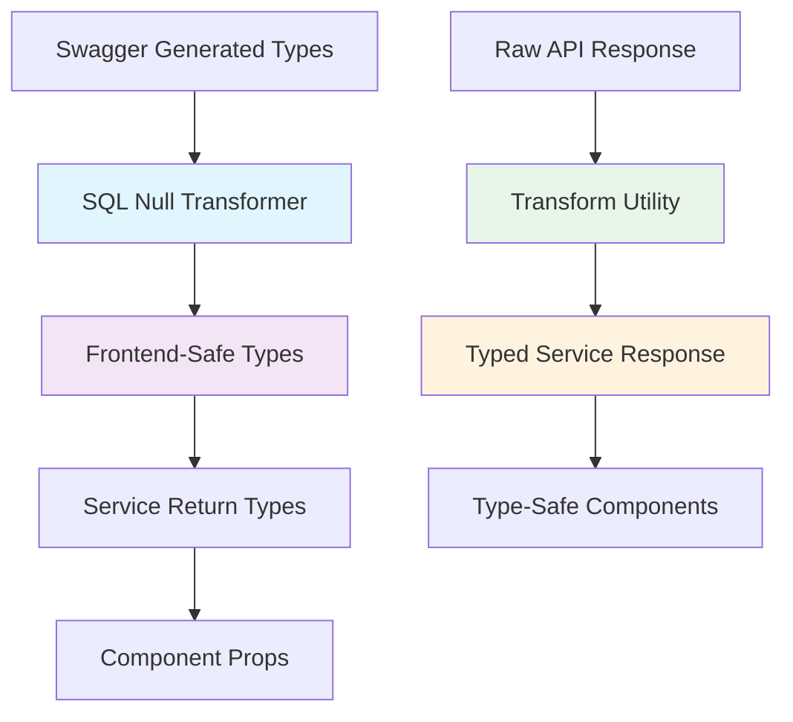
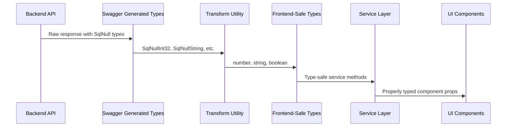
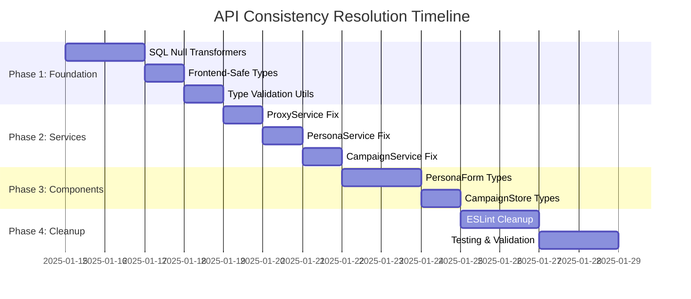

# API Consistency Resolution Plan

## Executive Summary

This document provides a comprehensive strategic plan to resolve all identified API consistency issues between swagger-generated types and frontend usage. The plan addresses critical compilation failures, type mismatches, and establishes a systematic approach for handling SQL null wrapper types.

## Problem Analysis

### Core Issue: SQL Null Wrapper Type Transformation Mismatch

**Primary Problem**: Gap between swagger-generated wrapper types and frontend simple types
- **Swagger generates**: `SqlNullInt32` with `{ int32?: number; valid?: boolean }`
- **Frontend services**: Correctly transform to simple types (`number`, `string`)
- **Service return types**: Still reference raw swagger wrapper types
- **Result**: Compilation failures like `failureCount` expects `SqlNullInt32` but receives `number`

### Secondary Issues Identified
- **114 ESLint warnings** for `any` type usage across 19 files
- **177 unused ESLint directive warnings** in generated API client files
- **Type annotation mismatches** in critical service files

### Critical Files Requiring Immediate Attention
1. `src/lib/services/proxyService.production.ts` - Compilation error on line 130
2. `src/lib/services/personaService.ts` - Type mismatches on lines 11, 51
3. `src/lib/services/campaignService.production.ts` - Type issues lines 135-137
4. `src/components/personas/PersonaForm.tsx` - 32 `any` types
5. `src/lib/stores/campaignDetailsStore.ts` - 13 `any` types

## Strategic Architecture

### Type Transformation Flow



### Data Flow Architecture



## Implementation Strategy

### 1. SQL Null Wrapper Type Handling Strategy

**Approach**: Centralized transformation with type safety preservation

**Key Components**:
- **Transform Function**: `transformSqlNullTypes<T>(input: T): TransformedType<T>`
- **Type Guards**: Runtime validation for transformation correctness
- **Generic Utilities**: Reusable across all entity types

**Implementation Location**: `src/lib/utils/sql-null-transformers.ts`

```typescript
// Example transformation signature
type TransformSqlNull<T> = T extends SqlNullInt32 
  ? number | null 
  : T extends SqlNullString 
    ? string | null 
    : T extends SqlNullTime 
      ? string | null 
      : T;
```

### 2. Type Definition Approach

**Strategy**: Create frontend-safe interface types representing post-transformation data

**Key Decisions**:
- **New file**: `src/lib/types/frontend-safe-types.ts`
- **Conditional types**: Map swagger types to frontend equivalents
- **Service annotations**: Update to reference frontend-safe types
- **Backwards compatibility**: Maintain during transition

**Type Mapping Strategy**:
```typescript
// Raw Swagger Type -> Frontend-Safe Type
ModelsProxy -> FrontendSafeProxy
SqlNullInt32 -> number | null
SqlNullString -> string | null
SqlNullTime -> string | null
```

### 3. Implementation Phases

#### Phase 1: Foundation (Priority: Critical)
**Objective**: Establish transformation infrastructure

**Tasks**:
1. Create `sql-null-transformers.ts` utility module
2. Define frontend-safe type mappings in `frontend-safe-types.ts`
3. Build centralized transformation pipeline
4. Create type validation utilities

**Deliverables**:
- Centralized transformation utilities
- Frontend-safe type definitions
- Type guard functions
- Unit tests for transformation logic

**Risk Mitigation**: 
- Backwards compatibility maintained
- Gradual rollout capability
- Comprehensive test coverage

#### Phase 2: Service Layer Updates (Priority: High)
**Objective**: Fix critical compilation errors

**Critical Fixes**:
1. **proxyService.production.ts line 130**: Update return type from `ModelsProxy[]` to `FrontendSafeProxy[]`
2. **personaService.ts lines 11, 51**: Replace `components["schemas"]["api.PersonaResponse"]` with transformed types
3. **campaignService.production.ts lines 135-137**: Fix snake_case/camelCase transformation annotations

**Implementation Pattern**:
```typescript
// Before
export async function getProxies(): Promise<ApiResponse<ModelsProxy[]>>

// After  
export async function getProxies(): Promise<ApiResponse<FrontendSafeProxy[]>>
```

**Quality Assurance**:
- Compilation verification after each file update
- Functional testing of transformed data
- Type safety validation

#### Phase 3: Component Type Safety (Priority: Medium)
**Objective**: Eliminate `any` types in critical components

**Target Files**:
1. **PersonaForm.tsx**: Replace 32 `any` types with proper interfaces
   - Use `HttpPersonaConfig` and `DnsPersonaConfig` types
   - Create typed form validation schemas
   - Update component prop types

2. **campaignDetailsStore.ts**: Replace 13 `any` types with proper interfaces
   - Use `GeneratedDomain` types consistently
   - Type WebSocket message interfaces
   - Create proper state type definitions

**Type Safety Improvements**:
- Replace `any` with specific swagger-generated types
- Create custom interfaces for UI-specific data structures
- Implement proper type guards for runtime validation

#### Phase 4: Cleanup & Validation (Priority: Low)
**Objective**: Final cleanup and comprehensive testing

**Tasks**:
1. Clean up 114 ESLint `any` type warnings across 19 files
2. Remove 177 unused ESLint directive warnings in generated files
3. Build comprehensive test suite for transformations
4. Create documentation for new type patterns

**ESLint Configuration Updates**:
- Update rules for generated files
- Create specific type checking rules
- Implement automated type validation

## Quality Assurance Approach

### Type Safety Validation

**Compile-time Checks**:
- TypeScript strict mode enforcement
- No implicit `any` types allowed
- Comprehensive type tests for transformations

**Runtime Validation**:
- Type guards for transformation verification
- Input validation at service boundaries
- Error handling for malformed data

**Testing Strategy**:
- Unit tests for transformation utilities
- Integration tests for service layer updates
- End-to-end tests for UI components

### Build Verification Process

**Phase-by-Phase Validation**:
1. Zero TypeScript compilation errors after each phase
2. Functional testing of existing features
3. Performance impact assessment
4. Backwards compatibility verification

**Continuous Integration**:
- Automated type checking in CI pipeline
- Regression testing for all modified files
- Performance benchmarking

### Risk Mitigation Strategies

**Technical Risks**:
- **Type drift**: Automated validation prevents inconsistencies
- **Breaking changes**: Gradual rollout with backwards compatibility
- **Performance impact**: Lightweight transformation utilities

**Implementation Risks**:
- **Scope creep**: Phase-based approach limits complexity
- **Integration issues**: Comprehensive testing at each phase
- **Timeline delays**: Priority-based task ordering

## Specific File Recommendations

### proxyService.production.ts
**Current Issue**: Line 130 compilation error - return type mismatch
**Solution**: 
```typescript
// Update return type annotation
export async function getProxies(): Promise<ApiResponse<FrontendSafeProxy[]>> {
  // existing transformation logic remains
  return {
    status: 'success',
    data: cleanedProxies, // now properly typed
    message: 'Proxies retrieved successfully'
  };
}
```

### personaService.ts
**Current Issue**: Lines 11, 51 - incorrect type references
**Solution**:
```typescript
// Replace with frontend-safe types
type Persona = FrontendSafePersona;
type PersonaTestResult = FrontendSafePersonaTestResult;
```

### campaignService.production.ts
**Current Issue**: Lines 135-137 - transformation type annotations
**Solution**:
```typescript
// Use proper transformation utility
const transformedCampaign = transformSqlNullTypes(campaign);
return {
  status: 'success',
  data: transformedCampaign as FrontendSafeCampaign
};
```

### PersonaForm.tsx
**Current Issue**: 32 `any` types causing type safety loss
**Solution**:
```typescript
// Replace any with specific types
interface FormData {
  configDetails: HttpPersonaConfig | DnsPersonaConfig;
  personaType: PersonaType;
  // ... other properly typed fields
}
```

### campaignDetailsStore.ts
**Current Issue**: 13 `any` types in store definitions
**Solution**:
```typescript
// Use proper OpenAPI types
interface CampaignDetailsState {
  domains: FrontendSafeGeneratedDomain[];
  campaign: FrontendSafeCampaign | null;
  // ... other properly typed state
}
```

## Success Criteria

### Technical Metrics
- **Zero TypeScript compilation errors** after implementation
- **Zero ESLint `any` type warnings** in critical files
- **100% type safety** for SQL null transformations
- **Backward compatibility** maintained throughout transition

### Quality Metrics
- **Comprehensive test coverage** for transformation utilities
- **Performance baseline** maintained or improved
- **Developer experience** enhanced with better autocomplete
- **Maintainability** improved through consistent type patterns

## Timeline and Dependencies

### Phase Dependencies


### Critical Path
1. **Foundation utilities** must be completed first
2. **Service layer fixes** depend on foundation
3. **Component updates** can be done in parallel after services
4. **Cleanup tasks** are final phase

## Conclusion

This comprehensive plan provides a systematic, low-risk approach to resolving all identified API consistency issues. The phase-based implementation ensures minimal disruption while achieving complete type safety and eliminating all compilation errors.

The architecture establishes a sustainable pattern for handling SQL null wrapper types and provides a foundation for future API integrations. Upon completion, the codebase will have:

- **Zero type inconsistencies** between backend and frontend
- **Complete type safety** throughout the application
- **Maintainable transformation patterns** for future development
- **Comprehensive test coverage** ensuring long-term stability

**Next Step**: Proceed to implementation Phase 1 using the Code mode to begin building the foundation utilities.