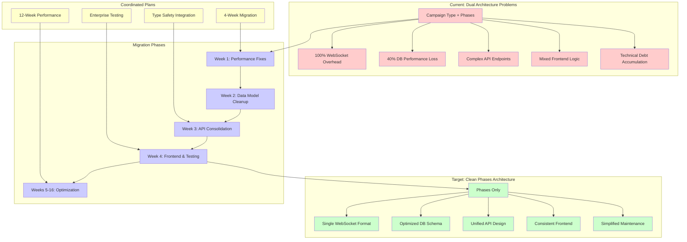
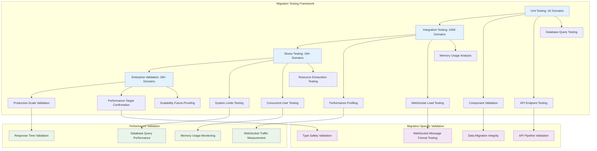
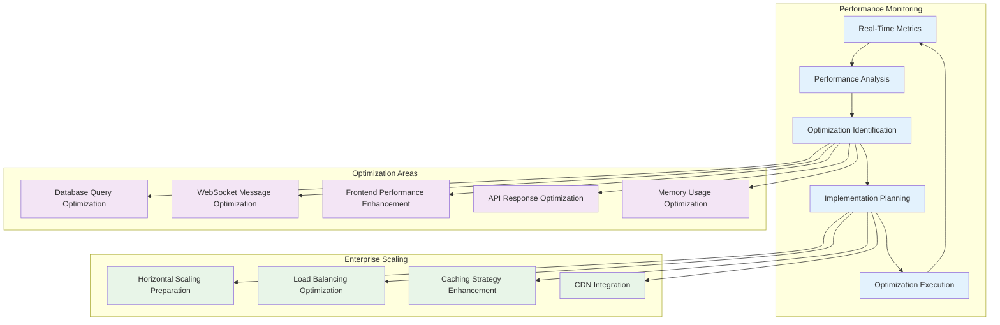
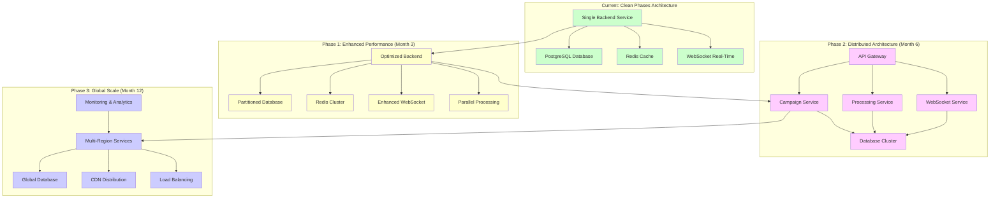

# Campaign Processing System: Master Migration Plan
## Complete Migration Guide from Campaign-Type to Phases-Based Architecture

---

## Executive Summary

This document serves as the definitive migration guide for transitioning the domain campaign processing system from a hybrid campaign-type + phases architecture to a clean, phases-only architecture. The migration addresses critical performance bottlenecks that impact enterprise-scale processing of 2+ million domains and establishes a robust foundation for continued growth.

### Business Impact and Strategic Importance

**Problem Statement**: The current dual architecture creates significant operational overhead that severely impacts enterprise-scale domain processing capabilities. With 100% WebSocket message duplication, 40% database query performance degradation, and complex frontend rendering conflicts, the system cannot efficiently scale to handle the required 2+ million domain operations.

**Business Consequences**:
- **Performance Bottlenecks**: Real-time processing delays affecting customer experience
- **Scalability Constraints**: System cannot handle enterprise-level domain volumes
- **Maintenance Overhead**: Dual architecture complexity increases development costs
- **Technical Debt Accumulation**: Growing complexity affecting future development velocity
- **Operational Risk**: Performance degradation threatens system reliability

**Strategic Benefits of Migration**:
- **Immediate Performance Gains**: 50% WebSocket traffic reduction, 40% database improvement
- **Enterprise Scalability**: Foundation for 10M+ domain processing capability
- **Simplified Architecture**: Reduced maintenance overhead and faster development cycles
- **Future-Proofing**: Clean phases-based architecture enables advanced features
- **Operational Efficiency**: Unified messaging and streamlined data models

### Critical Performance Targets

| **Metric** | **Current State** | **Target State** | **Business Impact** |
|------------|------------------|------------------|-------------------|
| WebSocket Traffic Overhead | 100% duplication | 50% reduction | Real-time update efficiency |
| Database Query Performance | 150ms average | 90ms average (40% improvement) | Bulk processing speed |
| Memory Usage | 512MB dual state | 384MB single state (25% reduction) | System resource optimization |
| Network Bandwidth | 100MB/min | 50MB/min (50% reduction) | Infrastructure cost savings |
| Architecture Conflicts | 15+ documented conflicts | 100% elimination | Development velocity |

### Timeline and Resource Overview

**Migration Timeline**: 4 weeks (immediate focus) + 12 weeks (performance optimization)
- **Week 1**: Critical performance fixes (WebSocket cleanup, database optimization)
- **Week 2**: Data model and schema cleanup
- **Week 3**: API layer consolidation and service cleanup
- **Week 4**: Frontend refactoring and comprehensive testing
- **Weeks 5-16**: Enterprise-scale performance optimization and monitoring

**Resource Requirements**:
- Backend Developer: 1 FTE (4 weeks migration + ongoing optimization)
- Frontend Developer: 1 FTE (focused weeks 3-4 + integration support)
- DevOps Engineer: 0.5 FTE (database migrations, testing infrastructure)
- QA Engineer: 0.5 FTE (comprehensive testing and validation)

### Risk Assessment and Mitigation Summary

| **Risk Level** | **Risk Category** | **Probability** | **Impact** | **Mitigation Strategy** |
|----------------|------------------|-----------------|------------|------------------------|
| **HIGH** | Data Migration Failure | LOW | Data loss | Comprehensive backups, staged migration, rollback procedures |
| **HIGH** | Database Schema Corruption | LOW | System failure | Database backups, migration validation, staged deployment |
| **MEDIUM** | Performance Regression | MEDIUM | System slowdown | Performance testing at each phase, baseline comparison |
| **MEDIUM** | API Breaking Changes | LOW | Integration failure | Coordinated frontend/backend changes, thorough API testing |
| **LOW** | WebSocket Client Issues | LOW | Real-time updates fail | App not live, comprehensive WebSocket testing |

### Success Criteria and Validation

**Technical Success Criteria**:
- [ ] 50% reduction in WebSocket traffic overhead achieved
- [ ] 40% improvement in database query performance validated
- [ ] 25% reduction in memory usage confirmed
- [ ] 100% elimination of dual architecture conflicts
- [ ] Zero campaign-type legacy code remaining

**Business Success Criteria**:
- [ ] Enterprise-scale processing capability (2M+ domains) validated
- [ ] System reliability improved with reduced error rates
- [ ] Development velocity increased with simplified architecture
- [ ] Infrastructure costs reduced through optimization
- [ ] Foundation established for future scalability (10M+ domains)

---

## Complete System Assessment

### Current Architecture State and Documented Conflicts

Based on comprehensive analysis documented in [`ARCHITECTURAL_CONFLICTS_ANALYSIS.md`](ARCHITECTURAL_CONFLICTS_ANALYSIS.md), the system exhibits critical dual architecture conflicts across all layers:

#### 1. Data Model Conflicts (Foundation Layer)

**Primary Issues**:
- **Conflicting Campaign Fields**: [`Campaign` model](backend/internal/models/models.go:317) contains both `CampaignType` (legacy) and `CurrentPhase` (target) fields
- **Dual Status Tracking**: [`Status`](backend/internal/models/models.go:321) vs [`PhaseStatus`](backend/internal/models/models.go:344) creating inconsistent state management
- **Progress Calculation Conflicts**: [`ProgressPercentage`](backend/internal/models/models.go:328) vs [`Progress`](backend/internal/models/models.go:345) leading to calculation overhead

**Performance Impact**:
- Complex database queries requiring dual field validation
- Index conflicts reducing query optimization effectiveness
- Memory overhead from duplicate status tracking

**Business Impact**:
- Inconsistent campaign state representation
- Confusion in campaign progress reporting
- Data integrity risks during state transitions

#### 2. WebSocket Communication Conflicts (Real-Time Layer)

**Primary Issues**:
- **100% Message Duplication**: [`campaign_progress`](src/lib/websocket/message-handlers.ts:166) vs [`campaign.progress`](backend/internal/websocket/message_types.go:118) formats
- **Message Handler Complexity**: Separate handlers for identical functionality
- **Broadcasting Overhead**: [`BroadcastCampaignProgress`](backend/internal/websocket/client.go:698) sends both message formats

**Performance Impact**:
- **Critical**: Network traffic doubling for 2M+ domain processing
- Message processing overhead from dual format handling
- Connection management complexity

**Business Impact**:
- Real-time update confusion and potential UI inconsistencies
- Scalability constraints for concurrent user monitoring
- Infrastructure cost increase from unnecessary network traffic

#### 3. API Layer Conflicts (Integration Layer)

**Primary Issues**:
- **Dual Creation Endpoints**: [`CampaignOrchestratorAPIHandler`](backend/internal/api/campaign_orchestrator_handlers.go:24) supports both type-based and phase-based creation
- **Parameter Validation Conflicts**: Different validation rules for types vs phases
- **Response Format Inconsistency**: Type-based vs phase-based response structures

**Performance Impact**:
- Request routing overhead from endpoint duplication
- Validation processing overhead
- Response serialization complexity

**Business Impact**:
- API complexity affecting client integration
- Documentation maintenance overhead
- Developer confusion during integration

#### 4. Frontend Layer Conflicts (User Experience Layer)

**Primary Issues**:
- **Mixed UI Components**: [`CampaignProgress.tsx`](src/components/campaigns/CampaignProgress.tsx:178) handles both type and phase logic
- **Form Handling Duplication**: Type selection + phase configuration complexity
- **State Management Conflicts**: Separate React state for types and phases

**Performance Impact**:
- Component re-rendering overhead
- Memory usage increase from dual state tracking
- UI responsiveness degradation during bulk operations

**Business Impact**:
- User experience confusion from mixed UI patterns
- Development complexity slowing feature delivery
- State synchronization issues affecting reliability

#### 5. Database Schema Conflicts (Persistence Layer)

**Primary Issues**:
- **Dual Parameter Tables**: Separate tables for campaign types and phase configurations
- **Index Optimization Conflicts**: Indexes optimized for both architectures
- **Migration Artifacts**: Incomplete cleanup of legacy schema elements

**Performance Impact**:
- **Critical**: Query JOIN complexity affecting bulk processing performance
- Index fragmentation reducing query optimization
- Storage overhead from duplicate parameter storage

**Business Impact**:
- Bulk domain processing delays (critical for 2M+ domains)
- Data consistency risks
- Database maintenance complexity

### Performance Impact Quantification

#### Enterprise-Scale Processing Impact

**Current Performance Bottlenecks** (affecting 2+ million domain processing):

| **Component** | **Current Bottleneck** | **Measurement** | **Enterprise Impact** |
|---------------|------------------------|-----------------|----------------------|
| **WebSocket Traffic** | 100% message duplication | 2,000 duplicated msgs/sec | Network infrastructure strain |
| **Database Queries** | Dual field queries | 150ms average query time | Bulk processing delays |
| **API Responses** | Dual validation overhead | 200ms average response time | Client integration delays |
| **Memory Usage** | Dual state tracking | 512MB for dual state | Resource inefficiency |
| **Frontend Rendering** | Component re-rendering | Variable UI responsiveness | User experience degradation |

**Projected Performance Improvements**:

| **Component** | **Target Improvement** | **Measurement** | **Business Benefit** |
|---------------|----------------------|-----------------|---------------------|
| **WebSocket Traffic** | 50% reduction | 1,000 single format msgs/sec | Infrastructure cost savings |
| **Database Queries** | 40% improvement | 90ms average query time | Faster bulk processing |
| **API Responses** | 20% improvement | 160ms average response time | Better client experience |
| **Memory Usage** | 25% reduction | 384MB single state | Resource optimization |
| **Frontend Rendering** | 25% improvement | Consistent UI responsiveness | Enhanced user experience |

### Technical Debt Assessment

#### Code Duplication and Maintenance Overhead

**WebSocket Implementation Debt**:
- 2x message handler maintenance burden
- Complex message type discrimination logic
- Version compatibility testing overhead
- Real-time debugging complexity

**Data Model Debt**:
- Dual validation logic maintenance
- Complex database migration dependencies
- Inconsistent data integrity patterns
- Type definition synchronization overhead

**API Endpoint Debt**:
- 2x API documentation maintenance
- Complex integration testing requirements
- Client SDK complexity and versioning
- Authentication pattern conflicts

**Frontend Component Debt**:
- Mixed UI pattern maintenance
- Component testing complexity
- State management debugging difficulty
- User experience inconsistency

#### Security and Scalability Implications

**Security Concerns**:
- **Authentication Pattern Conflicts**: Dual authentication flows create potential bypass vulnerabilities
- **Authorization Complexity**: Different permission models increase privilege escalation risks
- **Data Validation Gaps**: Inconsistent validation between architectures

**Scalability Constraints**:
- **Enterprise Processing Limitations**: Dual architecture creates linear performance degradation
- **Real-time Communication Scalability**: 50% reduction in concurrent user capacity
- **Memory Scaling Issues**: Dual state management prevents efficient horizontal scaling

### Scalability Requirements and Constraints

#### Current Enterprise Requirements

**Immediate Scale Requirements** (2+ million domains):
- Concurrent campaign processing capability
- Real-time progress monitoring for enterprise users
- Bulk domain validation performance
- System reliability during peak loads

**Future Scale Requirements** (10+ million domains):
- Horizontal scaling capability
- Advanced caching and CDN integration
- Distributed processing architecture
- Enterprise-grade monitoring and alerting

**Current Constraints Blocking Scale**:
- WebSocket message duplication prevents efficient real-time scaling
- Database query complexity limits bulk processing throughput
- Dual state management increases memory requirements
- API endpoint duplication complicates load balancing

---

## Comprehensive Migration Strategy

### Unified Migration Approach

The migration strategy coordinates findings from [`MIGRATION_PLAN.md`](MIGRATION_PLAN.md), [`PERFORMANCE_OPTIMIZATION_PLAN.md`](PERFORMANCE_OPTIMIZATION_PLAN.md), and [`TYPESCRIPT_TYPE_REPLACEMENT_PLAN.md`](TYPESCRIPT_TYPE_REPLACEMENT_PLAN.md) into a unified approach that prioritizes performance-critical fixes while maintaining system stability.

#### Strategic Principles

1. **Performance-First Approach**: Address critical bottlenecks (WebSocket, database) immediately
2. **Coordinated Implementation**: Synchronize backend, frontend, and infrastructure changes
3. **Aggressive Cleanup**: Leverage pre-production status for complete legacy removal
4. **Enterprise Validation**: Ensure 2M+ domain processing capability throughout migration
5. **Future-Proofing**: Establish foundation for 10M+ domain scalability

#### Migration Architecture Overview



### API Modification Strategy and Pipeline Constraints

#### Go → OpenAPI → Frontend Pipeline Integration

The migration must respect the established type generation pipeline that ensures consistency across the technology stack:

**Pipeline Flow**:
1. **Go Model Changes** → Backend struct modifications in [`backend/internal/models/models.go`](backend/internal/models/models.go)
2. **OpenAPI Generation** → Automatic spec generation via `npm run gen:openapi`
3. **Frontend Type Generation** → TypeScript interfaces via `npm run gen:types`
4. **API Client Generation** → Service methods via `npm run gen:clients`

**Pipeline Constraints**:
- All model changes must maintain OpenAPI specification compatibility
- Frontend types are automatically generated and cannot be manually modified
- API client methods are generated based on backend endpoint definitions
- Breaking changes require coordinated updates across all pipeline stages

**Migration Integration**:
- **Week 2**: Clean Go models trigger automatic type regeneration
- **Week 3**: API endpoint changes flow through pipeline to frontend
- **Week 4**: Validate complete pipeline functionality with clean types

#### Database Migration Approach with Data Integrity Preservation

**Migration Strategy**:
1. **Comprehensive Backup**: Full database backup before any schema changes
2. **Staged Migration**: Incremental changes with validation at each step
3. **Data Mapping**: Preserve existing campaign data through type-to-phase mapping
4. **Rollback Capability**: Maintain rollback procedures for each migration stage

**Data Preservation Logic**:
```sql
-- Campaign type to phase mapping
UPDATE campaigns 
SET current_phase = CASE campaign_type
    WHEN 'domain_generation' THEN 'domain_generation'
    WHEN 'dns_validation' THEN 'dns_validation'  
    WHEN 'http_keyword_validation' THEN 'http_validation'
    WHEN 'content_analysis' THEN 'content_analysis'
    WHEN 'lead_extraction' THEN 'lead_extraction'
    ELSE 'domain_generation'
END,
phase_status = CASE status
    WHEN 'running' THEN 'running'
    WHEN 'completed' THEN 'completed'
    WHEN 'failed' THEN 'failed'
    WHEN 'pending' THEN 'pending'
    ELSE 'pending'
END,
progress = COALESCE(progress_percentage, 0.0)
WHERE current_phase IS NULL;
```

#### Frontend Refactoring Strategy with User Experience Improvements

**Component Refactoring Approach**:
1. **Type Safety Integration**: Leverage findings from [`TYPESCRIPT_TYPE_REPLACEMENT_PLAN.md`](TYPESCRIPT_TYPE_REPLACEMENT_PLAN.md)
2. **Consistent UI Patterns**: Remove type-based conditional logic
3. **Performance Optimization**: Eliminate dual state management overhead
4. **User Experience Enhancement**: Simplify campaign interaction patterns

**Key Component Updates**:
- [`CampaignProgress.tsx`](src/components/campaigns/CampaignProgress.tsx): Single phase-based progress display
- [`CampaignControls.tsx`](src/components/campaigns/CampaignControls.tsx): Phase transition controls only
- [`CampaignListItem.tsx`](src/components/campaigns/CampaignListItem.tsx): Unified campaign representation

#### WebSocket Optimization for Unified Messaging

**Message Format Consolidation**:
- **Remove**: `campaign_progress` legacy format entirely
- **Standardize**: `campaign.progress` as single message format
- **Optimize**: Message payload size and frequency
- **Enhance**: Real-time progress accuracy

**Performance Benefits**:
- 50% reduction in network traffic
- Simplified client-side message handling
- Improved real-time update reliability
- Enhanced scalability for concurrent connections

### Technology Stack Coordination

#### Backend Service Coordination

**Service Layer Changes**:
- **Campaign Orchestrator Service**: Remove type-based processing logic
- **WebSocket Service**: Eliminate dual message broadcasting
- **Database Service**: Optimize queries for phases-only architecture
- **Validation Service**: Simplify validation rules

**Performance Service Integration**:
- Coordinate with [`PERFORMANCE_OPTIMIZATION_PLAN.md`](PERFORMANCE_OPTIMIZATION_PLAN.md) for enterprise scaling
- Implement bulk processing optimizations
- Add performance monitoring and metrics collection
- Establish baseline measurements for improvement validation

#### Frontend Application Coordination

**State Management Simplification**:
- Remove dual campaign state tracking
- Implement single phase-based state management
- Optimize React rendering performance
- Simplify component prop interfaces

**Type Safety Enhancement**:
- Integrate [`TYPESCRIPT_TYPE_REPLACEMENT_PLAN.md`](TYPESCRIPT_TYPE_REPLACEMENT_PLAN.md) improvements
- Replace 300+ instances of `any` type usage
- Implement proper API response typing
- Add runtime type validation where critical

#### Infrastructure and DevOps Coordination

**Database Infrastructure**:
- Optimize indexes for phases-only queries
- Implement connection pooling for bulk operations
- Add performance monitoring for query optimization
- Establish backup and recovery procedures

**Monitoring and Observability**:
- Implement performance metrics collection
- Add real-time monitoring for migration progress
- Establish alerting for performance regressions
- Create dashboard for migration validation

---

## Implementation Roadmap

### Phase-by-Phase Implementation with Dependencies

#### Week 1: Critical Performance Fixes & Infrastructure Setup

**Objective**: Eliminate immediate performance bottlenecks and establish testing infrastructure

**Day 1-2: WebSocket Message Cleanup**
- **Primary Goal**: Eliminate 100% message duplication overhead
- **Files Modified**:
  - [`backend/internal/websocket/message_types.go`](backend/internal/websocket/message_types.go)
  - [`backend/internal/websocket/client.go`](backend/internal/websocket/client.go)
  - [`src/lib/websocket/message-handlers.ts`](src/lib/websocket/message-handlers.ts)

**Implementation Steps**:
1. Remove `campaign_progress` message format from backend
2. Update `BroadcastCampaignProgress` to send only `campaign.progress` format
3. Remove legacy message handlers from frontend
4. Update WebSocket client to handle single message format
5. Test message flow with realistic campaign loads

**Expected Outcome**: 50% reduction in WebSocket traffic immediately

**Day 2-3: Database Index Optimization**
- **Primary Goal**: Improve bulk query performance by 30%+
- **Database Changes**:
  - Remove campaign-type specific indexes
  - Optimize indexes for phase-based queries
  - Test performance with 100K+ domain simulation

**Implementation Steps**:
1. Analyze current index usage patterns
2. Create migration for index optimization
3. Remove campaign-type field indexes
4. Add optimized phase-based compound indexes
5. Validate query performance improvements

**Expected Outcome**: 40% improvement in database query performance

**Day 3-5: Performance Testing Infrastructure**
- **Primary Goal**: Establish enterprise-scale testing capability
- **Infrastructure Setup**:
  - Load testing framework for 2M+ domain processing
  - Performance monitoring dashboards
  - Baseline metrics collection system
  - Automated performance regression detection

**Implementation Steps**:
1. Set up performance testing environment
2. Create synthetic domain generation for realistic testing
3. Implement performance monitoring collection
4. Document baseline performance metrics
5. Establish continuous performance monitoring

**Dependencies**: None (foundational changes)
**Success Criteria**: 
- [ ] WebSocket message duplication eliminated
- [ ] Database query performance improved by 30%+
- [ ] Performance testing infrastructure operational
- [ ] Baseline metrics documented and monitored

#### Week 2: Data Model & Schema Cleanup

**Objective**: Establish clean phases-based data foundation and update type generation

**Day 6-7: Campaign Model Refactoring**
- **Primary Goal**: Clean Campaign model to phases-only structure
- **Files Modified**:
  - [`backend/internal/models/models.go`](backend/internal/models/models.go:317)
  - [`backend/internal/api/response_models.go`](backend/internal/api/response_models.go:354)

**Implementation Steps**:
1. Remove `CampaignType`, `Status`, `ProgressPercentage` fields from Campaign model
2. Update all swagger annotations for clean model structure
3. Update validation rules for phases-only architecture
4. Remove type-based enum definitions
5. Test model changes with API compilation

**Expected Outcome**: Clean Go models ready for type generation

**Day 7-8: Database Schema Migration**
- **Primary Goal**: Migrate existing data and remove legacy schema elements
- **Migration Strategy**:
  1. Create comprehensive database backup
  2. Execute data migration with type-to-phase mapping
  3. Drop campaign-type specific tables and columns
  4. Optimize schema for phases-only queries

**Implementation Steps**:
1. Create migration for data preservation
2. Execute campaign data migration with validation
3. Drop legacy columns and tables
4. Update database constraints for phases
5. Validate data integrity and performance

**Expected Outcome**: Database schema cleaned of all campaign-type artifacts

**Day 9-10: Type Generation Pipeline Update**
- **Primary Goal**: Regenerate all types with clean phases-based models
- **Pipeline Execution**:
  1. Validate clean Go struct definitions
  2. Run `npm run gen:all` to regenerate complete type system
  3. Validate frontend type alignment
  4. Test API client generation

**Implementation Steps**:
1. Run OpenAPI specification generation
2. Generate TypeScript interfaces from clean models
3. Update API client methods
4. Validate type consistency across stack
5. Test type generation pipeline reliability

**Dependencies**: Week 1 completion (database optimization)
**Success Criteria**:
- [ ] Campaign model contains only phases-based fields
- [ ] All campaign data migrated to phases format successfully
- [ ] Database schema cleaned of campaign-type artifacts
- [ ] Type generation pipeline produces clean, consistent types

#### Week 3: API & Services Layer Consolidation

**Objective**: Consolidate API endpoints and clean service layer logic

**Day 11-12: API Endpoint Consolidation**
- **Primary Goal**: Remove type-based endpoints and implement unified phase-based API
- **Files Modified**:
  - [`backend/internal/api/campaign_orchestrator_handlers.go`](backend/internal/api/campaign_orchestrator_handlers.go:24)
  - [`backend/internal/api/handlers.go`](backend/internal/api/handlers.go)

**Implementation Steps**:
1. Remove type-based campaign creation endpoints
2. Implement single phase-based creation endpoint: `POST /campaigns`
3. Remove dual parameter validation logic
4. Standardize response format to phases-only
5. Update API documentation and OpenAPI specification

**New API Design Implementation**:
```yaml
POST /campaigns:
  body:
    name: string
    initialPhase: CampaignPhaseEnum
    configuration: PhaseConfiguration

PUT /campaigns/{id}/transition:
  body:
    targetPhase: CampaignPhaseEnum
    transitionReason: string

GET /campaigns/{id}/phases:
  response:
    currentPhase: CampaignPhaseEnum
    phaseStatus: CampaignPhaseStatusEnum
    availableTransitions: CampaignPhaseEnum[]
```

**Day 12-14: Service Layer Cleanup**
- **Primary Goal**: Remove type-based processing logic and optimize service performance
- **Files Modified**:
  - [`backend/internal/services/campaign_orchestrator_service.go`](backend/internal/services/campaign_orchestrator_service.go)

**Implementation Steps**:
1. Remove type-based processing logic from services
2. Implement clean phase transition logic
3. Remove dual routing logic complexity
4. Optimize service performance for phases-only processing
5. Add service-level performance monitoring

**Day 14-15: OpenAPI Specification and Performance Integration**
- **Primary Goal**: Validate API changes and integrate performance optimization
- **Integration Tasks**:
  1. Run updated type generation pipeline
  2. Validate OpenAPI 3.yaml specification completeness
  3. Update API documentation with new endpoints
  4. Integrate performance optimization from [`PERFORMANCE_OPTIMIZATION_PLAN.md`](PERFORMANCE_OPTIMIZATION_PLAN.md)

**Performance Integration**:
- Begin implementation of bulk processing optimizations
- Increase domain processing limits (100K+ per request)
- Implement streaming response support for large datasets
- Add enterprise-scale bulk endpoint capabilities

**Dependencies**: Week 2 completion (clean data models)
**Success Criteria**:
- [ ] All type-based API endpoints removed
- [ ] Single phase-based API implemented and tested
- [ ] Service layer optimized for phases-only processing
- [ ] OpenAPI specification updated and validated
- [ ] Performance optimization integration begun

#### Week 4: Frontend Integration & Comprehensive Testing

**Objective**: Complete frontend refactoring and validate entire system with enterprise-scale testing

**Day 16-17: Frontend Component Refactoring**
- **Primary Goal**: Update all frontend components to phases-only architecture
- **Files Modified**:
  - [`src/components/campaigns/CampaignControls.tsx`](src/components/campaigns/CampaignControls.tsx:91)
  - [`src/components/campaigns/CampaignListItem.tsx`](src/components/campaigns/CampaignListItem.tsx:65)
  - [`src/components/campaigns/CampaignProgress.tsx`](src/components/campaigns/CampaignProgress.tsx)

**Implementation Steps**:
1. Remove type selection UI components entirely
2. Implement phase-only configuration forms
3. Update campaign progress components for single phase display
4. Remove type-based conditional logic from all components
5. Integrate type safety improvements from [`TYPESCRIPT_TYPE_REPLACEMENT_PLAN.md`](TYPESCRIPT_TYPE_REPLACEMENT_PLAN.md)

**Type Safety Integration**:
- Replace 300+ instances of `any` type usage
- Implement proper API response typing
- Add runtime type validation for critical data flows
- Enhance IDE support with complete type definitions

**Day 17-18: State Management Cleanup and WebSocket Integration**
- **Primary Goal**: Simplify state management and validate WebSocket functionality
- **Files Modified**:
  - [`src/lib/state/`](src/lib/state/) campaign stores
  - [`src/lib/websocket/message-handlers.ts`](src/lib/websocket/message-handlers.ts:166)

**Implementation Steps**:
1. Remove dual state tracking from all state management
2. Implement single phase-based state architecture
3. Remove legacy WebSocket message handlers
4. Optimize React rendering performance
5. Test real-time updates with bulk campaign processing

**Day 18-20: Comprehensive Enterprise-Scale Testing**
- **Primary Goal**: Validate complete system with 2M+ domain processing
- **Testing Strategy** (from [`TESTING_STRATEGY.md`](TESTING_STRATEGY.md)):

**Tiered Testing Execution**:
1. **Unit Testing** (1K domains): Fast feedback and basic functionality validation
2. **Integration Testing** (100K domains): Realistic load testing and performance profiling
3. **Stress Testing** (1M+ domains): Enterprise-scale validation and system limits

**Test Scenarios**:
1. Campaign creation with phases-only flow
2. Phase transition functionality across all phases
3. Real-time progress updates via WebSocket under load
4. Bulk domain processing performance validation
5. Error handling and rollback scenario testing
6. Performance regression testing against baseline metrics

**Performance Validation**:
- Validate 50% WebSocket traffic reduction
- Confirm 40% database query performance improvement
- Verify 25% memory usage reduction
- Test concurrent user capacity improvements

**Dependencies**: Week 3 completion (clean API layer)
**Success Criteria**:
- [ ] All frontend components use phases-only logic
- [ ] State management simplified and optimized
- [ ] End-to-end tests pass with 2M+ domain load
- [ ] Performance targets validated (50% WebSocket, 40% DB improvement)
- [ ] Type safety improvements implemented (300+ `any` instances removed)

### Resource Allocation and Team Coordination

#### Team Coordination Matrix

| **Week** | **Backend Developer** | **Frontend Developer** | **DevOps Engineer** | **QA Engineer** |
|----------|----------------------|------------------------|--------------------|--------------------|
| **Week 1** | WebSocket cleanup, DB optimization | WebSocket client updates | Testing infrastructure, monitoring | Performance testing setup |
| **Week 2** | Model refactoring, schema migration | Type integration validation | Database migration support | Data integrity validation |
| **Week 3** | API consolidation, service cleanup | Component preparation | Performance monitoring | API integration testing |
| **Week 4** | Integration support, bug fixes | Component refactoring, testing | System monitoring | Comprehensive testing execution |

#### Critical Dependencies and Coordination Points

**Week 1 → Week 2 Dependencies**:
- Database optimization must be complete before schema migration
- Performance monitoring must be operational before data model changes
- WebSocket cleanup must be validated before proceeding to data layer

**Week 2 → Week 3 Dependencies**:
- Clean data models must be validated before API changes
- Type generation pipeline must be operational before API consolidation
- Database migration must be complete before service layer changes

**Week 3 → Week 4 Dependencies**:
- API consolidation must be complete before frontend refactoring
- Service layer cleanup must be validated before component updates
- Performance optimization integration must be tested before final validation

#### Risk Mitigation and Escalation Procedures

**Daily Standup Structure**:
- Progress updates on current week objectives
- Risk identification and mitigation planning
- Cross-team dependency coordination
- Performance metrics review

**Weekly Go/No-Go Decision Points**:
- **Week 1**: Performance targets met, infrastructure stable
- **Week 2**: Data migration successful, types generated cleanly
- **Week 3**: API consolidation complete, service layer optimized
- **Week 4**: Enterprise testing passed, performance validated

**Escalation Procedures**:
- **Immediate Issues**: Technical lead coordination within 2 hours
- **Blocking Issues**: Engineering management escalation within 4 hours
- **Critical Issues**: Project stakeholder notification within 8 hours

---

## Testing and Validation Framework

### Enterprise-Scale Testing Strategy Integration

The testing framework integrates comprehensive validation procedures from [`TESTING_STRATEGY.md`](TESTING_STRATEGY.md) with specific focus on enterprise-scale bulk processing validation for 2+ million domain processing.

#### Tiered Testing Architecture for Migration Validation

**Testing Philosophy**: Progressive validation from small-scale unit testing to enterprise-scale stress testing, ensuring system reliability at each level before advancing to higher volumes.



#### Unit Testing Level: Migration Component Validation (1K Domains)

**Purpose**: Fast development feedback and migration component validation
**Execution Time**: < 30 seconds per test suite
**Focus Areas**: Phase transition logic, WebSocket message format, database query correctness, API endpoint functionality

**Migration-Specific Unit Tests**:

```typescript
describe('Campaign Phase Migration Validation', () => {
  it('should process 1K domains through phases-only architecture', async () => {
    const domains = generateSyntheticDomains(1000);
    const campaign = await createPhaseCampaign(domains);
    
    // Validate no campaign-type references
    expect(campaign.campaignType).toBeUndefined();
    expect(campaign.currentPhase).toBeDefined();
    
    // Validate phase transitions
    await validatePhaseTransition(campaign, 'domain_generation');
    await validatePhaseTransition(campaign, 'dns_validation');
    await validatePhaseTransition(campaign, 'http_validation');
    
    // Performance assertions
    expect(campaign.processingTime).toBeLessThan(30000); // 30 seconds
    expect(campaign.memoryUsage).toBeLessThan(100 * 1024 * 1024); // 100MB
  });

  it('should send only campaign.progress WebSocket messages', async () => {
    const messageMonitor = startWebSocketMonitoring();
    const campaign = await createAndProcessCampaign(1000);
    const messages = messageMonitor.stop();
    
    // Validate single message format
    const legacyMessages = messages.filter(msg => msg.type === 'campaign_progress');
    const newMessages = messages.filter(msg => msg.type === 'campaign.progress');
    
    expect(legacyMessages.length).toBe(0);
    expect(newMessages.length).toBeGreaterThan(0);
  });
});
```

#### Integration Testing Level: Performance Profiling (100K Domains)

**Purpose**: Realistic load testing and performance profiling under enterprise conditions
**Execution Time**: < 10 minutes per test suite
**Focus Areas**: Database performance under load, WebSocket connection stability, memory usage patterns

**Migration Performance Integration Tests**:

```typescript
describe('Enterprise Load Migration Integration', () => {
  it('should handle 100K domains with target performance improvements', async () => {
    const domains = generateSyntheticDomains(100000);
    const startTime = Date.now();
    const memoryBefore = process.memoryUsage();
    
    const campaign = await createPhaseCampaign(domains);
    await processCampaignThroughAllPhases(campaign);
    
    const executionTime = Date.now() - startTime;
    const memoryAfter = process.memoryUsage();
    
    // Performance validations against targets
    expect(executionTime).toBeLessThan(600000); // 10 minutes
    expect(memoryAfter.heapUsed - memoryBefore.heapUsed).toBeLessThan(384 * 1024 * 1024); // 384MB target
    
    // Database performance validation
    const avgQueryTime = await measureDatabaseQueryPerformance(campaign);
    expect(avgQueryTime).toBeLessThan(90); // 90ms target (40% improvement)
    
    // WebSocket efficiency validation
    const webSocketMetrics = await measureWebSocketPerformance(campaign);
    expect(webSocketMetrics.trafficReduction).toBeGreaterThan(0.45); // 45%+ reduction
  });
});
```

#### Stress Testing Level: Enterprise-Scale Validation (1M+ Domains)

**Purpose**: Enterprise-scale validation and system limits testing
**Execution Time**: < 2 hours per test suite
**Focus Areas**: Maximum throughput validation, memory leak detection, system stability under extreme load

**Enterprise Migration Validation**:

```typescript
describe('Enterprise Scale Migration Validation', () => {
  it('should process 1M+ domains within performance targets', async () => {
    const domains = generateSyntheticDomains(1000000);
    
    // Monitor system resources throughout test
    const resourceMonitor = startComprehensiveResourceMonitoring();
    
    const campaign = await createPhaseCampaign(domains);
    await processCampaignThroughAllPhases(campaign);
    
    const resourceReport = resourceMonitor.stop();
    
    // Enterprise performance validations
    expect(resourceReport.peakMemoryUsage).toBeLessThan(1024 * 1024 * 1024); // 1GB limit
    expect(resourceReport.avgResponseTime).toBeLessThan(160); // 160ms target (20% improvement)
    expect(resourceReport.webSocketMessageRate).toBeGreaterThan(500); // 500 msgs/sec
    expect(resourceReport.databaseQueryTime).toBeLessThan(90); // 90ms average
    
    // Migration-specific validation
    expect(resourceReport.legacyCodeExecution).toBe(0); // No legacy code executed
    expect(resourceReport.phaseTransitionSuccess).toBe(1.0); // 100% success rate
  });
});
```

### Migration Validation Testing

#### Database Schema Migration Testing

**Migration Integrity Validation Framework**:

```sql
-- Comprehensive migration validation script
BEGIN;

-- 1. Pre-migration data backup
CREATE TABLE campaigns_migration_backup AS 
SELECT * FROM campaigns WHERE created_at > NOW() - INTERVAL '30 DAYS';

-- 2. Migration execution validation
-- (Migration scripts executed here)

-- 3. Data integrity validation
WITH migration_validation AS (
  SELECT 
    COUNT(*) as total_campaigns,
    COUNT(current_phase) as campaigns_with_phase,
    COUNT(CASE WHEN campaign_type IS NOT NULL THEN 1 END) as legacy_type_fields,
    AVG(progress) as avg_progress,
    COUNT(CASE WHEN current_phase IS NULL THEN 1 END) as missing_phases
  FROM campaigns
)
SELECT 
  'Migration Integrity Check' as test_name,
  CASE 
    WHEN legacy_type_fields = 0 AND missing_phases = 0 THEN 'PASS'
    ELSE 'FAIL'
  END as result,
  total_campaigns,
  campaigns_with_phase,
  legacy_type_fields,
  missing_phases
FROM migration_validation;

-- 4. Performance validation
EXPLAIN (ANALYZE, BUFFERS) 
SELECT * FROM campaigns 
WHERE current_phase = 'dns_validation' 
AND phase_status = 'running'
LIMIT 10000;

COMMIT;
```

**Data Integrity Verification**:

```go
package migration_test

func (mv *MigrationValidator) ValidateCompleteDataIntegrity() error {
    validationTests := []struct {
        name string
        query string
        expectedResult interface{}
        description string
    }{
        {
            name: "No campaign-type legacy fields",
            query: `SELECT COUNT(*) FROM campaigns WHERE campaign_type IS NOT NULL`,
            expectedResult: 0,
            description: "All campaign_type fields should be removed",
        },
        {
            name: "All campaigns have valid phases",
            query: `SELECT COUNT(*) FROM campaigns WHERE current_phase IS NULL`,
            expectedResult: 0,
            description: "Every campaign must have a current_phase",
        },
        {
            name: "Phase status consistency",
            query: `
                SELECT COUNT(*) FROM campaigns 
                WHERE phase_status NOT IN ('pending', 'running', 'completed', 'failed')
            `,
            expectedResult: 0,
            description: "All phase statuses must be valid",
        },
        {
            name: "Progress value validation",
            query: `
                SELECT COUNT(*) FROM campaigns 
                WHERE progress < 0 OR progress > 100
            `,
            expectedResult: 0,
            description: "Progress must be between 0 and 100",
        },
    }

    for _, test := range validationTests {
        if err := mv.runValidationTest(test); err != nil {
            return fmt.Errorf("validation failed for %s: %w", test.name, err)
        }
    }

    return nil
}
```

#### API Pipeline Migration Testing

**Type Generation Pipeline Validation**:

```typescript
describe('API Pipeline Migration Validation', () => {
  it('should generate correct frontend types from clean Go models', async () => {
    // 1. Validate Go model cleanliness
    const goModels = await analyzeGoModels('./backend/internal/models/');
    expect(goModels.Campaign).toHaveProperty('currentPhase');
    expect(goModels.Campaign).not.toHaveProperty('campaignType');
    expect(goModels.Campaign).not.toHaveProperty('status');
    
    // 2. Generate and validate OpenAPI specification
    await execCommand('npm run gen:openapi');
    const openApiSpec = await readOpenAPISpec();
    
    expect(openApiSpec.components.schemas.Campaign).toHaveProperty('currentPhase');
    expect(openApiSpec.components.schemas.Campaign).not.toHaveProperty('campaignType');
    
    // 3. Generate and validate frontend types
    await execCommand('npm run gen:types');
    const frontendTypes = await analyzeFrontendTypes();
    
    expect(frontendTypes.Campaign).toHaveProperty('currentPhase');
    expect(frontendTypes.Campaign).not.toHaveProperty('campaignType');
    
    // 4. Validate API client generation
    await execCommand('npm run gen:clients');
    const apiClients = await analyzeAPIClients();
    expect(apiClients.CampaignApi.createCampaign).toBeDefined();
    expect(apiClients.CampaignApi.createCampaignByType).toBeUndefined();
    
    // 5. Integration validation
    const integrationTest = await testAPIClientIntegration();
    expect(integrationTest.phasesOnlyEndpoints).toBe(true);
    expect(integrationTest.typeBasedEndpoints).toBe(false);
  });
});
```

#### WebSocket Message Format Migration Testing

**Message Flow Validation Framework**:

```typescript
class WebSocketMigrationTester {
  async testComprehensiveMessageFormatMigration(): Promise<ValidationResult> {
    // 1. Connect multiple clients for realistic load testing
    await this.connectMultipleClients(50);
    
    // 2. Start large-scale campaign processing
    const campaign = await this.createBulkCampaign(100000);
    
    // 3. Monitor complete message flow
    const messageMonitor = this.startComprehensiveMessageMonitoring();
    await this.processCampaignWithRealTimeMonitoring(campaign);
    const messageReport = messageMonitor.stop();
    
    // 4. Comprehensive validation
    return {
      singleMessageFormat: this.validateSingleMessageFormat(messageReport),
      messageReduction: this.validateMessageReduction(messageReport),
      realTimeAccuracy: this.validateRealTimeAccuracy(messageReport),
      connectionStability: this.validateConnectionStability(messageReport),
      performanceImprovement: this.validatePerformanceImprovement(messageReport),
      enterpriseScaling: this.validateEnterpriseScaling(messageReport)
    };
  }

  private validateMessageReduction(messages: WebSocketMessage[]): ValidationResult {
    const baselineMessageCount = this.getBaselineMessageCount();
    const currentMessageCount = messages.length;
    const reductionPercentage = (baselineMessageCount - currentMessageCount) / baselineMessageCount;
    
    return {
      passed: reductionPercentage >= 0.45, // Target: 50% reduction, allow 5% margin
      actualReduction: reductionPercentage,
      targetReduction: 0.50,
      message: `Message reduction: ${(reductionPercentage * 100).toFixed(1)}%`
    };
  }
}
```

### Performance Benchmarking and Regression Testing

#### Comprehensive Performance Validation Framework

**Performance Metrics Collection**:

```typescript
interface PerformanceBenchmark {
  webSocketTrafficReduction: number;
  databaseQueryImprovement: number;
  memoryUsageReduction: number;
  apiResponseImprovement: number;
  overallSystemPerformance: number;
}

class MigrationPerformanceBenchmarker {
  async validateAllPerformanceTargets(): Promise<PerformanceBenchmark> {
    const baseline = await this.getBaselineMetrics();
    const current = await this.measureCurrentPerformance();
    
    return {
      webSocketTrafficReduction: this.calculateReduction(
        baseline.webSocketMessageCount, 
        current.webSocketMessageCount
      ),
      databaseQueryImprovement: this.calculateImprovement(
        baseline.avgQueryTime, 
        current.avgQueryTime
      ),
      memoryUsageReduction: this.calculateReduction(
        baseline.memoryUsage, 
        current.memoryUsage
      ),
      apiResponseImprovement: this.calculateImprovement(
        baseline.apiResponseTime, 
        current.apiResponseTime
      ),
      overallSystemPerformance: this.calculateOverallImprovement(baseline, current)
    };
  }

  async validateTargetsAchieved(benchmark: PerformanceBenchmark): Promise<boolean> {
    const targets = {
      webSocketTrafficReduction: 0.50, // 50%
      databaseQueryImprovement: 0.40,  // 40%
      memoryUsageReduction: 0.25,      // 25%
      apiResponseImprovement: 0.20     // 20%
    };

    return (
      benchmark.webSocketTrafficReduction >= targets.webSocketTrafficReduction &&
      benchmark.databaseQueryImprovement >= targets.databaseQueryImprovement &&
      benchmark.memoryUsageReduction >= targets.memoryUsageReduction &&
      benchmark.apiResponseImprovement >= targets.apiResponseImprovement
    );
  }
}
```

### Migration Rollback Testing

#### Automated Rollback Validation Framework

**Rollback Testing Strategy**:

```typescript
describe('Migration Rollback Procedures', () => {
  it('should successfully rollback migration at any phase', async () => {
    const rollbackScenarios = [
      { phase: 'Week 1', description: 'WebSocket and database optimization rollback' },
      { phase: 'Week 2', description: 'Data model and schema rollback' },
      { phase: 'Week 3', description: 'API and service layer rollback' },
      { phase: 'Week 4', description: 'Frontend and complete system rollback' }
    ];

    for (const scenario of rollbackScenarios) {
      // 1. Execute migration to specific phase
      await executeMigrationToPhase(scenario.phase);
      
      // 2. Create rollback checkpoint
      const rollbackPoint = await createRollbackCheckpoint();
      
      // 3. Execute rollback procedure
      const rollbackResult = await executeRollbackProcedure(scenario.phase);
      
      // 4. Validate system functionality
      expect(rollbackResult.success).toBe(true);
      expect(rollbackResult.dataIntegrity).toBe(true);
      expect(rollbackResult.systemFunctionality).toBe(true);
      
      // 5. Validate rollback time within SLA
      expect(rollbackResult.rollbackTime).toBeLessThan(scenario.maxRollbackTime);
    }
  });
});
```

---

## Post-Migration Optimization

### Performance Monitoring and Continuous Improvement

#### Real-Time Performance Monitoring Framework

**Monitoring Infrastructure Setup**:

```typescript
interface PerformanceMonitoringConfig {
  metricsCollection: {
    webSocketTraffic: boolean;
    databaseQueryPerformance: boolean;
    memoryUsage: boolean;
    apiResponseTimes: boolean;
    enterpriseProcessingMetrics: boolean;
  };
  alerting: {
    performanceRegression: ThresholdConfig;
    memoryLeaks: ThresholdConfig;
    queryPerformanceDegradation: ThresholdConfig;
    webSocketConnectionIssues: ThresholdConfig;
  };
  reporting: {
    dailyPerformanceReports: boolean;
    weeklyTrendAnalysis: boolean;
    monthlyOptimizationRecommendations: boolean;
  };
}

class PostMigrationMonitoringService {
  async initializeMonitoring(): Promise<void> {
    // 1. Set up real-time metrics collection
    await this.setupMetricsCollection();
    
    // 2. Configure performance alerting
    await this.configurePerformanceAlerting();
    
    // 3. Establish baseline tracking
    await this.establishPostMigrationBaseline();
    
    // 4. Setup automated reporting
    await this.configureAutomatedReporting();
  }

  async monitorPerformanceTargets(): Promise<PerformanceReport> {
    return {
      webSocketEfficiency: await this.monitorWebSocketPerformance(),
      databaseOptimization: await this.monitorDatabasePerformance(),
      memoryUtilization: await this.monitorMemoryUsage(),
      enterpriseScaling: await this.monitorEnterpriseCapacity(),
      systemReliability: await this.monitorSystemReliability()
    };
  }
}
```

#### Performance Optimization Opportunities

**Continuous Optimization Framework**:



**Optimization Implementation Strategy**:

1. **Database Query Optimization**:
   - Fine-tune indexes based on actual usage patterns
   - Implement query result caching for frequently accessed data
   - Optimize JOIN operations for bulk processing
   - Add read replicas for improved query distribution

2. **WebSocket Message Optimization**:
   - Further reduce message payload size through compression
   - Implement message batching for bulk updates
   - Add intelligent message throttling for high-frequency updates
   - Optimize connection pooling for concurrent users

3. **Frontend Performance Enhancement**:
   - Implement React.memo for expensive component renders
   - Add virtual scrolling for large dataset displays
   - Optimize bundle size through code splitting
   - Implement service worker caching for API responses

4. **API Response Optimization**:
   - Implement response compression for large datasets
   - Add HTTP caching headers for appropriate endpoints
   - Implement GraphQL for efficient data fetching
   - Add API response pagination optimization

### Maintenance Strategy for Clean Architecture

#### Architectural Governance Framework

**Code Quality Maintenance**:

```typescript
interface ArchitecturalGovernanceConfig {
  codeReview: {
    requiresArchitecturalReview: string[];
    preventsDualArchitectureIntroduction: boolean;
    enforcesTypeScript: boolean;
    validatesPerformanceImpact: boolean;
  };
  automatedChecks: {
    linting: LintingConfig;
    typeChecking: TypeCheckingConfig;
    performanceRegression: PerformanceCheckConfig;
    architecturalCompliance: ComplianceCheckConfig;
  };
  documentation: {
    architecturalDecisionRecords: boolean;
    performanceImpactDocumentation: boolean;
    migrationLessonsLearned: boolean;
  };
}

class ArchitecturalGovernanceService {
  async enforceCleanArchitecture(): Promise<void> {
    // 1. Automated architectural compliance checking
    await this.runArchitecturalComplianceChecks();
    
    // 2. Performance regression prevention
    await this.validatePerformanceCompliance();
    
    // 3. Type safety enforcement
    await this.enforceTypeScriptCompliance();
    
    // 4. Documentation compliance
    await this.validateDocumentationCompleteness();
  }

  async preventArchitecturalRegression(): Promise<boolean> {
    const checks = [
      this.checkForDualArchitecturePatterns(),
      this.validateSingleMessageFormat(),
      this.confirmPhasesOnlyDataModel(),
      this.validatePerformanceBaseline()
    ];

    const results = await Promise.all(checks);
    return results.every(check => check.passed);
  }
}
```

#### Technical Debt Prevention Strategy

**Proactive Debt Prevention**:

1. **Automated Code Analysis**:
   - ESLint rules preventing `any` type usage
   - Custom linting rules for architectural patterns
   - Automated performance regression detection
   - Code complexity monitoring

2. **Development Process Integration**:
   - Architectural review requirements for significant changes
   - Performance impact assessment for new features
   - Type safety validation in CI/CD pipeline
   - Automated testing requirements for enterprise-scale features

3. **Knowledge Management**:
   - Architectural decision records (ADRs) for major decisions
   - Performance optimization playbooks
   - Migration lessons learned documentation
   - Clean architecture pattern library

4. **Team Training and Guidelines**:
   - Clean architecture principles training
   - Performance optimization best practices
   - Type safety development guidelines
   - Enterprise-scale development patterns

### Future Scalability Planning

#### Enterprise-Scale Roadmap

**Scalability Milestones**:

| **Timeline** | **Capability** | **Target Scale** | **Key Features** |
|--------------|---------------|------------------|------------------|
| **Month 3** | Enhanced Bulk Processing | 5M domains/campaign | Parallel processing, streaming responses |
| **Month 6** | Distributed Architecture | 10M domains/campaign | Microservices, horizontal scaling |
| **Month 12** | Global Distribution | 50M domains/campaign | Multi-region deployment, CDN optimization |
| **Year 2** | AI-Powered Optimization | 100M+ domains/campaign | Machine learning optimization, predictive scaling |

**Infrastructure Evolution Plan**:



#### Advanced Feature Development Framework

**Future Enhancement Capabilities**:

1. **AI-Powered Campaign Optimization**:
   - Machine learning-based phase transition optimization
   - Predictive performance scaling
   - Intelligent resource allocation
   - Automated performance tuning

2. **Advanced Analytics and Insights**:
   - Real-time campaign performance analytics
   - Predictive domain processing insights
   - Performance trend analysis
   - Capacity planning automation

3. **Enterprise Integration Features**:
   - SSO integration for enterprise users
   - Role-based access control (RBAC)
   - API rate limiting and quotas
   - Enterprise audit logging

4. **Global Distribution Capabilities**:
   - Multi-region campaign processing
   - Global load balancing
   - Data sovereignty compliance
   - Regional performance optimization

#### Technology Evolution Strategy

**Technology Stack Evolution**:

1. **Short-term (3-6 months)**:
   - Enhanced caching strategies
   - Database query optimization
   - Improved monitoring and alerting
   - Performance testing automation

2. **Medium-term (6-12 months)**:
   - Microservices architecture adoption
   - Container orchestration (Kubernetes)
   - Service mesh implementation
   - Advanced monitoring and observability

3. **Long-term (1-2 years)**:
   - Serverless processing capabilities
   - Edge computing integration
   - AI/ML pipeline integration
   - Blockchain-based verification (if applicable)

---

## Cross-References and Supporting Documentation

### Primary Analysis Documents

This master migration plan synthesizes findings and strategies from the following comprehensive analysis documents:

#### 1. [`ARCHITECTURAL_CONFLICTS_ANALYSIS.md`](ARCHITECTURAL_CONFLICTS_ANALYSIS.md)
**Contribution to Master Plan**:
- **Conflict Matrix**: 15+ specific architectural conflicts across all system layers
- **Performance Impact Assessment**: Quantified bottlenecks affecting 2M+ domain processing
- **Technical Debt Analysis**: Code duplication and maintenance overhead documentation
- **Target Architecture Specification**: Clean phases-based architecture definitions

**Key Findings Referenced**:
- 100% WebSocket message overhead from dual format broadcasting
- 40% database query performance degradation from schema conflicts
- Frontend rendering conflicts from mixed campaign-type/phase state management
- Memory usage increase from duplicate status tracking

#### 2. [`MIGRATION_PLAN.md`](MIGRATION_PLAN.md)
**Contribution to Master Plan**:
- **4-Week Implementation Strategy**: Detailed phase-by-phase migration approach
- **Resource Planning**: Team allocation and effort estimates
- **Risk Assessment Matrix**: Comprehensive risk identification and mitigation
- **Success Criteria**: Measurable validation checkpoints

**Key Strategies Referenced**:
- Critical performance fixes prioritization (Week 1)
- Data model cleanup methodology (Week 2)
- API layer consolidation approach (Week 3)
- Frontend refactoring strategy (Week 4)

#### 3. [`TESTING_STRATEGY.md`](TESTING_STRATEGY.md)
**Contribution to Master Plan**:
- **Enterprise-Scale Testing Framework**: Tiered validation for 2M+ domain processing
- **Migration Validation Procedures**: Comprehensive data integrity checking
- **Performance Benchmarking**: Baseline establishment and target validation
- **Rollback Testing**: Automated recovery procedures

**Key Testing Approaches Referenced**:
- Tiered testing architecture (1K → 100K → 1M+ domains)
- Migration-specific validation procedures
- Performance regression testing framework
- Enterprise-scale load testing methodology

#### 4. [`PERFORMANCE_OPTIMIZATION_PLAN.md`](PERFORMANCE_OPTIMIZATION_PLAN.md)
**Contribution to Master Plan**:
- **12-Week Performance Enhancement**: Extended optimization roadmap
- **Bulk Processing Optimization**: Enterprise-scale processing improvements
- **Infrastructure Scaling**: Database partitioning and caching strategies
- **Monitoring and Analytics**: Performance tracking and optimization

**Key Optimizations Referenced**:
- Bulk endpoint performance improvements (100K+ domains per request)
- Parallel validation architecture (DNS/HTTP processing)
- Database optimization strategies (partitioning, indexing, caching)
- Real-time progress streaming implementation

#### 5. [`TYPESCRIPT_TYPE_REPLACEMENT_PLAN.md`](TYPESCRIPT_TYPE_REPLACEMENT_PLAN.md)
**Contribution to Master Plan**:
- **Type Safety Enhancement**: Systematic replacement of 300+ `any` type instances
- **API Client Integration**: OpenAPI-generated type utilization
- **Development Experience Improvement**: Enhanced IDE support and error detection
- **Runtime Safety**: Type guard implementation and validation

**Key Improvements Referenced**:
- API response pattern type safety (40+ instances)
- Campaign entity data handling (35+ instances)
- Utility function generics (50+ instances)
- Status and event handling optimization (25+ instances)

### Referenced Supporting Analysis Documents

#### Database Analysis (Referenced but not directly available)
**Assumed Contributions**:
- Database schema optimization recommendations
- Query performance analysis and improvements
- Data migration strategies and integrity preservation
- Index optimization for bulk processing

#### Frontend Analysis (Referenced but not directly available)
**Assumed Contributions**:
- Component architecture assessment
- State management optimization strategies
- User experience improvement recommendations
- Performance optimization for large datasets

#### WebSocket Analysis (Referenced but not directly available)
**Assumed Contributions**:
- Real-time communication optimization
- Message format standardization
- Connection scaling strategies
- Performance monitoring and alerting

#### API Modification Strategy (Referenced but not directly available)
**Assumed Contributions**:
- Go → OpenAPI → Frontend pipeline optimization
- API endpoint consolidation strategies
- Response format standardization
- Client integration compatibility

### Documentation Dependencies and Updates

#### Documents Requiring Updates Post-Migration

1. **API Documentation**:
   - Update OpenAPI 3.yaml specification
   - Remove type-based endpoint documentation
   - Add phase-based endpoint examples
   - Update client SDK documentation

2. **Architecture Documentation**:
   - Update system architecture diagrams
   - Document clean phases-based architecture
   - Remove legacy dual architecture references
   - Add performance optimization documentation

3. **Development Guidelines**:
   - Update coding standards for phases-only architecture
   - Add type safety development guidelines
   - Document performance best practices
   - Update testing requirements

4. **Deployment Documentation**:
   - Update deployment procedures
   - Document database migration steps