# Phase 1: Comprehensive Legacy Code Analysis for OpenAPI 3.0 Migration

## Overview

**Context**: The frontend has completed migration from branded types to OpenAPI 3.0 with auto-generated API clients. This analysis identifies all legacy/redundant code that should be cleaned up to fully align with the new OpenAPI-native architecture.

**Scope**: Systematically scan the entire frontend codebase (`src/` directory) to identify legacy patterns that duplicate OpenAPI-generated functionality.

## Analysis Categories

### 1. Manually Defined Types (`src/lib/types/`)

**Target Files:**
- `src/lib/types/models-aligned.ts` - 737 lines of manually defined types
- `src/lib/types/unifiedTypes.ts` - Enum definitions duplicating OpenAPI
- `src/lib/types/aligned/aligned-api-types.ts` - API request/response types
- `src/lib/types/aligned/aligned-models.ts` - Model definitions
- `src/lib/types/aligned/transformation-layer.ts` - Type transformations
- `src/lib/types/transform.ts` - Legacy transform utilities
- `src/lib/types/proxyPoolTypes.ts` - Proxy pool type definitions

**Legacy Reason:** These files manually define types that now exist in the auto-generated OpenAPI client (`src/lib/api-client/types.ts`).

**Analysis Method:** Compare each interface/type against OpenAPI schemas in `components["schemas"]`.

### 2. Service Layer Redundancy (`src/lib/services/`)

**Target Files:**
- `src/lib/services/proxyService.production.ts` - Wrapper around OpenAPI proxy client
- `src/lib/services/campaignService.production.ts` - Wrapper around OpenAPI campaign client  
- `src/lib/services/keywordSetService.production.ts` - Wrapper around OpenAPI keyword client
- `src/lib/services/personaService.ts` - Wrapper around OpenAPI persona client
- `src/lib/services/apiClient.production.ts` - Custom API client implementation

**Legacy Reason:** These services add unnecessary abstraction layers over the generated API client, duplicating functionality.

**Analysis Method:** Verify that all functionality can be replaced with direct OpenAPI client usage from `@/lib/api-client/client`.

### 3. API Abstraction Layers (`src/lib/api/`)

**Target Files:**
- `src/lib/api/client.ts` - Custom session-based API client (391 lines)
- `src/lib/api/databaseApi.ts` - Custom database API wrapper
- `src/lib/api/healthApi.ts` - Custom health check API

**Legacy Reason:** Custom HTTP clients that duplicate OpenAPI client functionality.

**Analysis Method:** Ensure OpenAPI client covers all authentication, error handling, and request functionality.

### 4. Transformation Functions (`src/lib/api/transformers/`)

**Target Files:**
- `src/lib/api/transformers/campaign-transformers.ts` - Campaign response transformers
- `src/lib/api/transformers/domain-transformers.ts` - Domain response transformers
- `src/lib/api/transformers/auth-transformers.ts` - Auth response transformers
- `src/lib/api/transformers/error-transformers.ts` - Error response transformers

**Legacy Reason:** These transform OpenAPI responses into legacy types, which is no longer needed with direct OpenAPI usage.

**Analysis Method:** Check if any transformations are still required for UI compatibility.

### 5. Schema Generation Logic (`scripts/` and legacy generators)

**Target Files:**
- `scripts/generate-zod-schemas.js` (if exists)
- `scripts/contract-sync/generate-types.ts` - Manual type generation
- `scripts/contract-sync/extract-go-contracts.ts` - Contract extraction
- Any Zod schema generation that doesn't reflect backend truth

**Legacy Reason:** Manual schema generation is replaced by OpenAPI auto-generation.

**Analysis Method:** Verify scripts are no longer needed in the build process.

## Risk Assessment Framework

### Risk Levels

**🟢 SAFE TO DELETE**
- No active dependencies
- Clear duplication of OpenAPI functionality
- No unique business logic

**🟡 REFACTOR REQUIRED**
- Has dependencies but can be replaced
- Contains some unique logic that needs preservation
- Medium complexity migration

**🔴 GRADUAL MIGRATION**
- Complex dependencies across multiple components
- Critical business logic mixed with legacy patterns
- High-risk changes requiring careful migration

### Assessment Criteria

1. **Dependency Analysis**: How many files import/use this code?
2. **Functionality Overlap**: Does OpenAPI client provide equivalent functionality?
3. **Business Logic**: Does the code contain unique business rules?
4. **Test Coverage**: Are there tests that would need updating?
5. **Runtime Impact**: Could removal affect application behavior?

## Analysis Methodology

```mermaid
flowchart TD
    A[Scan Target File] --> B[Check Import Dependencies]
    B --> C[Analyze Exported Functions/Types]
    C --> D[Compare with OpenAPI Equivalent]
    D --> E[Assess Risk Level]
    E --> F[Generate Recommendation]
    
    F --> G[🟢 SAFE TO DELETE]
    F --> H[🟡 REFACTOR REQUIRED]
    F --> I[🔴 GRADUAL MIGRATION]
    
    G --> J[Document for Immediate Removal]
    H --> K[Create Migration Plan]
    I --> L[Create Phased Approach]
```



## Deliverable Format

For each identified legacy file/function, provide:

### File Analysis Template

**File Path**: Complete relative path from project root
**Affected Component**: Specific function, class, or export
**Legacy Reason**: Why it's redundant under OpenAPI-native architecture
**Risk Level**: 🟢 SAFE / 🟡 REFACTOR / 🔴 GRADUAL
**Dependencies**: List of files that import/use this code
**OpenAPI Equivalent**: Corresponding OpenAPI client functionality
**Recommendation**: Specific action (Delete, Refactor, Consolidate)
**Migration Path**: Step-by-step replacement instructions

### Example Analysis Entry

```
**File Path**: `src/lib/types/models-aligned.ts`
**Affected Component**: `ModelsCampaignAPI` interface (lines 81-108)
**Legacy Reason**: Duplicates `components["schemas"]["Campaign"]` from OpenAPI client
**Risk Level**: 🟡 REFACTOR REQUIRED
**Dependencies**: 
  - `src/lib/services/campaignService.production.ts`
  - `src/components/campaigns/CampaignList.tsx`
**OpenAPI Equivalent**: `import type { components } from '@/lib/api-client/types'`
  `type Campaign = components["schemas"]["Campaign"]`
**Recommendation**: Replace all imports with OpenAPI type
**Migration Path**:
  1. Update imports in dependent files
  2. Replace `ModelsCampaignAPI` with OpenAPI `Campaign` type
  3. Remove interface definition
  4. Update any type transformations
```

## Implementation Priority

### Phase 1: Immediate Cleanup (🟢 SAFE)
- Remove unused type definitions with no dependencies
- Delete legacy transformer functions not in use
- Clean up duplicate API response interfaces

### Phase 2: Refactor Dependencies (🟡 REFACTOR)
- Update service layer imports to use OpenAPI types
- Replace custom API clients with OpenAPI client
- Migrate transformation functions to use OpenAPI types directly

### Phase 3: Complex Migration (🔴 GRADUAL)
- Carefully migrate service abstractions with business logic
- Update complex components with multiple legacy dependencies
- Ensure backward compatibility during transition

## Expected Findings

Based on preliminary analysis, expecting to identify:

- **15-20 legacy type definitions** duplicating OpenAPI schemas
- **5-8 redundant service layer files** wrapping OpenAPI client
- **3-4 duplicate API client implementations** 
- **10+ transformation functions** no longer needed
- **Multiple utility functions** duplicating OpenAPI functionality
- **Legacy configuration patterns** that should use OpenAPI client config

## Success Criteria

1. **Complete Inventory**: Every legacy file/function identified and categorized
2. **Risk Assessment**: Clear priority and migration complexity for each item
3. **Migration Roadmap**: Specific steps for replacing each legacy component
4. **Dependency Mapping**: Understanding of what breaks when each item is removed
5. **OpenAPI Alignment**: Verification that OpenAPI client covers all use cases

## Next Steps

1. Execute comprehensive codebase scan using this methodology
2. Generate detailed analysis report with all findings
3. Create prioritized cleanup roadmap
4. Begin implementation starting with 🟢 SAFE items
5. Gradually migrate 🟡 REFACTOR and 🔴 GRADUAL items

---

**Note**: This analysis focuses on comprehensive cleanup to fully realize the benefits of OpenAPI-native architecture. The goal is eliminating redundancy while maintaining application functionality and ensuring type safety.