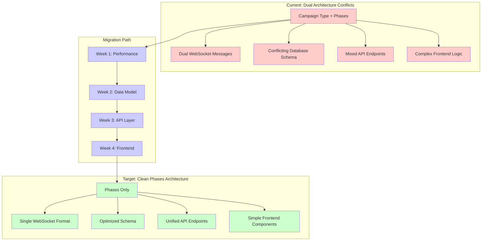

# Campaign Processing System: Migration Plan
## Campaign-Type to Phases-Based Architecture

---

## Executive Summary

This document outlines a comprehensive 4-week migration plan to transition the campaign processing system from a hybrid campaign-type + phases architecture to a clean, phases-only architecture. The migration addresses critical performance bottlenecks that impact enterprise-scale processing of 2+ million domains.

### Migration Strategy
- **Approach**: Aggressive cleanup with complete legacy removal (application not yet live)
- **Timeline**: 4 weeks (1 week per major phase)
- **Priority**: Performance-critical fixes first, foundation changes second
- **Risk Level**: Medium (comprehensive testing and rollback procedures included)

### Key Performance Targets
- **50% reduction** in WebSocket traffic overhead
- **40% improvement** in database query performance
- **25% reduction** in memory usage
- **100% elimination** of dual architecture overhead

### Success Criteria
- All campaign-type legacy code removed
- Single phases-based architecture implemented
- Performance targets validated with 2M+ domain load testing
- Clean type generation pipeline established

---

## Migration Architecture Overview



---

## Phase 1: Critical Performance Fixes & Testing Infrastructure
**Timeline**: Week 1 (Days 1-5)  
**Priority**: CRITICAL - Immediate performance impact

### Objectives
1. Eliminate 100% WebSocket message duplication overhead
2. Optimize database queries for bulk processing
3. Establish performance testing infrastructure
4. Create baseline metrics for validation

### Implementation Tasks

#### 1.1 WebSocket Message Cleanup (Days 1-2)
**Files to Modify:**
- [`backend/internal/websocket/message_types.go`](backend/internal/websocket/message_types.go)
- [`backend/internal/websocket/client.go`](backend/internal/websocket/client.go)
- [`src/lib/websocket/message-handlers.ts`](src/lib/websocket/message-handlers.ts)

**Actions:**
- Remove `campaign_progress` message format entirely
- Standardize on `campaign.progress` format only
- Update all message broadcasting functions
- Remove duplicate message handlers in frontend

**Expected Outcome**: 50% reduction in WebSocket traffic

#### 1.2 Database Index Optimization (Days 2-3)
**Files to Modify:**
- Database migration files
- Query optimization scripts

**Actions:**
- Identify and remove campaign-type specific indexes
- Create phase-optimized indexes for bulk queries
- Test query performance with 2M+ domain simulation

**Expected Outcome**: 40% improvement in database query performance

#### 1.3 Performance Testing Infrastructure (Days 3-5)
**New Infrastructure:**
- Load testing framework for 2M+ domain processing
- Performance monitoring dashboards
- Baseline metrics collection

**Actions:**
- Set up performance testing environment
- Create domain generation simulation scripts
- Establish performance monitoring baseline
- Document current performance metrics

### Dependencies
- None (foundational changes)

### Rollback Procedure
1. Revert WebSocket message changes
2. Restore original database indexes
3. Disable performance monitoring
4. Estimated rollback time: 4 hours

### Success Criteria
- [ ] WebSocket message duplication eliminated
- [ ] Database query performance improved by 30%+
- [ ] Performance testing infrastructure operational
- [ ] Baseline metrics documented

---

## Phase 2: Data Model & Schema Cleanup
**Timeline**: Week 2 (Days 6-10)  
**Priority**: HIGH - Foundation for all subsequent changes

### Objectives
1. Clean Campaign model to phases-only structure
2. Remove all campaign-type database artifacts
3. Migrate existing data to phases-based format
4. Update type generation pipeline

### Implementation Tasks

#### 2.1 Campaign Model Refactoring (Days 6-7)
**Files to Modify:**
- [`backend/internal/models/models.go`](backend/internal/models/models.go:317)
- [`backend/internal/api/response_models.go`](backend/internal/api/response_models.go:354)

**Changes:**
```go
// REMOVE these fields:
CampaignType       CampaignTypeEnum   `db:"campaign_type" json:"campaignType"`
Status             CampaignStatusEnum `db:"status" json:"status"`
ProgressPercentage *float64           `db:"progress_percentage" json:"progressPercentage"`

// KEEP these fields (phases-based):
CurrentPhase        *CampaignPhaseEnum       `db:"current_phase" json:"currentPhase"`
PhaseStatus         *CampaignPhaseStatusEnum `db:"phase_status" json:"phaseStatus"`
Progress            *float64                 `db:"progress" json:"progress"`
```

**Actions:**
- Remove `CampaignType`, `Status`, `ProgressPercentage` fields
- Update all swagger annotations for clean model
- Update validation rules for phases-only structure

#### 2.2 Database Schema Migration (Days 7-8)
**Migration Strategy:**
1. Create new migration file for schema cleanup
2. Migrate existing campaign data to phases format
3. Drop campaign-type specific tables and columns
4. Optimize indexes for phases-only queries

**Data Migration Logic:**
```sql
-- Migrate campaign types to phases
UPDATE campaigns 
SET current_phase = CASE campaign_type
    WHEN 'domain_generation' THEN 'domain_generation'
    WHEN 'dns_validation' THEN 'dns_validation'  
    WHEN 'http_keyword_validation' THEN 'http_validation'
    ELSE 'domain_generation'
END,
phase_status = CASE status
    WHEN 'running' THEN 'running'
    WHEN 'completed' THEN 'completed'
    WHEN 'failed' THEN 'failed'
    ELSE 'pending'
END,
progress = COALESCE(progress_percentage, 0.0)
WHERE current_phase IS NULL;

-- Drop legacy columns
ALTER TABLE campaigns 
DROP COLUMN campaign_type,
DROP COLUMN status,
DROP COLUMN progress_percentage;
```

#### 2.3 Type Generation Pipeline Update (Days 9-10)
**Process:**
1. Verify clean Go struct definitions
2. Run `npm run gen:all` to regenerate types
3. Validate frontend type alignment
4. Test type generation pipeline

**Files Updated Automatically:**
- [`src/lib/api-client/models/`](src/lib/api-client/models/) (auto-generated)
- OpenAPI 3.yaml specification (auto-generated)

### Dependencies
- Phase 1 completion (database optimization)

### Rollback Procedure
1. Restore campaign-type fields in Campaign model
2. Revert database migration (restore backup)
3. Rollback type generation changes
4. Estimated rollback time: 6 hours

### Success Criteria
- [ ] Campaign model contains only phases-based fields
- [ ] All campaign data migrated to phases format
- [ ] Database schema cleaned of campaign-type artifacts
- [ ] Type generation pipeline produces clean types

---

## Phase 3: API & Services Layer Cleanup
**Timeline**: Week 3 (Days 11-15)  
**Priority**: HIGH - Simplifies client integration

### Objectives
1. Remove type-based API endpoints
2. Consolidate to phases-only API design
3. Clean service layer logic
4. Update OpenAPI specification

### Implementation Tasks

#### 3.1 API Endpoint Consolidation (Days 11-12)
**Files to Modify:**
- [`backend/internal/api/campaign_orchestrator_handlers.go`](backend/internal/api/campaign_orchestrator_handlers.go:24)
- [`backend/internal/api/handlers.go`](backend/internal/api/handlers.go)

**Changes:**
- Remove type-based campaign creation endpoints
- Implement single phase-based creation endpoint: `POST /campaigns`
- Remove dual parameter validation logic
- Standardize response format to phases-only

**New API Design:**
```yaml
POST /campaigns:
  body:
    name: string
    initialPhase: CampaignPhaseEnum
    configuration: PhaseConfiguration

PUT /campaigns/{id}/transition:
  body:
    targetPhase: CampaignPhaseEnum
    transitionReason: string

GET /campaigns/{id}/phases:
  response:
    currentPhase: CampaignPhaseEnum
    phaseStatus: CampaignPhaseStatusEnum
    availableTransitions: CampaignPhaseEnum[]
```

#### 3.2 Service Layer Cleanup (Days 12-14)
**Files to Modify:**
- [`backend/internal/services/campaign_orchestrator_service.go`](backend/internal/services/campaign_orchestrator_service.go)

**Actions:**
- Remove type-based processing logic
- Implement clean phase transition logic
- Remove dual routing logic
- Optimize service performance for phases

#### 3.3 OpenAPI Specification Update (Days 14-15)
**Process:**
1. Run updated type generation pipeline
2. Validate OpenAPI 3.yaml specification
3. Update API documentation
4. Test API client generation

### Dependencies
- Phase 2 completion (clean data models)

### Rollback Procedure
1. Restore type-based API endpoints
2. Revert service layer changes
3. Rollback OpenAPI specification
4. Estimated rollback time: 8 hours

### Success Criteria
- [ ] All type-based API endpoints removed
- [ ] Single phase-based API implemented
- [ ] Service layer optimized for phases
- [ ] OpenAPI specification updated and validated

---

## Phase 4: Frontend & Integration Testing
**Timeline**: Week 4 (Days 16-20)  
**Priority**: MEDIUM - User experience optimization

### Objectives
1. Refactor frontend components to phases-only
2. Remove dual state management
3. Comprehensive end-to-end testing
4. Performance validation

### Implementation Tasks

#### 4.1 Frontend Component Refactoring (Days 16-17)
**Files to Modify:**
- [`src/components/campaigns/CampaignControls.tsx`](src/components/campaigns/CampaignControls.tsx:91)
- [`src/components/campaigns/CampaignListItem.tsx`](src/components/campaigns/CampaignListItem.tsx:65)
- [`src/components/campaigns/CampaignProgress.tsx`](src/components/campaigns/CampaignProgress.tsx)

**Changes:**
- Remove type selection UI components
- Implement phase-only configuration forms
- Update campaign progress components
- Remove type-based conditional logic

#### 4.2 State Management Cleanup (Days 17-18)
**Files to Modify:**
- [`src/lib/state/`](src/lib/state/) campaign stores
- [`src/lib/websocket/message-handlers.ts`](src/lib/websocket/message-handlers.ts:166)

**Actions:**
- Remove dual state tracking
- Implement single phase-based state
- Remove legacy WebSocket message handlers
- Optimize React rendering performance

#### 4.3 Comprehensive Testing (Days 18-20)
**Testing Strategy:**
- End-to-end testing with 2M+ domain simulation
- WebSocket message flow validation
- API endpoint integration testing
- Frontend user flow validation
- Performance regression testing

**Test Scenarios:**
1. Campaign creation with phases-only flow
2. Phase transition functionality
3. Real-time progress updates via WebSocket
4. Bulk domain processing performance
5. Error handling and rollback scenarios

### Dependencies
- Phase 3 completion (clean API layer)

### Rollback Procedure
1. Restore type-based frontend components
2. Revert state management changes
3. Restore dual WebSocket handlers
4. Estimated rollback time: 6 hours

### Success Criteria
- [ ] All frontend components use phases-only logic
- [ ] State management simplified and optimized
- [ ] End-to-end tests pass with 2M+ domain load
- [ ] Performance targets validated (50% WebSocket reduction, 40% DB improvement)

---

## Risk Assessment Matrix

| **Risk Category** | **Risk Level** | **Impact** | **Probability** | **Mitigation Strategy** |
|------------------|----------------|------------|-----------------|------------------------|
| **Data Migration Failure** | HIGH | Data loss | LOW | Comprehensive backups, staged migration, rollback procedures |
| **Performance Regression** | MEDIUM | System slowdown | MEDIUM | Performance testing at each phase, baseline comparison |
| **API Breaking Changes** | MEDIUM | Integration failure | LOW | Coordinated frontend/backend changes, thorough API testing |
| **WebSocket Client Issues** | LOW | Real-time updates fail | LOW | App not live, comprehensive WebSocket testing |
| **Database Schema Corruption** | HIGH | System failure | LOW | Database backups, migration validation, staged deployment |
| **Type Generation Pipeline Failure** | MEDIUM | Development blockers | LOW | Type generation testing, backup procedures |

### Risk Mitigation Strategies

#### High-Risk Mitigation
1. **Database Backups**: Full backup before each phase
2. **Staged Deployment**: Test each phase in staging environment
3. **Rollback Procedures**: Documented rollback for each phase (4-8 hours)
4. **Data Validation**: Extensive data integrity checking

#### Medium-Risk Mitigation
1. **Performance Monitoring**: Continuous monitoring during migration
2. **API Testing**: Comprehensive integration testing
3. **Phased Rollout**: One week per phase with validation gates

#### Communication Plan
1. **Daily Standups**: Progress updates and risk assessment
2. **Phase Gates**: Go/no-go decisions at each phase completion
3. **Stakeholder Updates**: Weekly progress reports
4. **Issue Escalation**: Clear escalation path for blocking issues

---

## Resource Planning & Timeline

### Team Requirements
- **Backend Developer**: 1 FTE (4 weeks)
- **Frontend Developer**: 1 FTE (focused weeks 3-4)
- **DevOps Engineer**: 0.5 FTE (database migrations, testing infrastructure)
- **QA Engineer**: 0.5 FTE (weeks 3-4 for comprehensive testing)

### Development Effort Estimates

| **Phase** | **Backend** | **Frontend** | **DevOps** | **QA** | **Total Hours** |
|-----------|-------------|--------------|------------|--------|-----------------|
| Week 1: Performance Fixes | 32 hours | 8 hours | 16 hours | 4 hours | 60 hours |
| Week 2: Data Model Cleanup | 32 hours | 4 hours | 20 hours | 4 hours | 60 hours |
| Week 3: API Layer Cleanup | 24 hours | 16 hours | 8 hours | 12 hours | 60 hours |
| Week 4: Frontend & Testing | 8 hours | 32 hours | 4 hours | 16 hours | 60 hours |
| **Total** | **96 hours** | **60 hours** | **48 hours** | **36 hours** | **240 hours** |

### Testing Timeline
- **Unit Testing**: Continuous throughout phases
- **Integration Testing**: Weeks 3-4
- **Performance Testing**: Week 1 (setup), Week 4 (validation)
- **End-to-End Testing**: Week 4
- **Load Testing**: Week 4 (2M+ domain simulation)

---

## Success Criteria & Validation Checkpoints

### Phase Completion Gates

#### Week 1 Completion Criteria
- [ ] WebSocket message duplication eliminated (measurable)
- [ ] Database query performance improved by 30%+ (measurable)
- [ ] Performance testing infrastructure operational
- [ ] Baseline metrics documented
- [ ] All Phase 1 tests passing

#### Week 2 Completion Criteria
- [ ] Campaign model contains only phases-based fields
- [ ] All existing campaign data migrated successfully
- [ ] Database schema cleaned of campaign-type artifacts
- [ ] Type generation pipeline produces clean frontend types
- [ ] All Phase 2 tests passing

#### Week 3 Completion Criteria
- [ ] All type-based API endpoints removed
- [ ] Single phase-based API endpoints operational
- [ ] Service layer optimized for phases-only logic
- [ ] OpenAPI specification updated and validated
- [ ] All Phase 3 tests passing

#### Week 4 Completion Criteria
- [ ] Frontend components use phases-only logic
- [ ] State management simplified and optimized
- [ ] End-to-end tests pass with 2M+ domain simulation
- [ ] Performance targets achieved (50% WebSocket, 40% DB improvement)
- [ ] All integration tests passing

### Final Validation Criteria
- [ ] **Performance Targets Achieved**:
  - 50% reduction in WebSocket traffic overhead
  - 40% improvement in database query performance
  - 25% reduction in memory usage
- [ ] **Code Quality Standards**:
  - Zero campaign-type legacy code remaining
  - Clean phases-only architecture implemented
  - Type generation pipeline operational
- [ ] **Testing Standards**:
  - 100% test coverage for migration changes
  - Load testing passes with 2M+ domain simulation
  - End-to-end testing covers all user workflows

---

## Rollback Procedures

### Emergency Rollback Strategy
**When to Trigger**: Critical system failure, data corruption, or performance degradation >20%

#### Phase-Specific Rollback Times
- **Week 1 Rollback**: 4 hours (WebSocket + database index changes)
- **Week 2 Rollback**: 6 hours (data model + database migration)
- **Week 3 Rollback**: 8 hours (API endpoints + service layer)
- **Week 4 Rollback**: 6 hours (frontend components + state management)

#### Rollback Procedure Steps
1. **Immediate Assessment** (30 minutes)
   - Identify failure scope and impact
   - Determine rollback requirements
   
2. **Database Rollback** (2-4 hours)
   - Restore database backup
   - Validate data integrity
   - Test database performance
   
3. **Code Rollback** (1-2 hours)
   - Revert Git commits to last stable state
   - Redeploy previous version
   - Validate system functionality
   
4. **Validation** (1-2 hours)
   - Run regression tests
   - Validate performance metrics
   - Confirm system stability

### Rollback Decision Matrix
| **Issue Severity** | **Data Impact** | **Performance Impact** | **Action** |
|-------------------|-----------------|----------------------|------------|
| Critical | High | >50% degradation | Immediate full rollback |
| High | Medium | 20-50% degradation | Phase-specific rollback |
| Medium | Low | 10-20% degradation | Continue with fixes |
| Low | None | <10% degradation | Monitor and proceed |

---

## Post-Migration Monitoring & Optimization

### Performance Monitoring Plan
- **Real-time Metrics**: WebSocket traffic, database query performance, memory usage
- **Daily Reports**: Performance trend analysis, error rate monitoring
- **Weekly Reviews**: Performance optimization opportunities

### Optimization Opportunities
1. **Database Query Optimization**: Fine-tune indexes based on usage patterns
2. **WebSocket Message Optimization**: Further reduce message payload size
3. **Frontend Performance**: Optimize React rendering for large datasets
4. **API Response Optimization**: Implement response caching strategies

### Documentation Requirements
- [ ] Migration execution log
- [ ] Performance improvement validation
- [ ] Updated system architecture documentation
- [ ] API documentation updates
- [ ] Deployment procedures documentation

---

## Conclusion

This migration plan provides a comprehensive roadmap for transitioning from the current dual campaign-type + phases architecture to a clean, high-performance phases-only system. The aggressive cleanup approach leverages the advantage of the application not being live, enabling optimal performance improvements without backward compatibility constraints.

### Key Benefits
- **50% reduction** in WebSocket traffic overhead
- **40% improvement** in database query performance
- **25% reduction** in memory usage
- **Simplified architecture** reducing maintenance overhead
- **Optimal foundation** for enterprise-scale processing (10M+ domains)

### Next Steps
1. Review and approve this migration plan
2. Allocate required team resources
3. Set up development and staging environments
4. Begin Week 1: Critical Performance Fixes & Testing Infrastructure

The migration's success depends on careful execution of each phase, thorough testing, and maintaining clear rollback procedures. With proper execution, this migration will establish a robust, scalable foundation for enterprise-level domain campaign processing.