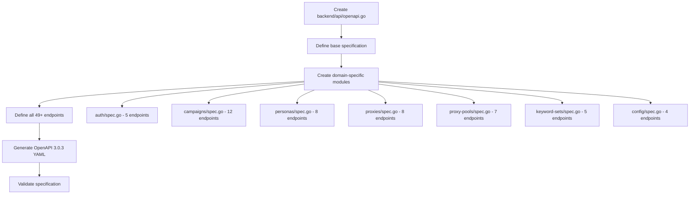
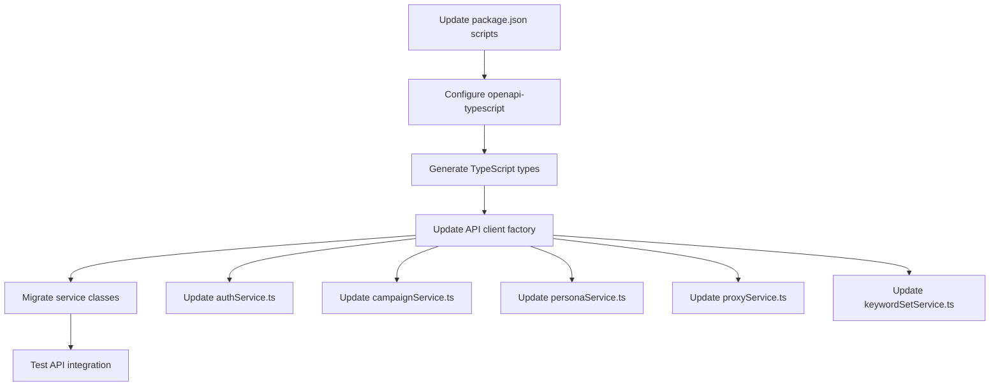

# Swaggo to Modern OpenAPI 3.0.3 Migration Plan

## Executive Summary

This document outlines a comprehensive migration strategy to replace the current swaggo-based API documentation system with a modern OpenAPI 3.0.3-compatible solution using kin-openapi for Go backend generation and openapi-typescript for frontend TypeScript client generation.

## Current State Analysis

### Backend Current State:
- **Swaggo Integration**: 49+ annotations across 6 API domains (Auth, Campaigns, Personas, Proxies, Proxy Pools, Keyword Sets, Config)
- **Dependencies**: `swaggo/swag` v1.16.4, `kin-openapi` v0.132.0 already available
- **Output**: Swagger 2.0 → Custom Python conversion → OpenAPI 3.0.3 YAML
- **Framework**: Gin with session-based authentication

### Frontend Current State:
- **Generator**: `@openapitools/openapi-generator-cli` v2.20.2 with typescript-axios
- **Available**: `openapi-typescript` v7.8.0 (unused)
- **Pattern**: Well-established API client factory with proper configuration
- **Auth**: Session-based with cookies, CSRF protection

## Migration Architecture

```mermaid
graph TB
    subgraph "Current (Swaggo)"
        A[Go Code with @Summary, @Tags annotations] --> B[swag init]
        B --> C[swagger.json Swagger 2.0]
        C --> D[Python conversion script]
        D --> E[openapi-3.yaml]
        E --> F[OpenAPI Generator typescript-axios]
        F --> G[Frontend TypeScript Client]
    end
    
    subgraph "Target (kin-openapi + openapi-typescript)"
        H[Go Code with Structured Specs] --> I[kin-openapi Manual Generation]
        I --> J[openapi-3.yaml OpenAPI 3.0.3]
        J --> K[openapi-typescript]
        K --> L[Frontend TypeScript Types]
        L --> M[Updated Client Factory]
    end
    
    style A fill:#ffcccc
    style B fill:#ffcccc
    style C fill:#ffcccc
    style D fill:#ffcccc
    style H fill:#ccffcc
    style I fill:#ccffcc
    style J fill:#ccffcc
    style K fill:#ccffcc
```



## Comprehensive Migration Plan

### Phase 1: Backend OpenAPI Specification Setup (2-3 days)

**1.1 Create Centralized OpenAPI Specification**
- Replace swaggo annotations with a centralized `backend/api/openapi.go` file
- Use `kin-openapi` to build the specification programmatically
- Define all paths, components, schemas, and security requirements

**1.2 Domain-Specific Specification Modules**
```
backend/api/
├── openapi.go          # Main specification builder
├── auth/               # Auth domain specs
├── campaigns/          # Campaign domain specs  
├── personas/           # Persona domain specs
├── proxies/            # Proxy domain specs
├── proxy-pools/        # Proxy pool domain specs
├── keyword-sets/       # Keyword set domain specs
└── config/             # Configuration domain specs
```

**1.3 Replace Swaggo Integration**
- Remove swaggo dependency from `go.mod`
- Update `main.go` to remove swaggo imports
- Create new generation command using kin-openapi

### Phase 2: Frontend Client Generation Migration (1-2 days)

**2.1 Switch to openapi-typescript**
- Update `package.json` scripts to use `openapi-typescript` instead of OpenAPI Generator
- Configure type generation for frontend consumption
- Maintain compatibility with existing API client factory pattern

**2.2 Update API Client Structure**
```
src/lib/api-client/
├── types.ts            # Generated types from openapi-typescript
├── client.ts           # Updated type-safe client
├── api/                # Domain-specific API classes
└── configuration.ts    # Updated configuration
```

### Phase 3: Comprehensive Implementation (3-4 days)

**3.1 API Domain Migration (Comprehensive Approach)**
- **Auth API**: Login, logout, refresh, me, change-password (5 endpoints)
- **Campaigns API**: CRUD, lifecycle, results (12 endpoints)  
- **Personas API**: CRUD, testing, type-specific (8 endpoints)
- **Proxies API**: CRUD, health checks, testing (8 endpoints)
- **Proxy Pools API**: CRUD, membership management (7 endpoints)
- **Keyword Sets API**: CRUD operations (5 endpoints)
- **Config API**: Feature flags, various configs (4 endpoints)

**3.2 Build Process Updates**
- Update all generation scripts in `scripts/`
- Modify `package.json` build commands
- Update CI/CD pipelines (if any)

### Phase 4: Testing & Validation (1-2 days)

**4.1 Contract Validation**
- Ensure OpenAPI 3.0.3 compliance
- Validate against existing API behavior
- Test frontend client compatibility

**4.2 Integration Testing**
- Test all API endpoints with new clients
- Verify session authentication works
- Validate error handling

## Detailed Implementation Steps

### Step 1: Backend Specification Generation



### Step 2: Frontend Client Migration



## Technical Implementation Details

### Backend: kin-openapi Specification Structure

```go
// backend/api/openapi.go
package api

import (
    "github.com/getkin/kin-openapi/openapi3"
    "github.com/fntelecomllc/studio/backend/api/auth"
    "github.com/fntelecomllc/studio/backend/api/campaigns"
    // ... other domain imports
)

func GenerateOpenAPISpec() *openapi3.T {
    spec := &openapi3.T{
        OpenAPI: "3.0.3",
        Info: &openapi3.Info{
            Title:       "DomainFlow API",
            Version:     "2.0.0",
            Description: "DomainFlow API for domain generation, validation, and campaign management.",
        },
        Servers: openapi3.Servers{
            {URL: "http://localhost:8080/api/v2", Description: "Development server"},
        },
    }

    // Initialize paths and components
    spec.Paths = openapi3.Paths{}
    spec.Components = &openapi3.Components{
        Schemas: make(openapi3.Schemas),
        SecuritySchemes: make(openapi3.SecuritySchemes),
    }

    // Add domain-specific specifications
    auth.AddAuthPaths(spec)
    campaigns.AddCampaignPaths(spec)
    // ... other domains

    return spec
}
```

### Frontend: openapi-typescript Configuration

```json
// package.json scripts update
{
  "scripts": {
    "api:generate-types": "openapi-typescript backend/docs/openapi-3.yaml -o src/lib/api-client/types.ts",
    "api:generate": "npm run api:generate-spec && npm run api:generate-types",
    "api:generate-spec": "cd backend && go run cmd/generate-openapi/main.go"
  }
}
```

### Updated Client Factory Pattern

```typescript
// src/lib/api-client/client.ts
import type { paths, components } from './types';

type ApiPaths = paths;
type ApiComponents = components;

export class ApiClient {
  // Type-safe methods using generated types
  async request<
    TPath extends keyof ApiPaths,
    TMethod extends keyof ApiPaths[TPath],
    TResponse = ApiPaths[TPath][TMethod] extends {
      responses: { 200: { content: { 'application/json': infer R } } }
    } ? R : unknown
  >(path: TPath, method: TMethod, options?: RequestOptions): Promise<TResponse>
}
```

## Risk Assessment & Mitigation

### High Risk Areas:
1. **Type Compatibility**: Frontend types may change significantly
   - **Mitigation**: Incremental testing, compatibility layers

2. **Authentication Flow**: Session handling must remain intact
   - **Mitigation**: Preserve existing auth patterns, extensive testing

3. **Complex Domain Models**: Campaigns and personas have complex nested structures
   - **Mitigation**: Careful schema definition, validation testing

### Medium Risk Areas:
1. **Build Process Changes**: Scripts and CI/CD may break
   - **Mitigation**: Parallel build processes during transition

2. **Developer Experience**: New workflow may be unfamiliar
   - **Mitigation**: Documentation, training, gradual rollout

### Low Risk Areas:
1. **Performance**: kin-openapi vs swaggo performance difference
   - **Mitigation**: Benchmarking, monitoring

## Rollback Strategy

1. **Phase-Based Rollback**: Can revert to swaggo at any phase boundary
2. **Parallel Builds**: Maintain both systems temporarily
3. **Git Branches**: Feature branch approach with merge protection
4. **Backup Specifications**: Keep existing swaggo annotations until validation complete

## Timeline

| Phase | Duration | Key Deliverables |
|-------|----------|------------------|
| Phase 1 | 2-3 days | kin-openapi specification system |
| Phase 2 | 1-2 days | openapi-typescript integration |
| Phase 3 | 3-4 days | Complete API migration (49+ endpoints) |
| Phase 4 | 1-2 days | Testing & validation |
| **Total** | **7-11 days** | Full swaggo replacement |

## Success Criteria

1. ✅ All 49+ API endpoints defined in OpenAPI 3.0.3
2. ✅ Frontend generates proper TypeScript types
3. ✅ Existing API client patterns preserved
4. ✅ Session authentication continues working
5. ✅ Build processes updated and functional
6. ✅ No breaking changes to frontend consumers
7. ✅ Performance equivalent or improved

## Dependencies & Prerequisites

### Tools Required:
- Go 1.23+ with kin-openapi v0.132.0+
- Node.js with openapi-typescript v7.8.0+
- Existing build tools (make, scripts)

### Knowledge Requirements:
- OpenAPI 3.0.3 specification format
- kin-openapi Go library usage
- TypeScript type generation patterns
- Existing codebase architecture

## Post-Migration Benefits

1. **Modern Standards**: Full OpenAPI 3.0.3 compliance
2. **Type Safety**: Improved TypeScript integration
3. **Maintainability**: Centralized specification management
4. **Flexibility**: Manual control over API documentation
5. **Performance**: Elimination of Python conversion step
6. **Developer Experience**: Better IDE support and validation

---

*This migration plan represents a comprehensive approach to modernizing the API documentation and client generation system while minimizing disruption to existing workflows and maintaining full compatibility with current authentication and API patterns.*