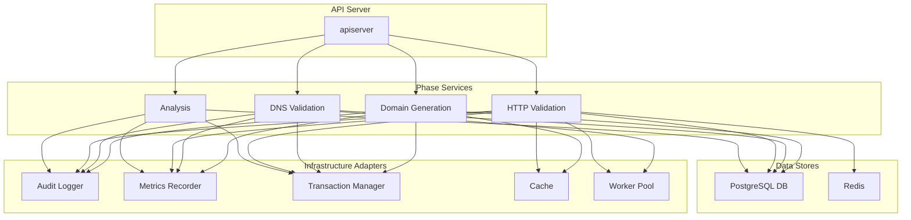

# Architecture & Flows

## Updated Dependency Diagram



## Sequence Diagram for Domain Generation

```mermaid
sequenceDiagram
    participant Client
    participant API Server
    participant Domain Generation Service
    participant DomainExpert
    participant Campaign Store
    participant SSE Service

    Client->>API Server: POST /campaigns (Configure)
    API Server->>Domain Generation Service: Configure(ctx, campaignID, config)
    Domain Generation Service->>DomainExpert: NewDomainGenerator(config)
    DomainExpert-->>Domain Generation Service: generator
    Domain Generation Service->>Campaign Store: SaveConfiguration(ctx, campaignID, config)
    Campaign Store-->>Domain Generation Service: success
    Domain Generation Service-->>API Server: success
    API Server-->>Client: 201 Created

    Client->>API Server: POST /campaigns/{id}/execute
    API Server->>Domain Generation Service: Execute(ctx, campaignID)
    Domain Generation Service->>DomainExpert: GenerateBatch(offset, batchSize)
    DomainExpert-->>Domain Generation Service: domains, nextOffset
    Domain Generation Service->>Campaign Store: CreateGeneratedDomains(ctx, domains)
    Campaign Store-->>Domain Generation Service: success
    Domain Generation Service->>Campaign Store: UpdateDomainsData(ctx, domains)
    Campaign Store-->>Domain Generation Service: success
    Domain Generation Service->>SSE Service: PublishProgress(progress)
    SSE Service-->>Client: SSE Event
    Domain Generation Service-->>API Server: progress channel
    API Server-->>Client: streaming progress
