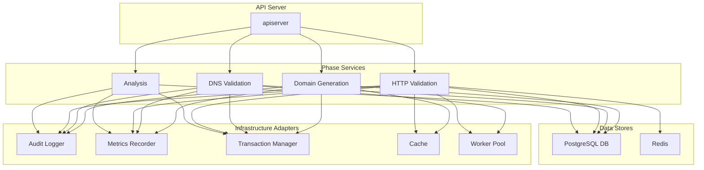

# Architecture & Flows

## Updated Dependency Diagram



## Consolidated Analysis/Extraction Pipeline

The system implements a unified pipeline for content extraction, feature materialization, reconciliation, and analysis scoring. This represents the final, steady-state architecture after consolidation of legacy dual-read approaches.

### Pipeline Flow

The consolidated pipeline follows this sequence:

1. **Discovery Phase**: Domain generation and initial crawl target identification
2. **HTTP Validation**: Domain accessibility and basic metadata collection  
3. **Feature Extraction**: Content analysis and structured feature materialization
4. **Reconciliation**: Cleanup of stuck/failed tasks and missing feature detection
5. **Analysis Scoring**: Relevance scoring based on extracted features
6. **Stale Score Detection**: Identification and re-scoring of outdated analysis results

### Core Components

#### Feature Extraction & Materialization

### Frontend SSE Client

Campaign dashboards consume the stream through `src/hooks/useSSE.ts`. The hook now:

- Selects the appropriate EventSource implementation at runtime (native, browser polyfill, or custom factory) so authenticated headers and local dev proxies keep working.
- Shares a single default registry of campaign event names with consumers while still allowing overrides via the hook options.
- Parses payloads defensively with JSON-shape detection and retries the connection automatically whenever three malformed events are received in a row.
- Tracks liveness via stale timers and reconnects with exponential backoff and jitter, resetting counters once messages resume.

Downstream hooks (`useCampaignSSE`, `useCampaignPhaseStream`) lean on this shared client, so any future hardening should land in `useSSE` first.

#### Reconciliation System
The extraction reconciler (`ExtractionReconciler`) handles:

#### Stale Score Detection
The stale score detector (`StaleScoreDetector`) identifies:
- Analysis scores older than `PIPELINE_STALE_SCORE_MAX_AGE`
- Where corresponding extraction features are newer than the score
- Automatically enqueues rescore jobs for detected stale scores

### Pipeline Configuration

Unified configuration via `PipelineConfig` loaded from environment variables:

| Environment Variable | Default | Purpose |
|---------------------|---------|---------|
| `ANALYSIS_FEATURE_TABLE_MIN_COVERAGE` | 0.9 | Minimum feature coverage ratio for analysis |
| `PIPELINE_RECONCILE_ENABLED` | true | Enable/disable reconciliation process |
| `PIPELINE_RECONCILE_INTERVAL` | 10m | Interval between reconciliation passes |
| `PIPELINE_STUCK_RUNNING_MAX_AGE` | 30m | Max age for running tasks before reset |
| `PIPELINE_STUCK_PENDING_MAX_AGE` | 20m | Max age for pending tasks before reset |
| `PIPELINE_MISSING_FEATURE_GRACE` | 5m | Grace period for feature materialization |
| `PIPELINE_MAX_RETRIES` | 3 | Maximum retry attempts per task |
| `PIPELINE_STALE_SCORE_DETECTION_ENABLED` | true | Enable stale score detection |
| `PIPELINE_STALE_SCORE_MAX_AGE` | 1h | Max age for analysis scores |

All values support duration strings (e.g., "30m", "1h") and are automatically clamped to reasonable ranges.

### Metrics & Observability

#### Pipeline Metrics
- `extraction_reconcile_pass_total{result}`: Reconciliation pass results (success/error/skipped)
- `extraction_reconcile_rows_examined_total{category}`: Rows examined by category
- `extraction_reconcile_rows_adjusted_total{action}`: Rows adjusted by action type
- `extraction_reconcile_latency_seconds`: Reconciliation pass duration
- `analysis_stale_scores_detected_total`: Count of stale scores detected
- `analysis_feature_table_coverage_ratio{campaign_id}`: Feature coverage per campaign

#### Safety & Reliability
- Single-flight protection prevents overlapping reconciliation passes
- Configurable timeouts (20s default) prevent runaway operations
- All database operations use parameterized queries with row limits (500 per category)
- Transactional updates ensure consistency
- Clock abstraction enables deterministic testing

## Sequence Diagram for Domain Generation

```mermaid
sequenceDiagram
    participant Client
    participant API Server
    participant Domain Generation Service
    participant DomainExpert
    participant Campaign Store
    participant SSE Service

    Client->>API Server: POST /campaigns (Configure)
    API Server->>Domain Generation Service: Configure(ctx, campaignID, config)
    Domain Generation Service->>DomainExpert: NewDomainGenerator(config)
    DomainExpert-->>Domain Generation Service: generator
    Domain Generation Service->>Campaign Store: SaveConfiguration(ctx, campaignID, config)
    Campaign Store-->>Domain Generation Service: success
    Domain Generation Service-->>API Server: success
    API Server-->>Client: 201 Created

    Client->>API Server: POST /campaigns/{id}/execute
    API Server->>Domain Generation Service: Execute(ctx, campaignID)
    Domain Generation Service->>DomainExpert: GenerateBatch(offset, batchSize)
    DomainExpert-->>Domain Generation Service: domains, nextOffset
    Domain Generation Service->>Campaign Store: CreateGeneratedDomains(ctx, domains)
    Campaign Store-->>Domain Generation Service: success
    Domain Generation Service->>Campaign Store: UpdateDomainsData(ctx, domains)
    Campaign Store-->>Domain Generation Service: success
    Domain Generation Service->>SSE Service: PublishProgress(progress)
    SSE Service-->>Client: SSE Event
    Domain Generation Service-->>API Server: progress channel
    API Server-->>Client: streaming progress
