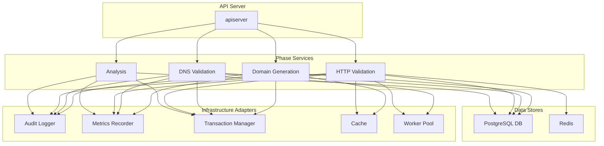

# Architecture & Flows

## Updated Dependency Diagram



## Extraction → Analysis Redesign (Phase P0/P1 Integration)

The new extraction feature pipeline introduces canonical, versioned feature rows decoupling HTML parsing from scoring.

### New Persistence Artifacts (Migration 000055)
- `domain_extraction_features` (one row per campaign+domain)
- `domain_extracted_keywords` (optional detail rows per keyword)
- `analysis_ready_features` view (projection used by analysis phase in future dual-read mode)

### Feature Flags / Env Vars
| Flag | Default | Purpose |
|------|---------|---------|
| `EXTRACTION_FEATURE_TABLE_ENABLED` | false | Gate writes to new feature tables (safe shadow mode) |
| `EXTRACTION_KEYWORD_DETAIL_ENABLED` | false | Persist keyword detail rows (P2 onward) |
| `ANALYSIS_DUAL_READ` | false | Future: compare legacy scoring vs new feature-table driven scoring |
| `DUAL_READ_VARIANCE_THRESHOLD` | 0.25 | Threshold for high variance detection in dual-read mode |

Flags follow existing pattern: set to `1`, `true`, or `on` (case-insensitive) to enable.

### Dual-Read Variance Telemetry

When `ANALYSIS_DUAL_READ=true`, the system performs shadow comparisons between legacy feature_vector scoring and new analysis_ready_features scoring paths. To accelerate diagnostic capabilities and comparison analysis, variance telemetry provides structured observability:

**Metrics Emitted**:
- `analysis_dualread_campaigns_total`: Counter incremented once per rescore run with dual read enabled
- `analysis_dualread_domains_compared_total`: Counter of total domain comparisons performed  
- `analysis_dualread_high_variance_domains_total`: Counter of domains exceeding variance threshold
- `analysis_dualread_domain_variance`: Histogram capturing absolute variance ratios with configurable buckets (0, .05, .1, .15, .2, .25, .3, .4, .5, 1)

**Structured Logging**: High variance domains (>= threshold) trigger Info-level logs with structured fields including domain, scores, variance ratio, and correlation ID for traceability.

**SSE Events**: Campaign completion emits `dualread_variance_summary` events containing aggregated variance statistics for real-time dashboard updates.

**Memory Management**: Detailed diff collection is capped at 50 domains per campaign to prevent memory issues during large rescoring operations.

**Purpose**: This telemetry enables rapid identification of scoring discrepancies during the migration from legacy to new feature extraction paths, supporting data-driven rollout decisions and regression detection.

### Package Scaffold
`internal/extraction` provides:
- Pure aggregation stub (`BuildFeatures`) returning a minimal `FeatureAggregate`.
- Upsert helpers (`UpsertFeatureRow`, `TransitionReady`, `TransitionError`).
- Flag helpers for gating.

### Next Steps (High-Level)
1. Expand `BuildFeatures` to compute full richness & microcrawl metrics.
2. Integrate extraction sub-steps (http_fetch, primary_parse, microcrawl) feeding `RawSignals`.
3. Implement batch keyword detail persistence behind detail flag.
4. Add reconciliation job for stuck `building` rows.
5. Introduce dual-read scoring path and delta instrumentation.

### Rollback
Disabling `EXTRACTION_FEATURE_TABLE_ENABLED` halts new writes; legacy path (generated_domains feature_vector) remains unaffected. Migration reversible via 000055 down script.

## Sequence Diagram for Domain Generation

```mermaid
sequenceDiagram
    participant Client
    participant API Server
    participant Domain Generation Service
    participant DomainExpert
    participant Campaign Store
    participant SSE Service

    Client->>API Server: POST /campaigns (Configure)
    API Server->>Domain Generation Service: Configure(ctx, campaignID, config)
    Domain Generation Service->>DomainExpert: NewDomainGenerator(config)
    DomainExpert-->>Domain Generation Service: generator
    Domain Generation Service->>Campaign Store: SaveConfiguration(ctx, campaignID, config)
    Campaign Store-->>Domain Generation Service: success
    Domain Generation Service-->>API Server: success
    API Server-->>Client: 201 Created

    Client->>API Server: POST /campaigns/{id}/execute
    API Server->>Domain Generation Service: Execute(ctx, campaignID)
    Domain Generation Service->>DomainExpert: GenerateBatch(offset, batchSize)
    DomainExpert-->>Domain Generation Service: domains, nextOffset
    Domain Generation Service->>Campaign Store: CreateGeneratedDomains(ctx, domains)
    Campaign Store-->>Domain Generation Service: success
    Domain Generation Service->>Campaign Store: UpdateDomainsData(ctx, domains)
    Campaign Store-->>Domain Generation Service: success
    Domain Generation Service->>SSE Service: PublishProgress(progress)
    SSE Service-->>Client: SSE Event
    Domain Generation Service-->>API Server: progress channel
    API Server-->>Client: streaming progress
