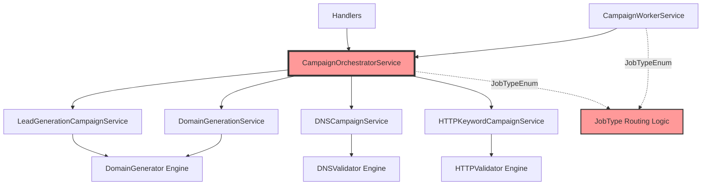
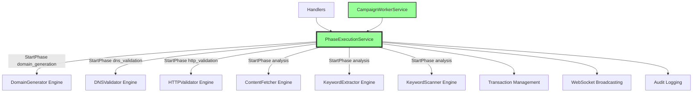

# Architecture Transformation: Before vs After

## Current Architecture (Problems)



### Problems:
- **Red boxes show problematic areas**
- CampaignOrchestratorService: 2688-line monolith
- Dual JobTypeEnum routing (orchestrator + worker)
- Three service layers with unclear boundaries
- Service intermediaries between phase logic and engines

## Target Architecture (Clean)



### Benefits:
- **Green boxes show clean architecture**
- Single service with clear responsibilities
- Direct engine integration (no intermediaries)
- Unified StartPhase() entry point
- No JobTypeEnum routing complexity
- Clean separation of concerns

## Migration Strategy

```mermaid
graph LR
    A[Phase 1: Enhance LeadGenerationCampaignService] --> B[Phase 2: Direct Engine Integration]
    B --> C[Phase 3: Update Dependencies] 
    C --> D[Phase 4: Remove Orchestrator]
    
    A1[Add transaction management] -.-> A
    A2[Add lifecycle methods] -.-> A
    A3[Add CRUD operations] -.-> A
    
    B1[Replace service delegation] -.-> B
    B2[Add direct engine calls] -.-> B
    B3[Add error handling] -.-> B
    
    C1[Update handlers] -.-> C
    C2[Update worker service] -.-> C
    C3[Update main.go] -.-> C
    
    D1[Remove orchestrator files] -.-> D
    D2[Remove JobTypeEnum] -.-> D
    D3[Test everything] -.-> D