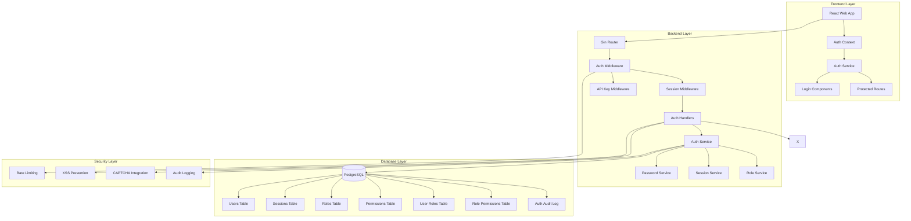
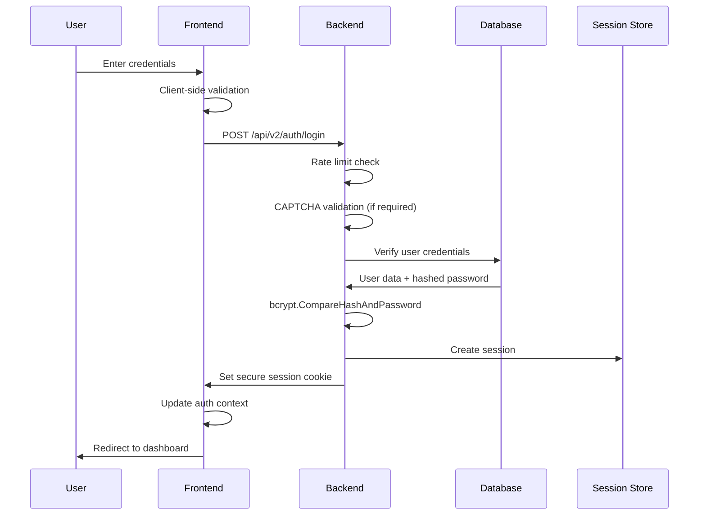
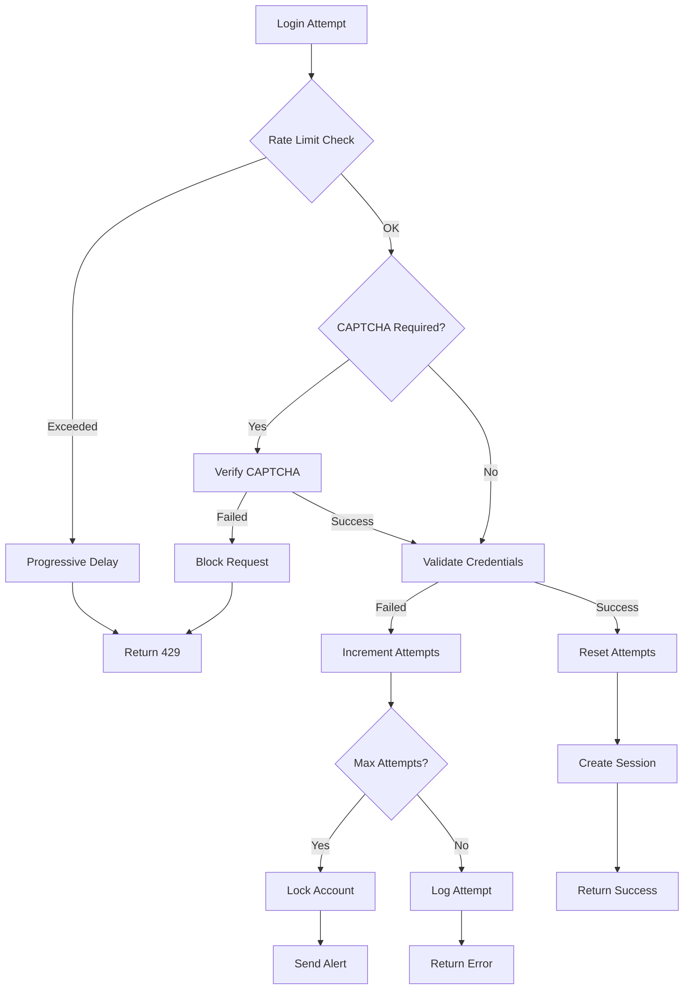

# DomainFlow Secure Authentication System Architecture

## Executive Summary

This document outlines the comprehensive secure authentication system architecture for DomainFlow web application. The design maintains the existing API key authentication for programmatic API access while introducing a robust user authentication system for the web interface, featuring enterprise-grade security practices including bcrypt password hashing, session management, role-based access control (RBAC), and multi-layered security protections.

## Architecture Overview



## 1. Authentication Architecture Design

### 1.1 Dual Authentication System

**API Key Authentication (Existing)**
- Maintains current API key system for programmatic access
- Used for `/api/v2/*` endpoints requiring API access
- Bearer token format: `Authorization: Bearer <api_key>`

**Session-Based Web Authentication (New)**
- Cookie-based sessions for web interface
- Secure session management with httpOnly, secure, sameSite cookies
- Automatic session refresh and cleanup

### 1.2 Authentication Flow



### 1.3 Password Security

**Bcrypt Implementation**
- Minimum 12 salt rounds (configurable up to 15)
- Pepper encryption using AES-256-GCM
- Password complexity requirements:
  - Minimum 12 characters
  - Mixed case letters, numbers, special characters
  - No common passwords (dictionary check)

### 1.4 Session Management

**Session Configuration**
```go
type SessionConfig struct {
    Name           string        `json:"name"`           // "domainflow_session"
    Domain         string        `json:"domain"`         // ".domainflow.com"
    Path           string        `json:"path"`           // "/"
    MaxAge         time.Duration `json:"maxAge"`         // 24 hours
    Secure         bool          `json:"secure"`         // true in production
    HttpOnly       bool          `json:"httpOnly"`       // true
    SameSite       http.SameSite `json:"sameSite"`       // SameSiteStrictMode
    SessionTimeout time.Duration `json:"sessionTimeout"` // 30 minutes idle
}
```

## 2. Database Schema Design

### 2.1 Authentication Tables

```sql
-- Users table
CREATE TABLE auth.users (
    id UUID PRIMARY KEY DEFAULT gen_random_uuid(),
    email VARCHAR(255) UNIQUE NOT NULL,
    email_verified BOOLEAN DEFAULT FALSE,
    email_verification_token VARCHAR(255),
    email_verification_expires_at TIMESTAMP,
    password_hash VARCHAR(255) NOT NULL,
    password_pepper_version INTEGER DEFAULT 1,
    first_name VARCHAR(100) NOT NULL,
    last_name VARCHAR(100) NOT NULL,
    avatar_url TEXT,
    is_active BOOLEAN DEFAULT TRUE,
    is_locked BOOLEAN DEFAULT FALSE,
    failed_login_attempts INTEGER DEFAULT 0,
    locked_until TIMESTAMP,
    last_login_at TIMESTAMP,
    last_login_ip INET,
    password_changed_at TIMESTAMP DEFAULT CURRENT_TIMESTAMP,
    must_change_password BOOLEAN DEFAULT FALSE,
    created_at TIMESTAMP DEFAULT CURRENT_TIMESTAMP,
    updated_at TIMESTAMP DEFAULT CURRENT_TIMESTAMP
);

-- Sessions table
CREATE TABLE auth.sessions (
    id VARCHAR(128) PRIMARY KEY,
    user_id UUID NOT NULL REFERENCES auth.users(id) ON DELETE CASCADE,
    ip_address INET,
    user_agent TEXT,
    is_active BOOLEAN DEFAULT TRUE,
    expires_at TIMESTAMP NOT NULL,
    last_activity_at TIMESTAMP DEFAULT CURRENT_TIMESTAMP,
    created_at TIMESTAMP DEFAULT CURRENT_TIMESTAMP,
    
    INDEX idx_sessions_user_id (user_id),
    INDEX idx_sessions_expires_at (expires_at),
    INDEX idx_sessions_active (is_active, expires_at)
);

-- Roles table
CREATE TABLE auth.roles (
    id UUID PRIMARY KEY DEFAULT gen_random_uuid(),
    name VARCHAR(50) UNIQUE NOT NULL,
    display_name VARCHAR(100) NOT NULL,
    description TEXT,
    is_system_role BOOLEAN DEFAULT FALSE,
    created_at TIMESTAMP DEFAULT CURRENT_TIMESTAMP,
    updated_at TIMESTAMP DEFAULT CURRENT_TIMESTAMP
);

-- Permissions table
CREATE TABLE auth.permissions (
    id UUID PRIMARY KEY DEFAULT gen_random_uuid(),
    name VARCHAR(100) UNIQUE NOT NULL,
    display_name VARCHAR(150) NOT NULL,
    description TEXT,
    resource VARCHAR(50) NOT NULL, -- campaigns, personas, proxies, etc.
    action VARCHAR(20) NOT NULL,   -- create, read, update, delete, execute
    created_at TIMESTAMP DEFAULT CURRENT_TIMESTAMP,
    
    UNIQUE(resource, action)
);

-- User roles junction table
CREATE TABLE auth.user_roles (
    user_id UUID NOT NULL REFERENCES auth.users(id) ON DELETE CASCADE,
    role_id UUID NOT NULL REFERENCES auth.roles(id) ON DELETE CASCADE,
    assigned_by UUID REFERENCES auth.users(id),
    assigned_at TIMESTAMP DEFAULT CURRENT_TIMESTAMP,
    expires_at TIMESTAMP,
    
    PRIMARY KEY (user_id, role_id),
    INDEX idx_user_roles_user_id (user_id),
    INDEX idx_user_roles_role_id (role_id)
);

-- Role permissions junction table
CREATE TABLE auth.role_permissions (
    role_id UUID NOT NULL REFERENCES auth.roles(id) ON DELETE CASCADE,
    permission_id UUID NOT NULL REFERENCES auth.permissions(id) ON DELETE CASCADE,
    
    PRIMARY KEY (role_id, permission_id),
    INDEX idx_role_permissions_role_id (role_id),
    INDEX idx_role_permissions_permission_id (permission_id)
);

-- Password reset tokens
CREATE TABLE auth.password_reset_tokens (
    id UUID PRIMARY KEY DEFAULT gen_random_uuid(),
    user_id UUID NOT NULL REFERENCES auth.users(id) ON DELETE CASCADE,
    token_hash VARCHAR(255) NOT NULL,
    expires_at TIMESTAMP NOT NULL,
    used_at TIMESTAMP,
    ip_address INET,
    user_agent TEXT,
    created_at TIMESTAMP DEFAULT CURRENT_TIMESTAMP,
    
    INDEX idx_password_reset_user_id (user_id),
    INDEX idx_password_reset_expires (expires_at)
);

-- Authentication audit log
CREATE TABLE auth.auth_audit_log (
    id BIGSERIAL PRIMARY KEY,
    user_id UUID REFERENCES auth.users(id),
    session_id VARCHAR(128),
    event_type VARCHAR(50) NOT NULL, -- login, logout, password_change, etc.
    event_status VARCHAR(20) NOT NULL, -- success, failure, blocked
    ip_address INET,
    user_agent TEXT,
    details JSONB,
    risk_score INTEGER DEFAULT 0,
    created_at TIMESTAMP DEFAULT CURRENT_TIMESTAMP,
    
    INDEX idx_auth_audit_user_id (user_id),
    INDEX idx_auth_audit_event_type (event_type),
    INDEX idx_auth_audit_created_at (created_at),
    INDEX idx_auth_audit_risk_score (risk_score)
);

-- Rate limiting table
CREATE TABLE auth.rate_limits (
    id BIGSERIAL PRIMARY KEY,
    identifier VARCHAR(255) NOT NULL, -- IP address or user ID
    action VARCHAR(50) NOT NULL,      -- login, password_reset, etc.
    attempts INTEGER DEFAULT 1,
    window_start TIMESTAMP DEFAULT CURRENT_TIMESTAMP,
    blocked_until TIMESTAMP,
    
    UNIQUE(identifier, action),
    INDEX idx_rate_limits_identifier (identifier),
    INDEX idx_rate_limits_blocked_until (blocked_until)
);
```

### 2.2 Default Data Seeding

```sql
-- Default roles
INSERT INTO auth.roles (name, display_name, description, is_system_role) VALUES
('super_admin', 'Super Administrator', 'Full system access with all permissions', true),
('admin', 'Administrator', 'Administrative access to most system functions', true),
('campaign_manager', 'Campaign Manager', 'Can create and manage campaigns', false),
('analyst', 'Analyst', 'Read-only access to campaigns and reports', false),
('user', 'User', 'Basic user access', false);

-- Default permissions
INSERT INTO auth.permissions (name, display_name, description, resource, action) VALUES
-- Campaign permissions
('campaigns.create', 'Create Campaigns', 'Create new campaigns', 'campaigns', 'create'),
('campaigns.read', 'View Campaigns', 'View campaign details and results', 'campaigns', 'read'),
('campaigns.update', 'Edit Campaigns', 'Modify existing campaigns', 'campaigns', 'update'),
('campaigns.delete', 'Delete Campaigns', 'Remove campaigns from system', 'campaigns', 'delete'),
('campaigns.execute', 'Execute Campaigns', 'Start and stop campaign execution', 'campaigns', 'execute'),

-- Persona permissions
('personas.create', 'Create Personas', 'Create new personas', 'personas', 'create'),
('personas.read', 'View Personas', 'View persona configurations', 'personas', 'read'),
('personas.update', 'Edit Personas', 'Modify existing personas', 'personas', 'update'),
('personas.delete', 'Delete Personas', 'Remove personas from system', 'personas', 'delete'),

-- Proxy permissions
('proxies.create', 'Create Proxies', 'Add new proxy configurations', 'proxies', 'create'),
('proxies.read', 'View Proxies', 'View proxy configurations and status', 'proxies', 'read'),
('proxies.update', 'Edit Proxies', 'Modify existing proxy configurations', 'proxies', 'update'),
('proxies.delete', 'Delete Proxies', 'Remove proxy configurations', 'proxies', 'delete'),

-- System permissions
('system.admin', 'System Administration', 'Full system administration access', 'system', 'admin'),
('system.config', 'System Configuration', 'Modify system configuration', 'system', 'config'),
('system.users', 'User Management', 'Manage user accounts and permissions', 'system', 'users'),
('system.audit', 'Audit Logs', 'View system audit logs', 'system', 'audit');

-- Default admin user (password: TempPassword123!)
INSERT INTO auth.users (id, email, password_hash, first_name, last_name, is_active, must_change_password) VALUES
('00000000-0000-0000-0000-000000000001', 'admin@domainflow.local', '$2a$12$LQv3c1yqBWVHxkd0LHAkCOYz6TtxMQJqhN8/LewdBPj3bp.Gm.QBG', 'System', 'Administrator', true, true);

-- Assign super_admin role to default admin
INSERT INTO auth.user_roles (user_id, role_id) 
SELECT '00000000-0000-0000-0000-000000000001', id FROM auth.roles WHERE name = 'super_admin';
```

## 3. Security Architecture

### 3.1 Multi-layered Brute Force Protection



**Rate Limiting Strategy**
- **Level 1**: IP-based rate limiting (10 attempts per 15 minutes)
- **Level 2**: User-based rate limiting (5 attempts per 15 minutes)
- **Level 3**: Progressive delays (1s, 2s, 4s, 8s, 16s, 30s)
- **Level 4**: Account lockout (15 minutes after 5 failed attempts)
- **Level 5**: CAPTCHA requirement (after 3 failed attempts)

### 3.2 XSS Prevention

**Content Security Policy (CSP)**
```
Content-Security-Policy: 
  default-src 'self';
  script-src 'self' 'unsafe-inline' https://apis.google.com;
  style-src 'self' 'unsafe-inline' https://fonts.googleapis.com;
  font-src 'self' https://fonts.gstatic.com;
  img-src 'self' data: https:;
  connect-src 'self' wss: https:;
  frame-ancestors 'none';
  base-uri 'self';
  form-action 'self';
```

**Input Sanitization**
- HTML sanitization using `bluemonday` library
- SQL injection prevention with parameterized queries
- JSON input validation with struct tags

### 3.4 CAPTCHA Integration

**Google reCAPTCHA v3 Integration Points**
- Login form (after 3 failed attempts)
- Password reset form
- User registration form
- Sensitive operations (role changes, password changes)

## 4. API Endpoint Specifications

### 4.1 Authentication Endpoints

```yaml
# Authentication API Specification
paths:
  /api/v2/auth/login:
    post:
      summary: User login
      requestBody:
        required: true
        content:
          application/json:
            schema:
              type: object
              required: [email, password]
              properties:
                email:
                  type: string
                  format: email
                password:
                  type: string
                  minLength: 12
                rememberMe:
                  type: boolean
                  default: false
                captchaToken:
                  type: string
      responses:
        200:
          description: Login successful
          headers:
            Set-Cookie:
              description: Session cookie
              schema:
                type: string
          content:
            application/json:
              schema:
                type: object
                properties:
                  success:
                    type: boolean
                  user:
                    $ref: '#/components/schemas/User'
        401:
          description: Invalid credentials
        429:
          description: Rate limit exceeded
        423:
          description: Account locked

  /api/v2/auth/logout:
    post:
      summary: User logout
      security:
        - sessionAuth: []
      responses:
        200:
          description: Logout successful

  /api/v2/me:
    get:
      summary: Get current user
      security:
        - sessionAuth: []
      responses:
        200:
          description: Current user information
          content:
            application/json:
              schema:
                $ref: '#/components/schemas/User'

  /api/v2/auth/change-password:
    post:
      summary: Change password (authenticated)
      security:
        - sessionAuth: []
      requestBody:
        required: true
        content:
          application/json:
            schema:
              type: object
              required: [currentPassword, newPassword]
              properties:
                currentPassword:
                  type: string
                newPassword:
                  type: string
                  minLength: 12
      responses:
        200:
          description: Password changed successfully
        400:
          description: Invalid current password
```

### 4.2 User Management Endpoints

```yaml
  /api/v2/users:
    get:
      summary: List users (admin only)
      security:
        - sessionAuth: []
      parameters:
        - name: page
          in: query
          schema:
            type: integer
            default: 1
        - name: limit
          in: query
          schema:
            type: integer
            default: 20
        - name: search
          in: query
          schema:
            type: string
      responses:
        200:
          description: List of users
          content:
            application/json:
              schema:
                type: object
                properties:
                  users:
                    type: array
                    items:
                      $ref: '#/components/schemas/User'
                  pagination:
                    $ref: '#/components/schemas/Pagination'

    post:
      summary: Create user (admin only)
      security:
        - sessionAuth: []
      requestBody:
        required: true
        content:
          application/json:
            schema:
              $ref: '#/components/schemas/CreateUserRequest'
      responses:
        201:
          description: User created successfully
        400:
          description: Validation error
        409:
          description: Email already exists

  /api/v2/users/{userId}:
    get:
      summary: Get user by ID
      security:
        - sessionAuth: []
      parameters:
        - name: userId
          in: path
          required: true
          schema:
            type: string
            format: uuid
      responses:
        200:
          description: User information
          content:
            application/json:
              schema:
                $ref: '#/components/schemas/User'

    put:
      summary: Update user
      security:
        - sessionAuth: []
      parameters:
        - name: userId
          in: path
          required: true
          schema:
            type: string
            format: uuid
      requestBody:
        required: true
        content:
          application/json:
            schema:
              $ref: '#/components/schemas/UpdateUserRequest'
      responses:
        200:
          description: User updated successfully

    delete:
      summary: Delete user (admin only)
      security:
        - sessionAuth: []
      parameters:
        - name: userId
          in: path
          required: true
          schema:
            type: string
            format: uuid
      responses:
        204:
          description: User deleted successfully
```

## 5. Frontend Component Architecture

### 5.1 Authentication Context Enhancement

```typescript
// Enhanced AuthContext with comprehensive security features
interface AuthContextType extends AuthState {
  // Authentication methods
  login: (credentials: LoginCredentials) => Promise<AuthResult>;
  logout: () => Promise<void>;
  refreshSession: () => Promise<boolean>;
  
  // Password management
  changePassword: (currentPassword: string, newPassword: string) => Promise<AuthResult>;
  
  // Permission checking
  hasPermission: (permission: string) => boolean;
  hasRole: (role: string) => boolean;
  hasAnyRole: (roles: string[]) => boolean;
  hasAllPermissions: (permissions: string[]) => boolean;
  canAccess: (resource: string, action: string) => boolean;
  
  // Security features
  isSessionValid: () => boolean;
  getSessionTimeRemaining: () => number;
  extendSession: () => Promise<boolean>;
  
  // State management
  isInitialized: boolean;
  securityContext: SecurityContext;
}

interface SecurityContext {
  sessionId: string;
  lastActivity: Date;
  sessionExpiry: Date;
  requiresPasswordChange: boolean;
  mfaEnabled: boolean;
  riskScore: number;
}
```

### 5.2 Enhanced Login Component

```typescript
// LoginForm component with comprehensive security features
interface LoginFormProps {
  onSuccess?: (user: AuthUser) => void;
  onError?: (error: string) => void;
  redirectTo?: string;
  showRememberMe?: boolean;
  enableCaptcha?: boolean;
}

const LoginForm: React.FC<LoginFormProps> = ({
  onSuccess,
  onError,
  redirectTo = '/dashboard',
  showRememberMe = true,
  enableCaptcha = false
}) => {
  const [formData, setFormData] = useState<LoginFormData>({
    email: '',
    password: '',
    rememberMe: false,
    captchaToken: ''
  });
  
  const [formState, setFormState] = useState<LoginFormState>({
    isLoading: false,
    errors: {},
    showCaptcha: false,
    attemptCount: 0,
    isLocked: false,
    lockoutTime: null
  });
  
  // Client-side validation
  const validateForm = useCallback((data: LoginFormData): ValidationErrors => {
    const errors: ValidationErrors = {};
    
    if (!data.email) {
      errors.email = 'Email is required';
    } else if (!isValidEmail(data.email)) {
      errors.email = 'Please enter a valid email address';
    }
    
    if (!data.password) {
      errors.password = 'Password is required';
    } else if (data.password.length < 12) {
      errors.password = 'Password must be at least 12 characters';
    }
    
    if (formState.showCaptcha && !data.captchaToken) {
      errors.captcha = 'Please complete the CAPTCHA verification';
    }
    
    return errors;
  }, [formState.showCaptcha]);
  
  // Enhanced form submission with security features
  const handleSubmit = useCallback(async (e: React.FormEvent) => {
    e.preventDefault();
    
    const errors = validateForm(formData);
    if (Object.keys(errors).length > 0) {
      setFormState(prev => ({ ...prev, errors }));
      return;
    }
    
    setFormState(prev => ({ 
      ...prev, 
      isLoading: true, 
      errors: {} 
    }));
    
    try {
      const result = await authService.login(formData);
      
      if (result.success) {
        onSuccess?.(result.user!);
        router.push(redirectTo);
      } else {
        handleLoginError(result.error!);
      }
    } catch (error) {
      handleLoginError('Network error. Please try again.');
    } finally {
      setFormState(prev => ({ ...prev, isLoading: false }));
    }
  }, [formData, validateForm, onSuccess, redirectTo]);
  
  const handleLoginError = useCallback((error: string) => {
    setFormState(prev => {
      const newAttemptCount = prev.attemptCount + 1;
      const shouldShowCaptcha = newAttemptCount >= 3;
      const isLocked = error.includes('locked') || error.includes('429');
      
      return {
        ...prev,
        attemptCount: newAttemptCount,
        showCaptcha: shouldShowCaptcha,
        isLocked,
        errors: { general: error }
      };
    });
    
    onError?.(error);
  }, [onError]);
  
  return (
    <form onSubmit={handleSubmit} className="space-y-6">
      {/* Email field with validation */}
      <div>
        <label htmlFor="email" className="block text-sm font-medium text-gray-700">
          Email Address
        </label>
        <input
          id="email"
          name="email"
          type="email"
          autoComplete="email"
          required
          value={formData.email}
          onChange={(e) => setFormData(prev => ({ ...prev, email: e.target.value }))}
          className={`mt-1 block w-full px-3 py-2 border rounded-md shadow-sm focus:outline-none focus:ring-blue-500 focus:border-blue-500 ${
            formState.errors.email ? 'border-red-300' : 'border-gray-300'
          }`}
          disabled={formState.isLoading || formState.isLocked}
        />
        {formState.errors.email && (
          <p className="mt-1 text-sm text-red-600">{formState.errors.email}</p>
        )}
      </div>
      
      {/* Password field with validation */}
      <div>
        <label htmlFor="password" className="block text-sm font-medium text-gray-700">
          Password
        </label>
        <input
          id="password"
          name="password"
          type="password"
          autoComplete="current-password"
          required
          value={formData.password}
          onChange={(e) => setFormData(prev => ({ ...prev, password: e.target.value }))}
          className={`mt-1 block w-full px-3 py-2 border rounded-md shadow-sm focus:outline-none focus:ring-blue-500 focus:border-blue-500 ${
            formState.errors.password ? 'border-red-300' : 'border-gray-300'
          }`}
          disabled={formState.isLoading || formState.isLocked}
        />
        {formState.errors.password && (
          <p className="mt-1 text-sm text-red-600">{formState.errors.password}</p>
        )}
      </div>
      
      {/* CAPTCHA component */}
      {formState.showCaptcha && (
        <div>
          <ReCAPTCHA
            sitekey={process.env.NEXT_PUBLIC_RECAPTCHA_SITE_KEY!}
            onChange={(token) => setFormData(prev => ({ ...prev, captchaToken: token || '' }))}
          />
          {formState.errors.captcha && (
            <p className="mt-1 text-sm text-red-600">{formState.errors.captcha}</p>
          )}
        </div>
      )}
      
      {/* Remember me checkbox */}
      {showRememberMe && (
        <div className="flex items-center">
          <input
            id="remember-me"
            name="remember-me"
            type="checkbox"
            checked={formData.rememberMe}
            onChange={(e) => setFormData(prev => ({ ...prev, rememberMe: e.target.checked }))}
            className="h-4 w-4 text-blue-600 focus:ring-blue-500 border-gray-300 rounded"
            disabled={formState.isLoading || formState.isLocked}
          />
          <label htmlFor="remember-me" className="ml-2 block text-sm text-gray-900">
            Remember me for 30 days
          </label>
        </div>
      )}
      
      {/* General error message */}
      {formState.errors.general && (
        <div className="rounded-md bg-red-50 p-4">
          <p className="text-sm text-red-800">{formState.errors.general}</p>
        </div>
      )}
      
      {/* Account lockout message */}
      {formState.isLocked && formState.lockoutTime && (
        <div className="rounded-md bg-yellow-50 p-4">
          <p className="text-sm text-yellow-800">
            Account temporarily locked. Please try again after {formatLockoutTime(formState.lockoutTime)}.
          </p>
        </div>
      )}
      
      {/* Submit button */}
      <div>
        <button
          type="submit"
          disabled={formState.isLoading || formState.isLocked}
          className={`group relative w-full flex justify-center py-2 px-4 border border-transparent text-sm font-medium rounded-md text-white ${
            formState.isLoading || formState.isLocked
              ? 'bg-gray-400 cursor-not-allowed'
              : 'bg-