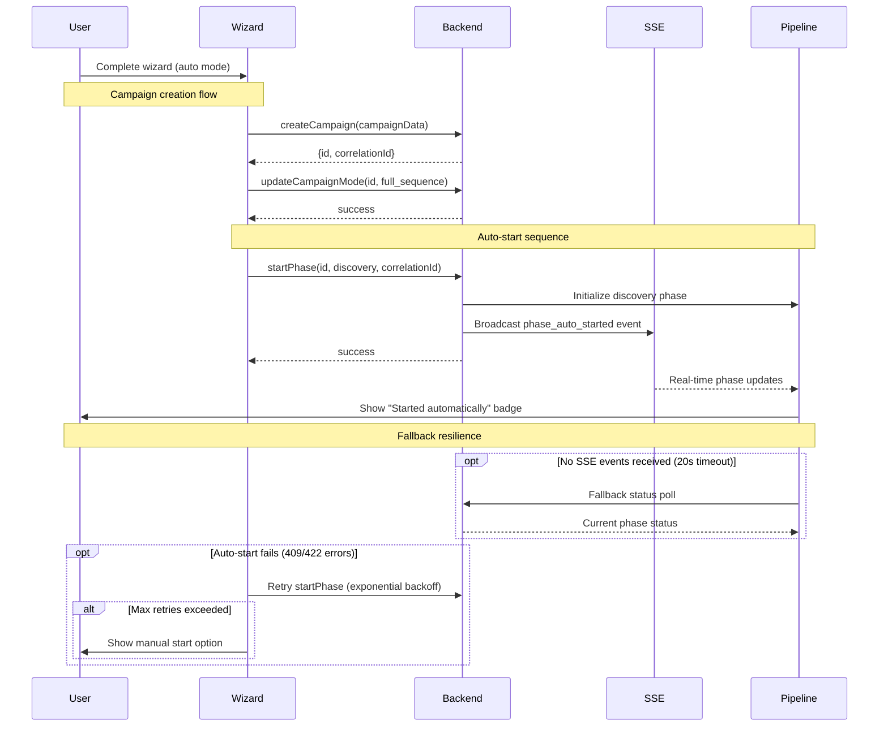

# Campaign Creation Wizard Auto-Start Feature

## Overview

The Campaign Creation Wizard now supports automatic pipeline startup for campaigns created in "Full Auto" mode. This feature provides a streamlined user experience by automatically initiating the discovery phase immediately after campaign creation.

## Execution Modes

### Manual Mode
- **Description**: Traditional step-by-step campaign execution
- **User Control**: Users manually start each phase after configuring it
- **Best For**: Users who want full control over timing and execution
- **Backend Mode**: `step_by_step`

### Full Auto Mode  
- **Description**: Automated pipeline execution with auto-start capability
- **Auto-Start**: Automatically starts the discovery phase after campaign creation
- **User Control**: Users can still manually control subsequent phases or let auto-advance handle them
- **Best For**: Users who want quick campaign startup with minimal manual intervention
- **Backend Mode**: `full_sequence`

## Auto-Start Logic Implementation

### Workflow
1. User completes wizard and selects "Full Auto" execution mode
2. Campaign is created via `createCampaign` API
3. Campaign mode is set to `full_sequence` via `updateCampaignMode` API
4. **Auto-start trigger**: `startPhase` API is called with `phase: 'discovery'`
5. User receives success feedback and is redirected to campaign detail page

### Sequence Diagram



### Error Handling
- **Graceful Failure**: If auto-start fails, campaign creation still succeeds
- **User Feedback**: Clear messaging distinguishes between creation success and auto-start failure
- **Manual Recovery**: Users can manually start the discovery phase if auto-start fails

### Loading States
- **Creating...**: During campaign creation and mode setting
- **Starting Campaign...**: During auto-start phase
- **Disabled UI**: Prevents multiple submissions during the process

## Code Implementation

### Key Files Modified
- `src/components/refactor/campaign/CampaignCreateWizard.tsx`
  - Added `useStartPhaseStandaloneMutation` hook
  - Implemented auto-start logic in `handleSubmit` function
  - Enhanced loading states and user feedback

### API Integration
```typescript
// Auto-start logic for full auto mode
if (wizardState.goal.executionMode === 'auto') {
  try {
    await startPhase({
      campaignId,
      phase: 'discovery'
    }).unwrap();
    
    toast({
      title: "Campaign Created & Started",
      description: "Campaign has been created and discovery phase started automatically.",
    });
  } catch (startError) {
    // Graceful fallback - campaign still created successfully
    toast({
      title: "Campaign Created",
      description: "Campaign created successfully, but auto-start failed. You can start manually.",
      variant: 'default'
    });
  }
}
```

## User Experience

### Success Flow (Auto Mode)
1. User completes wizard
2. Sees "Starting Campaign..." loading state
3. Receives "Campaign Created & Started" success message
4. Redirected to campaign detail page with discovery phase running

### Error Recovery Flow (Auto Mode)
1. User completes wizard  
2. Campaign creation succeeds but auto-start fails
3. Receives warning message about manual start needed
4. Redirected to campaign detail page where they can manually start discovery

### Manual Mode Flow
1. User completes wizard
2. Sees "Creating..." loading state
3. Receives "Campaign Created Successfully" message
4. Redirected to campaign detail page for manual phase management

## Future Enhancements

### Planned Improvements
- **Configuration Validation**: Check if discovery phase is properly configured before auto-start
- **Pre-start Validation**: Validate required resources (personas, proxies) before attempting start
- **Retry Logic**: Implement automatic retry for transient auto-start failures
- **Progress Tracking**: Real-time feedback during auto-start process

### Integration Points
- **Auto-Advance Pipeline**: Seamless integration with existing auto-advance logic in `PipelineWorkspace`
- **SSE Updates**: Real-time phase status updates via Server-Sent Events
- **Error Recovery**: Integration with campaign management error handling

## Testing

### Test Coverage
- **Unit Tests**: Auto-start logic, error handling, loading states
- **Integration Tests**: Full wizard flow with auto-start enabled/disabled
- **E2E Tests**: Complete user journey from creation to auto-start

### Test Scenarios
- ✅ Successful auto-start in full auto mode
- ✅ Graceful failure handling when auto-start fails
- ✅ No auto-start attempt in manual mode
- ✅ Correct loading states and user feedback
- ✅ Proper API call sequencing

## Monitoring and Observability

### Metrics to Track
- Auto-start success rate
- Time from campaign creation to discovery phase start
- Error types and frequencies in auto-start attempts
- User satisfaction with auto-start feature

### Logging
- Campaign creation events with execution mode
- Auto-start attempts and outcomes
- Error details for failed auto-start operations

## Backwards Compatibility

The auto-start feature is **fully backwards compatible**:
- Existing manual mode behavior unchanged
- No breaking changes to existing APIs
- Optional feature that enhances rather than replaces existing functionality
- Graceful degradation when auto-start fails

## Troubleshooting

### Common Issues

| Symptom | Probable Cause | Remediation |
|---------|---------------|-------------|
| Auto-start fails immediately | Discovery phase not configured | Configure discovery phase settings before creating campaign |
| Auto-start fails with 409 error | Phase already running or in wrong state | Wait for current phase to complete, then retry |
| Auto-start fails with 422 error | Invalid phase configuration | Verify personas, proxies, and validation settings |
| Auto-start succeeds but no progress | SSE connection failed | Check network connectivity, refresh page |
| Campaign created but no auto-start | Execution mode not set correctly | Verify campaign mode is `full_sequence` |
| Pipeline shows "Initializing" indefinitely | Backend service unavailable | Check server status, try manual start |
| Auto-start retries exhausted | Resource availability issues | Check persona and proxy availability |
| No real-time updates after start | SSE service disruption | Use manual refresh or wait for fallback polling |

### Debug Information
- Check browser console for auto-start error details
- Verify campaign mode was correctly set to `full_sequence`
- Confirm discovery phase configuration exists and is valid
- Look for correlation IDs in logs to trace requests
- Check SSE connection status in browser dev tools

### Performance Expectations
- **Campaign Creation**: 1-3 seconds
- **Auto-start Latency**: 2-5 seconds from creation to startPhase request
- **First Phase Running**: 5-15 seconds from creation to first phase RUNNING status
- **SSE Event Delivery**: Real-time (< 1 second)
- **Fallback Polling**: Triggers after 20 seconds of no SSE events

### Operational Monitoring
- Monitor `campaign.auto_start.success_rate` metric (target: >95%)
- Alert on `campaign.auto_start.latency_ms` >10s (P95)
- Track `campaign.auto_start.failures_total` for error patterns
- Monitor SSE connection health and event delivery rates