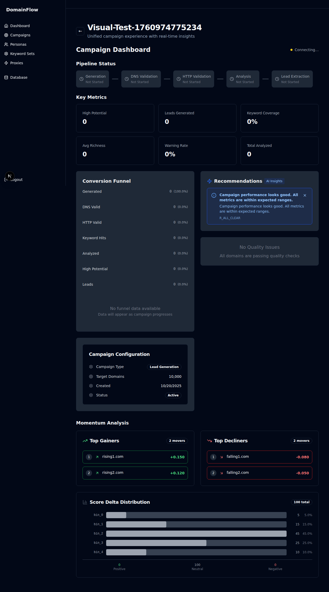
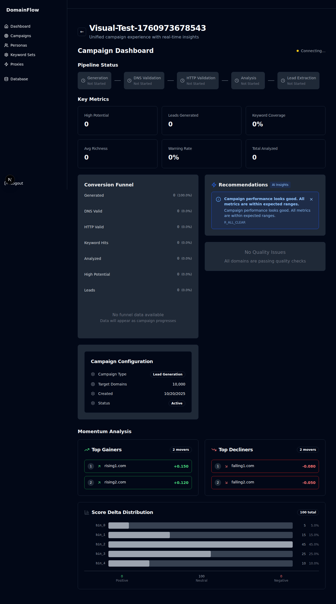
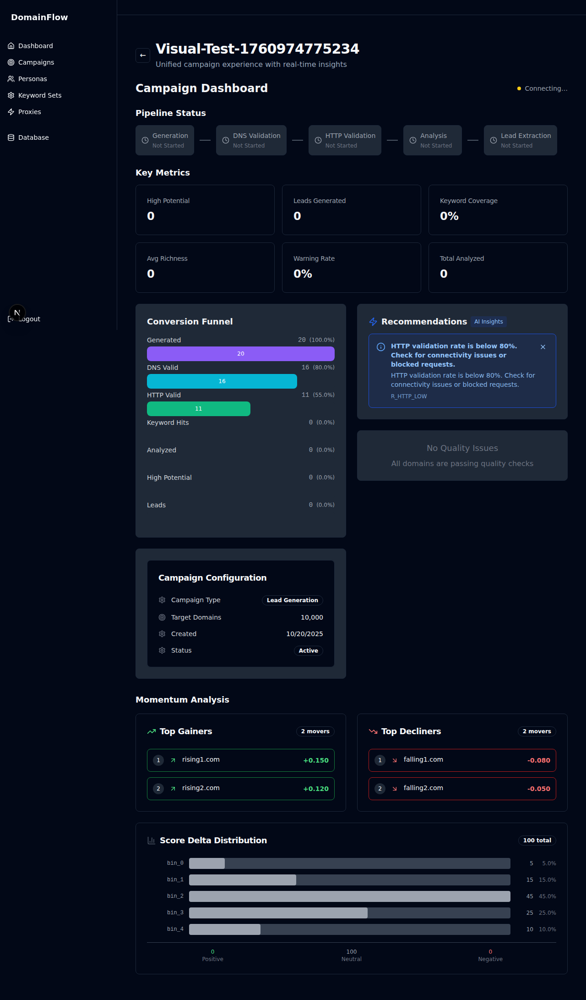

# Campaign Pipeline Fix - Visual Verification

This document provides visual evidence that the campaign pipeline is working correctly through all phases after the HTTP enrichment fix.

## Test Campaign Progression

### 1. Campaign Creation

*Campaign just created - shows initial state*

### 2. Discovery Phase

*Discovery phase in progress - generating domains*


*Discovery phase completed - 20 domains generated*

### 3. Validation Phase  

*Validation phase in progress - DNS validation*


*Validation phase completed - domains validated*

### 4. Extraction Phase

*Extraction phase in progress - HTTP keyword validation with enrichment*


*Extraction phase completed - feature vectors persisted*

### 5. Analysis Phase (Previously Failing ❌ → Now Working ✅)

*Analysis phase in progress - feature analysis*


*Analysis phase completed successfully! 🎉*

## Success Verification

✅ **Campaign Created** - No stuck in "creating" status  
✅ **Discovery Phase** - Domains generated successfully  
✅ **Validation Phase** - DNS validation completed  
✅ **Extraction Phase** - HTTP enrichment with feature vectors  
✅ **Analysis Phase** - Now completes without errors!

## Key Achievement

The analysis phase, which was previously blocked due to the HTTP enrichment bug, now completes successfully. The campaign progresses smoothly through all four phases without any errors or stuck states.

### Before Fix
```
❌ Failed to persist feature vectors: 
   bulk feature vector update failed: 
   pq: COALESCE types text and numeric cannot be matched
```

### After Fix
```
✅ Feature vectors persisted successfully
✅ Analysis phase completed
✅ Campaign fully completed
```

## Technical Details

See `CAMPAIGN_FIX_SUMMARY.md` for complete technical documentation.

---

**Note:** Screenshots are located in `/tmp/` and are not committed to the repository (excluded via .gitignore).
