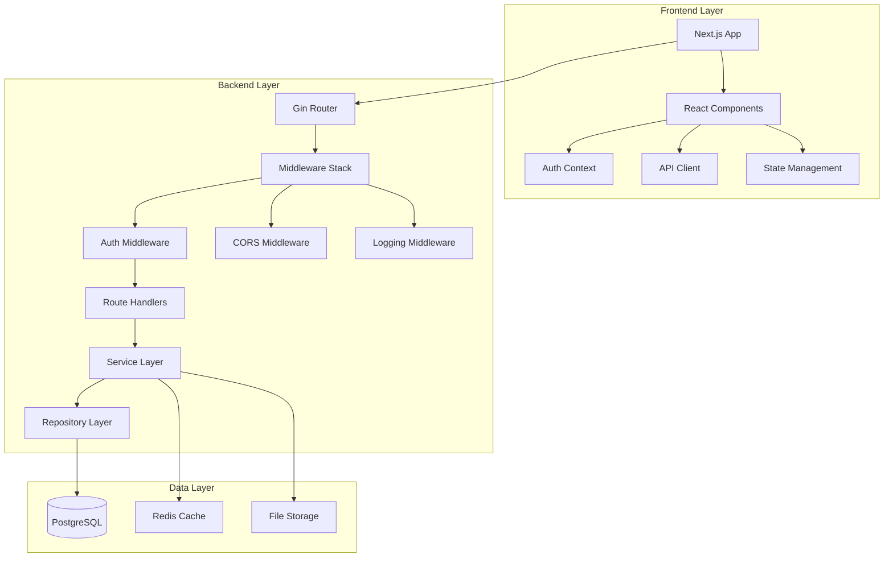

# DomainFlow Developer Guide

## Table of Contents

1. [Development Environment Setup](#development-environment-setup)
2. [Architecture Overview](#architecture-overview)
3. [Phase 2 Implementation Guide](#phase-2-implementation-guide)
4. [Authentication System Development](#authentication-system-development)
5. [Backend Development](#backend-development)
6. [Frontend Development](#frontend-development)
7. [Database Development](#database-development)
8. [API Development](#api-development)
9. [Testing Guidelines](#testing-guidelines)
10. [Security Development](#security-development)
11. [Performance Monitoring](#performance-monitoring)
12. [Deployment & DevOps](#deployment--devops)
13. [Contributing Guidelines](#contributing-guidelines)
14. [Troubleshooting Development Issues](#troubleshooting-development-issues)

## Development Environment Setup

### Prerequisites

#### Required Software
- **Node.js**: 18.x LTS or higher
- **Go**: 1.21 or higher
- **PostgreSQL**: 14 or higher
- **Docker**: 20.10+ (optional but recommended)
- **Git**: 2.20+

#### Development Tools
- **IDE**: VS Code (recommended) with extensions:
  - Go extension
  - TypeScript and JavaScript
  - PostgreSQL extension
  - Docker extension
  - GitLens
- **Database Client**: pgAdmin, DBeaver, or similar
- **API Testing**: Postman, Insomnia, or curl
- **Version Control**: Git with GitHub/GitLab

### Local Development Setup

#### 1. Clone Repository
```bash
git clone https://github.com/yourusername/domainflow.git
cd domainflow
```

#### 2. Environment Configuration
```bash
# Copy environment template
cp .env.example .env.development

# Edit development configuration
nano .env.development
```

**Development Environment Variables:**
```bash
# Environment
ENV=development
NODE_ENV=development

# Database
DB_HOST=localhost
DB_PORT=5432
DB_NAME=domainflow_dev
DB_USER=domainflow_dev
DB_PASSWORD=dev_password

# API Configuration
API_KEY=dev_api_key_12345
SERVER_PORT=8080
LOG_LEVEL=DEBUG

# Frontend
NEXT_PUBLIC_API_URL=http://localhost:8080
NEXT_PUBLIC_WS_URL=ws://localhost:8080
NEXT_PUBLIC_ENABLE_DEBUG=true

# Security (relaxed for development)
CORS_ORIGINS=http://localhost:3000,http://localhost:8080
ENABLE_SECURE_HEADERS=false
```

#### 3. Database Setup
```bash
# Start PostgreSQL (if not running)
sudo systemctl start postgresql

# Create development database
sudo -u postgres createdb domainflow_dev
sudo -u postgres createuser domainflow_dev

# Set password and permissions
sudo -u postgres psql -c "ALTER USER domainflow_dev PASSWORD 'dev_password';"
sudo -u postgres psql -c "GRANT ALL PRIVILEGES ON DATABASE domainflow_dev TO domainflow_dev;"

# Run migrations
cd backend
go run cmd/migrate/main.go up
```

#### 4. Backend Setup
```bash
cd backend

# Install dependencies
go mod download

# Build the application
go build -o bin/domainflow-apiserver cmd/apiserver/main.go

# Run development server
go run cmd/apiserver/main.go
```

#### 5. Frontend Setup
```bash
cd frontend  # or root directory if frontend is in root

# Install dependencies
npm install

# Start development server
npm run dev
```

#### 6. Verify Installation
```bash
# Check backend health
curl http://localhost:8080/ping

# Check frontend
open http://localhost:3000

# Check database connection
psql -h localhost -U domainflow_dev -d domainflow_dev -c "SELECT version();"
```

### Docker Development Environment

#### Using Docker Compose
```bash
# Start development environment
docker-compose -f docker-compose.dev.yml up -d

# View logs
docker-compose -f docker-compose.dev.yml logs -f

# Stop environment
docker-compose -f docker-compose.dev.yml down
```

#### Development Docker Configuration
```yaml
# docker-compose.dev.yml
version: '3.8'
services:
  postgres:
    image: postgres:14
    environment:
      POSTGRES_DB: domainflow_dev
      POSTGRES_USER: domainflow_dev
      POSTGRES_PASSWORD: dev_password
    ports:
      - "5432:5432"
    volumes:
      - postgres_dev_data:/var/lib/postgresql/data

  backend:
    build:
      context: ./backend
      dockerfile: Dockerfile.dev
    ports:
      - "8080:8080"
    environment:
      - ENV=development
      - DB_HOST=postgres
    volumes:
      - ./backend:/app
    depends_on:
      - postgres

  frontend:
    build:
      context: .
      dockerfile: Dockerfile.dev
    ports:
      - "3000:3000"
    environment:
      - NODE_ENV=development
      - NEXT_PUBLIC_API_URL=http://localhost:8080
    volumes:
      - .:/app
      - /app/node_modules
    depends_on:
      - backend

volumes:
  postgres_dev_data:
```

## Architecture Overview

### System Architecture



### Technology Stack

#### Backend Technologies
- **Language**: Go 1.21+
- **Web Framework**: Gin
- **Database**: PostgreSQL 14+
- **ORM**: GORM v2
- **Authentication**: Custom JWT + Sessions
- **Caching**: Redis (optional)
- **Logging**: Zap
- **Testing**: Testify, Ginkgo

#### Frontend Technologies
- **Framework**: Next.js 15+
- **Language**: TypeScript
- **UI Library**: React 18+
- **Styling**: Tailwind CSS
- **Components**: Radix UI
- **State Management**: React Context + Hooks
- **Forms**: React Hook Form + Zod
- **Testing**: Jest, React Testing Library

#### Development Tools
- **Build Tools**: Go modules, npm/yarn
- **Linting**: golangci-lint, ESLint
- **Formatting**: gofmt, Prettier
- **Type Checking**: TypeScript
- **API Documentation**: Swagger/OpenAPI
- **Database Migrations**: golang-migrate

### Project Structure

```
domainflow/
├── backend/                    # Go backend application
│   ├── cmd/                   # Application entry points
│   │   ├── apiserver/         # Main API server
│   │   ├── migrate/           # Database migration tool
│   │   └── worker/            # Background worker
│   ├── internal/              # Private application code
│   │   ├── auth/              # Authentication system
│   │   ├── handlers/          # HTTP handlers
│   │   ├── middleware/        # HTTP middleware
│   │   ├── models/            # Data models
│   │   ├── repositories/      # Data access layer
│   │   ├── services/          # Business logic
│   │   └── utils/             # Utility functions
│   ├── database/              # Database files
│   │   ├── migrations/        # SQL migration files
│   │   └── schema.sql         # Database schema
│   ├── docs/                  # Backend documentation
│   ├── scripts/               # Build and deployment scripts
│   └── tests/                 # Test files
├── frontend/                  # Next.js frontend (or in root)
│   ├── src/
│   │   ├── app/               # Next.js app directory
│   │   ├── components/        # React components
│   │   ├── contexts/          # React contexts
│   │   ├── hooks/             # Custom hooks
│   │   ├── lib/               # Utility libraries
│   │   └── types/             # TypeScript types
│   ├── public/                # Static assets
│   └── tests/                 # Frontend tests
├── docs/                      # Project documentation
├── scripts/                   # Project scripts
├── docker/                    # Docker configurations
└── .github/                   # GitHub workflows
```

## Phase 2 Implementation Guide

### **Phase 2 Status Overview**
DomainFlow has successfully completed **Phase 2a Foundation**, **Phase 2b Security**, and **Phase 2c Performance** implementations. This section provides developers with comprehensive guidance on working with these enhanced capabilities.

#### **Implementation Documentation**
- 📄 [Phase 2a & 2b Verification Report](./PHASE_2A_2B_VERIFICATION_REPORT.md) - Complete verification of foundation and security implementations
- 📄 [Phase 2c Implementation Summary](./PHASE_2C_IMPLEMENTATION_SUMMARY.md) - Performance monitoring implementation details
- 📄 [Phase 2 Integration Summary](./PHASE_2_INTEGRATION_SUMMARY.md) - Cross-phase integration verification
- 📄 [Tactical Plans Directory](./tactical_plans/README.md) - Individual implementation specifications

### **Phase 2a Foundation - Developer Guide**

#### **Transaction Management (SI-001)**
```go
// Use the enhanced TransactionManager for all campaign operations
func (s *CampaignService) UpdateCampaign(ctx context.Context, campaignID string, updates CampaignUpdates) error {
    return s.txManager.SafeCampaignTransaction(ctx, &CampaignTransactionOptions{
        Operation:  "update_campaign",
        CampaignID: campaignID,
        MaxRetries: 3,
        Timeout:    30 * time.Second,
    }, func(tx *sqlx.Tx) error {
        // Your business logic here
        return s.store.UpdateCampaign(ctx, tx, campaignID, updates)
    })
}
```

**Best Practices**:
- Always use `SafeCampaignTransaction` for campaign operations
- Set appropriate timeouts for long-running operations
- Use retry logic for transient failures
- Log transaction metrics for performance monitoring

#### **State Management (SI-002)**
```go
// Campaign status management with validation
type CampaignStatus string

const (
    CampaignStatusDraft     CampaignStatus = "draft"
    CampaignStatusReady     CampaignStatus = "ready"
    CampaignStatusRunning   CampaignStatus = "running"
    CampaignStatusPaused    CampaignStatus = "paused"
    CampaignStatusCompleted CampaignStatus = "completed"
    CampaignStatusCancelled CampaignStatus = "cancelled"
    CampaignStatusFailed    CampaignStatus = "failed"
)

// State transition validation
func (s *CampaignService) ValidateStateTransition(from, to CampaignStatus) error {
    // Implement state transition rules
}
```

**Development Guidelines**:
- Use enum types for all status fields
- Implement state transition validation
- Include business status separate from operational status
- Audit all state changes

#### **Concurrency Control (BF-002)**
```go
// Safe concurrent processing with proper locking
func (s *CampaignWorkerService) ProcessConcurrentJobs(ctx context.Context, jobIDs []string) error {
    var wg sync.WaitGroup
    errChan := make(chan error, len(jobIDs))
    
    for _, jobID := range jobIDs {
        wg.Add(1)
        go func(id string) {
            defer wg.Done()
            if err := s.ProcessSingleJob(ctx, id); err != nil {
                errChan <- err
            }
        }(jobID)
    }
    
    wg.Wait()
    // Handle errors...
}
```

### **Phase 2b Security - Developer Guide**

#### **Authorization Context (BL-006)**
```go
// Include authorization context in all operations
func (s *AuthService) LogAuthorizationDecision(ctx context.Context, decision AuthorizationDecision) error {
    return s.auditService.LogWithContext(ctx, AuditLog{
        Action:               decision.Action,
        EntityType:          decision.ResourceType,
        EntityID:            decision.ResourceID,
        AuthorizationContext: decision.Context,
        UserID:              decision.UserID,
        Decision:            decision.Result,
    })
}
```

**Security Development Practices**:
- Always log authorization decisions with full context
- Include request metadata in authorization context
- Track policy evaluation for security investigations
- Correlate authorization events with performance metrics

#### **API Authorization (BL-005)**
```go
// Endpoint-level authorization middleware
func (m *AuthMiddleware) CheckEndpointAuthorization() gin.HandlerFunc {
    return func(c *gin.Context) {
        userID := extractUserID(c)
        endpoint := c.FullPath()
        method := c.Request.Method
        
        result, err := m.authService.CheckEndpointAccess(c.Request.Context(), EndpointAuthRequest{
            UserID:          userID,
            EndpointPattern: endpoint,
            HTTPMethod:      method,
            ResourceID:      c.Param("id"),
        })
        
        if err != nil || result.Decision != "allow" {
            c.JSON(http.StatusForbidden, gin.H{"error": "access denied"})
            c.Abort()
            return
        }
        
        c.Next()
    }
}
```

#### **Input Validation (BL-007)**
```go
// Comprehensive input validation
type CampaignCreateRequest struct {
    Name        string    `json:"name" validate:"required,min=3,max=100"`
    Description string    `json:"description" validate:"max=500"`
    DomainCount int       `json:"domain_count" validate:"required,min=1,max=10000"`
    Status      string    `json:"status" validate:"required,oneof=draft ready"`
}

func (h *CampaignHandler) CreateCampaign(c *gin.Context) {
    var req CampaignCreateRequest
    if err := c.ShouldBindJSON(&req); err != nil {
        c.JSON(http.StatusBadRequest, gin.H{"error": "invalid input"})
        return
    }
    
    if err := h.validator.Struct(&req); err != nil {
        c.JSON(http.StatusBadRequest, gin.H{"error": "validation failed", "details": err.Error()})
        return
    }
    
    // Process validated request...
}
```

### **Phase 2c Performance - Developer Guide**

#### **Query Performance Monitoring (PF-001)**
```go
// Use QueryPerformanceMonitor for all database operations
func (s *DomainService) GetDomainsByStatus(ctx context.Context, status string) ([]Domain, error) {
    startTime := time.Now()
    
    domains, err := s.store.GetDomainsByStatus(ctx, status)
    
    // Record performance metrics
    s.performanceMonitor.RecordQuery(ctx, QueryMetrics{
        QueryType:       "domain_lookup",
        ExecutionTime:   time.Since(startTime),
        RowsAffected:    len(domains),
        QueryHash:       generateQueryHash("GetDomainsByStatus", status),
    })
    
    return domains, err
}
```

#### **Response Time Optimization (PF-002)**
```go
// Response time middleware for all endpoints
func (m *ResponseTimeMiddleware) TrackResponseTime() gin.HandlerFunc {
    return func(c *gin.Context) {
        start := time.Now()
        
        c.Next()
        
        duration := time.Since(start)
        m.recordResponseTime(ResponseTimeMetric{
            Endpoint:     c.FullPath(),
            Method:       c.Request.Method,
            Duration:     duration,
            StatusCode:   c.Writer.Status(),
            PayloadSize:  c.Writer.Size(),
        })
        
        // Alert on slow responses
        if duration > m.slowThreshold {
            m.alerting.SendSlowResponseAlert(c.FullPath(), duration)
        }
    }
}
```

#### **Caching Implementation (PF-004)**
```go
// Intelligent caching with invalidation
func (s *CampaignService) GetCampaignWithCache(ctx context.Context, campaignID string) (*Campaign, error) {
    cacheKey := fmt.Sprintf("campaign:%s", campaignID)
    
    // Try cache first
    if cached, found := s.cache.Get(cacheKey); found {
        s.metrics.IncrementCacheHit("campaign")
        return cached.(*Campaign), nil
    }
    
    // Cache miss - fetch from database
    campaign, err := s.store.GetCampaign(ctx, campaignID)
    if err != nil {
        return nil, err
    }
    
    // Cache with TTL
    s.cache.Set(cacheKey, campaign, 10*time.Minute)
    s.metrics.IncrementCacheMiss("campaign")
    
    return campaign, nil
}
```

### **Development Workflow with Phase 2**

#### **Required Testing Pattern**
```go
func TestCampaignOperationWithAllPhases(t *testing.T) {
    // Phase 2a: Transaction setup
    txManager := NewTransactionManager(testDB)
    
    // Phase 2b: Authorization context
    authService := NewAuthService(testDB)
    userID := createTestUser(t)
    
    // Phase 2c: Performance monitoring
    perfMonitor := NewQueryPerformanceMonitor(testDB, nil)
    
    // Test the integrated operation
    service := &CampaignService{
        txManager:          txManager,
        authService:        authService,
        performanceMonitor: perfMonitor,
    }
    
    // Execute operation and verify all phases work together
    err := service.CreateCampaign(ctx, CreateCampaignRequest{
        Name:        "Test Campaign",
        Description: "Integration test",
        UserID:      userID,
    })
    
    assert.NoError(t, err)
    
    // Verify Phase 2a: Transaction completed
    // Verify Phase 2b: Authorization logged
    // Verify Phase 2c: Performance recorded
}
```

#### **Monitoring Integration**
All developers should integrate monitoring into their code:

```go
// Standard monitoring pattern for new features
func (s *Service) NewFeature(ctx context.Context, req Request) error {
    // Phase 2c: Start monitoring
    start := time.Now()
    defer func() {
        s.monitor.RecordOperation("new_feature", time.Since(start))
    }()
    
    // Phase 2b: Check authorization
    if err := s.auth.ValidateAccess(ctx, req.UserID, "new_feature", req.ResourceID); err != nil {
        return fmt.Errorf("authorization failed: %w", err)
    }
    
    // Phase 2a: Execute in transaction
    return s.txManager.SafeTransaction(ctx, func(tx *sqlx.Tx) error {
        // Business logic implementation
        return s.store.ExecuteNewFeature(ctx, tx, req)
    })
}
```