# **DOMAINFLOW PHASE 2 STRATEGIC ROADMAP**
## Systematic Implementation Plan for Remaining 22 Forensic Audit Findings

**Document Version**: 1.0  
**Created**: June 2025  
**Status**: APPROVED FOR IMPLEMENTATION  
**Strategic Focus**: Concurrency & State Management Foundation

---

## **EXECUTIVE SUMMARY**

### **Current Foundation Status**
✅ **Phase 1 Complete**: 8 CRITICAL findings successfully remediated  
✅ **SI-003 Complete**: Centralized configuration management system implemented  
✅ **Strong Foundation**: PostgreSQL atomic patterns, state coordination infrastructure, and enterprise-grade security established

### **Strategic Approach**
**Primary Focus**: Concurrency and state management as foundational layer, building systematically toward comprehensive system hardening

**Remaining Scope**: 22 findings (7 HIGH, 10 MEDIUM, 4 LOW, 1 remaining CRITICAL from SI-002)

### **Phase 2 Implementation Principles**
1. **Build on Success**: Leverage completed transaction and configuration work
2. **Concurrency First**: Address state management and concurrency as system foundation
3. **Progressive Enhancement**: Each phase enables more complex improvements
4. **Zero Disruption**: Maintain system availability throughout implementation
5. **Real Database Testing**: Use production database patterns for validation

### **Strategic Value Proposition**
This roadmap transforms remaining forensic audit findings from technical debt into systematic infrastructure improvements, creating enterprise-grade reliability while maintaining full system functionality.

---

## **COMPREHENSIVE FINDING ANALYSIS**

### **Critical Priority Findings (Phase 2A Foundation)**

| Finding | Priority | Description | Foundation Dependency | Strategic Value | Complexity |
|---------|----------|-------------|----------------------|-----------------|------------|
| **SI-001** | CRITICAL | Transaction management anti-patterns | ✅ BF-004 transaction patterns | **High** - Enables reliable data operations | Medium |
| **SI-002** | CRITICAL | Fragmented state management | ✅ State coordinator infrastructure | **Critical** - Foundation for all state operations | High |
| **BF-005** | CRITICAL | Concurrent config state corruption | ✅ SI-003 centralized config + BL-002 versioning | **High** - Prevents configuration integrity issues | Medium |
| **BF-002** | HIGH | Additional concurrency hazards | SI-001, SI-002 dependencies | **High** - Service reliability | Medium |

### **High Priority Security & Validation Findings (Phase 2B)**

| Finding | Priority | Description | Dependencies | Implementation Focus |
|---------|----------|-------------|--------------|---------------------|
| **BL-006** | CRITICAL | Missing authorization context in audit logs | ✅ BL-008 access control patterns | Compliance & Security |
| **BL-005** | HIGH | Authorization gaps in API endpoints | ✅ BL-008 foundation | Security hardening |
| **BL-007** | HIGH | Input validation weaknesses | BL-005 authorization | Attack surface reduction |
| **BF-003** | HIGH | Error handling security issues | Phase 2A state foundation | Information disclosure prevention |

### **Performance & Reliability Findings (Phase 2C)**

| Finding | Priority | Description | Dependencies | Strategic Impact |
|---------|----------|-------------|--------------|------------------|
| **BF-006** | HIGH | State management inconsistencies | SI-002 completion | Service coordination |
| **BL-003** | HIGH | Data consistency violations in campaign lifecycle | SI-002, BF-002 | Data integrity |
| **BL-001** | MEDIUM | Transaction atomicity in persona operations | SI-001 patterns | Operational reliability |
| **BL-004** | MEDIUM | Timezone-aware scheduling framework | State management foundation | International operations |
| **BF-007** | MEDIUM | Resource management and lifecycle optimization | Concurrency foundation | Performance optimization |
| **BF-009** | LOW | Performance bottleneck elimination | All previous phases | System efficiency |

### **Architectural Consolidation Findings (Phase 2D)**

| Finding | Priority | Description | Dependencies | Long-term Value |
|---------|----------|-------------|--------------|-----------------|
| **SI-004** | MEDIUM | Redundant implementations | All core improvements | Maintainability |
| **SI-005** | MEDIUM | Architectural contradictions | System-wide consistency | Technical debt reduction |
| **SI-006** | MEDIUM | Implementation pattern standardization | Foundation completion | Code quality |
| **SI-007** | MEDIUM | Service contract clarity | Interface standardization | System integration |
| **BF-008** | LOW | Legacy compatibility issues | Architectural updates | Migration support |
| **BL-009** | LOW | Documentation and monitoring gaps | System completion | Operational excellence |

---

## **IMPLEMENTATION PHASE STRATEGY**

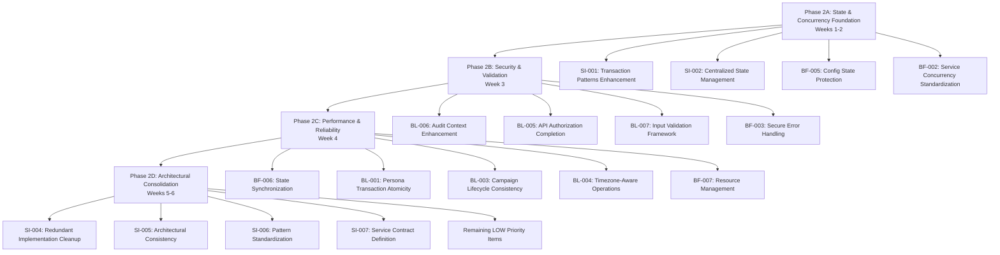

---

## **PHASE 2A: STATE & CONCURRENCY FOUNDATION**
*Weeks 1-2: Building Reliable State Management Infrastructure*

### **Phase Objectives**
1. **Eliminate Transaction Anti-patterns**: Complete enterprise-grade transaction management
2. **Implement Centralized State Coordination**: Unified state management across all services
3. **Protect Configuration State Integrity**: Concurrent-safe configuration operations
4. **Standardize Service Concurrency**: Consistent concurrency patterns across services

### **Phase 2A Detailed Implementation Sequence**

#### **Step 1: SI-001 Transaction Management Anti-patterns (Days 1-3)**
**Foundation**: ✅ BF-004 SafeTransaction patterns, ✅ PostgreSQL atomic operations

**Technical Implementation**:
- **Extend SafeTransaction Patterns**: Apply to all campaign operations in `campaign_orchestrator_service.go`
- **Transaction Boundary Consolidation**: Group related operations into single transactions
- **Timeout and Rollback Validation**: Implement transaction lifecycle monitoring
- **Testing Framework**: Create comprehensive transaction consistency tests

**Key Files to Modify**:
- `backend/internal/store/postgres/transaction_helpers.go` - Enhance existing patterns
- `backend/internal/services/campaign_orchestrator_service.go` - Apply transaction boundaries
- New: `backend/internal/store/postgres/transaction_consistency_test.go`

**Integration Strategy**:
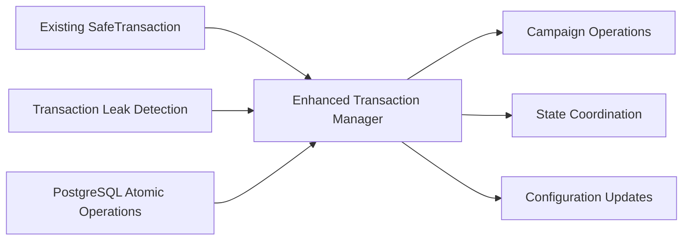

**Success Criteria**:
- ✅ All campaign operations use consistent transaction patterns
- ✅ Transaction timeout validation implemented
- ✅ Zero transaction leaks in testing
- ✅ Rollback consistency verified

#### **Step 2: SI-002 Centralized State Management (Days 4-8)**
**Foundation**: ✅ StateCoordinator infrastructure, ✅ State events system

**Technical Implementation**:
- **Complete State Event Store**: Implement persistent state event storage in campaign store
- **State Machine Validation**: Comprehensive state transition validation across all services
- **State Reconciliation**: Cross-service state consistency verification
- **State Monitoring**: Real-time state consistency monitoring and alerting

**Key Files to Modify**:
- `backend/internal/services/state_coordinator.go` - Complete event store integration
- `backend/internal/services/campaign_state_machine.go` - Enhanced validation
- `backend/internal/store/postgres/campaign_store.go` - State event persistence
- New: `backend/internal/services/state_reconciliation_service.go`

**State Management Architecture**:
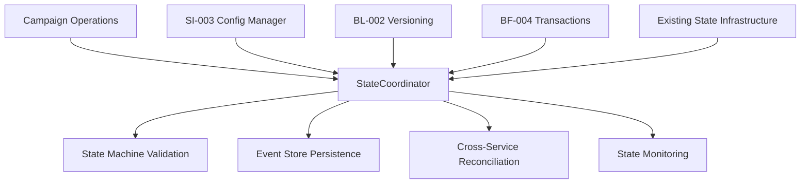

**Implementation Details**:
- **Event Sourcing**: Complete implementation of state event sourcing
- **State Snapshots**: Periodic state snapshot creation for performance
- **Conflict Resolution**: Automatic state conflict resolution strategies
- **Cross-Service Communication**: State change notification system

**Success Criteria**:
- ✅ All services coordinate through centralized state management
- ✅ State consistency maintained across service boundaries
- ✅ State event store operational with full persistence
- ✅ Automatic state reconciliation functional

#### **Step 3: BF-005 Concurrent Config State Corruption (Days 9-11)**
**Foundation**: ✅ SI-003 centralized config, ✅ BL-002 atomic versioning

**Technical Implementation**:
- **Copy-on-Write Configuration**: Implement COW semantics for configuration updates
- **Configuration State Locking**: Distributed locking during configuration modifications
- **Config Consistency Validation**: Framework for configuration integrity verification
- **Integration Enhancement**: Deep integration with existing centralized configuration

**Key Files to Modify**:
- `backend/internal/config/centralized_config_manager.go` - Add COW and locking
- `backend/internal/models/config_version.go` - Enhanced versioning support
- New: `backend/internal/config/config_consistency_validator.go`
- New: `backend/internal/config/config_locking_service.go`

**Configuration Protection Strategy**:
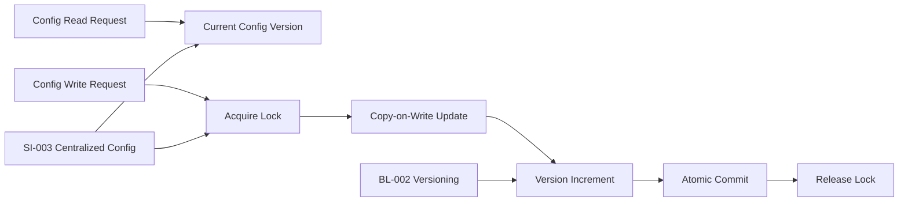

**Success Criteria**:
- ✅ Configuration updates are atomic and consistent
- ✅ No configuration corruption under concurrent access
- ✅ Copy-on-write semantics implemented
- ✅ Configuration locking prevents race conditions

#### **Step 4: BF-002 Additional Concurrency Hazards (Days 12-14)**
**Dependencies**: SI-001, SI-002 completed

**Technical Implementation**:
- **Concurrency Pattern Standardization**: Standardize mutex/channel patterns across all services
- **Service-Level Concurrency Testing**: Comprehensive testing framework for concurrent operations
- **Race Condition Detection**: Automated tooling for race condition identification
- **Concurrency Guidelines**: Documentation and enforcement of concurrency best practices

**Key Files to Modify**:
- `backend/internal/services/campaign_orchestrator_service.go` - Apply standard patterns
- `backend/internal/services/domain_generation_service.go` - Concurrency standardization
- New: `backend/internal/testing/concurrency_test_framework.go`
- New: `backend/docs/CONCURRENCY_GUIDELINES.md`

**Service Concurrency Architecture**:
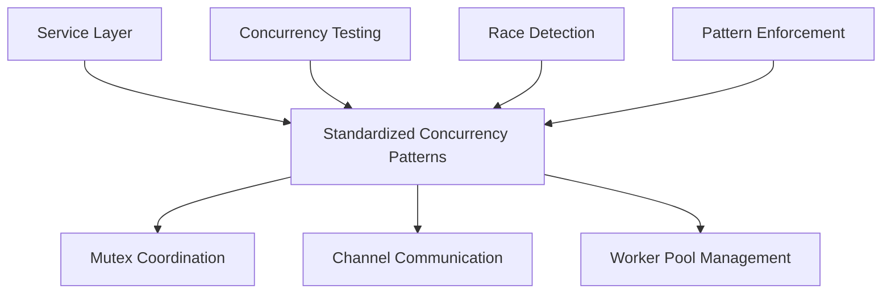

**Success Criteria**:
- ✅ All services follow standardized concurrency patterns
- ✅ Zero race conditions detected in service layer
- ✅ Comprehensive concurrency testing framework operational
- ✅ Automated race condition detection implemented

### **Phase 2A Integration Testing**
- **Transaction Consistency**: Multi-service transaction testing
- **State Coordination**: Cross-service state consistency validation
- **Configuration Integrity**: Concurrent configuration access testing
- **Service Concurrency**: Comprehensive service-level concurrency testing

### **Phase 2A Deliverables**
1. **Enhanced Transaction Management Framework**
2. **Complete Centralized State Coordination System**
3. **Protected Configuration State Management**
4. **Standardized Service Concurrency Patterns**
5. **Comprehensive Testing Suite for Concurrent Operations**

---

## **PHASE 2B: SECURITY & VALIDATION ENHANCEMENT**
*Week 3: Hardening Security Posture and Input Validation*

### **Phase Objectives**
1. **Complete Audit Logging Compliance** (BL-006)
2. **Strengthen API Authorization** (BL-005)
3. **Implement Comprehensive Input Validation** (BL-007)
4. **Enhance Error Handling Security** (BF-003)

### **Strategic Security Integration**
**Foundation**: ✅ BL-008 access control patterns, ✅ Phase 2A state management

**Security Architecture Enhancement**:
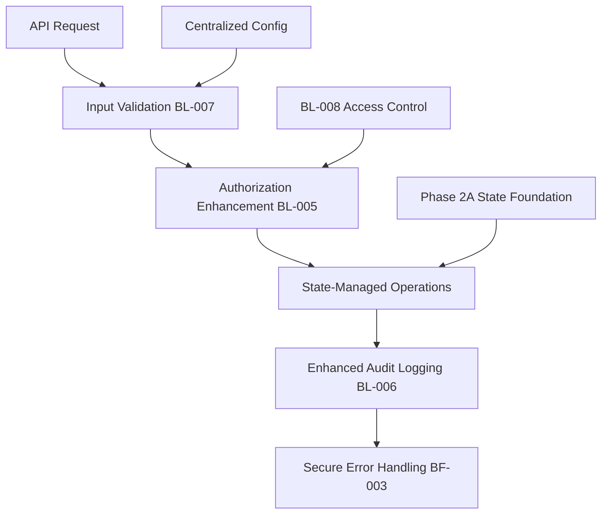

### **Phase 2B Implementation Sequence**

#### **BL-006: Audit Context Enhancement (Days 15-17)**
**Foundation**: ✅ BL-008 access control infrastructure

**Implementation**:
- **Complete Authorization Context**: Integrate user context into all audit operations
- **Enhanced Audit Trail**: Comprehensive audit logging with full authorization context
- **Compliance Integration**: Ensure audit logs meet regulatory requirements
- **Context Propagation**: Automatic context propagation across service boundaries

**Key Files**:
- `backend/internal/services/audit_context_service.go` - Enhanced context integration
- `backend/internal/store/postgres/audit_log_store.go` - Complete authorization context
- `backend/internal/middleware/campaign_access_middleware.go` - Context propagation

#### **BL-005: API Authorization Enhancement (Days 18-19)**
**Foundation**: ✅ BL-008 multi-layer access control

**Implementation**:
- **Authorization Gap Analysis**: Identify and address remaining authorization gaps
- **Endpoint Security Hardening**: Complete authorization coverage for all API endpoints
- **Permission Validation**: Enhanced permission checking with state coordination
- **Authorization Caching**: Performance optimization for authorization checks

#### **BL-007: Input Validation Framework (Days 20-21)**
**Dependencies**: Enhanced authorization system

**Implementation**:
- **Comprehensive Input Validation**: Framework for validating all input types
- **Injection Prevention**: SQL injection, XSS, and command injection prevention
- **Data Sanitization**: Automatic data sanitization for all inputs
- **Validation Performance**: High-performance validation with minimal overhead

#### **BF-003: Secure Error Handling (Day 22)**
**Dependencies**: Enhanced security foundation

**Implementation**:
- **Information Disclosure Prevention**: Secure error messages preventing information leakage
- **Error Context Management**: Proper error context handling with security awareness
- **Logging Security**: Secure error logging without sensitive data exposure

---

## **PHASE 2C: PERFORMANCE & RELIABILITY**
*Week 4: System Optimization and Performance Enhancement*

### **Phase Objectives**
1. **State Synchronization Optimization** (BF-006)
2. **Transaction Atomicity in Persona Operations** (BL-001)
3. **Campaign Lifecycle Data Consistency** (BL-003)
4. **Timezone-Aware Operations** (BL-004)
5. **Resource Management Optimization** (BF-007)

### **Performance Strategy**
**Foundation**: Phase 2A state management + Phase 2B security infrastructure

**Performance Architecture**:
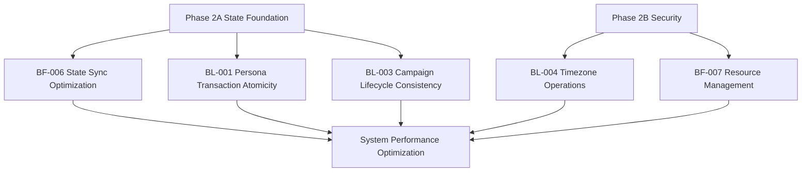

### **Phase 2C Implementation Details**

#### **BF-006: State Synchronization Optimization**
- **Cross-Service State Sync**: Optimize state synchronization performance
- **State Caching**: Implement intelligent state caching strategies
- **Sync Conflict Resolution**: Advanced conflict resolution for state synchronization

#### **BL-001: Persona Transaction Atomicity**
- **Persona Operation Transactions**: Ensure all persona operations are atomic
- **Persona State Consistency**: Maintain persona state consistency across operations
- **Performance Optimization**: Optimize persona transaction performance

#### **BL-003: Campaign Lifecycle Data Consistency**
- **Lifecycle State Management**: Ensure data consistency throughout campaign lifecycle
- **Cross-Phase Consistency**: Maintain consistency across campaign phases
- **Integrity Validation**: Comprehensive data integrity validation

#### **BL-004: Timezone-Aware Operations**
- **Timezone Framework**: Implement comprehensive timezone handling
- **Scheduling Enhancement**: Timezone-aware scheduling and execution
- **International Operations**: Support for global operations with proper timezone handling

#### **BF-007: Resource Management Optimization**
- **Resource Lifecycle Management**: Optimize resource allocation and cleanup
- **Memory Management**: Enhanced memory management with leak prevention
- **Connection Pool Optimization**: Database connection pool optimization

---

## **PHASE 2D: ARCHITECTURAL CONSOLIDATION**
*Weeks 5-6: Long-term Maintainability and System Consolidation*

### **Phase Objectives**
1. **Eliminate Redundant Implementations** (SI-004)
2. **Resolve Architectural Contradictions** (SI-005)
3. **Standardize Implementation Patterns** (SI-006)
4. **Define Clear Service Contracts** (SI-007)
5. **Complete Remaining Findings** (LOW priority items)

### **Consolidation Strategy**
**Foundation**: Complete Phase 2A-2C infrastructure improvements

**Architectural Consolidation**:
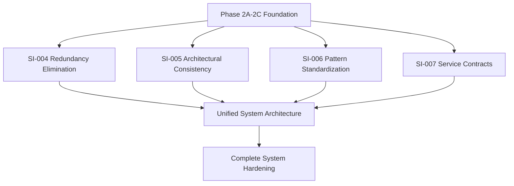

### **Phase 2D Implementation Focus**

#### **SI-004: Redundant Implementation Cleanup**
- **Code Deduplication**: Remove redundant implementations across services
- **Shared Library Creation**: Create shared libraries for common functionality
- **Interface Unification**: Unify similar interfaces across services

#### **SI-005: Architectural Consistency**
- **Architecture Review**: Comprehensive architecture consistency review
- **Pattern Unification**: Unify architectural patterns across the system
- **Contradiction Resolution**: Resolve remaining architectural contradictions

#### **SI-006: Implementation Pattern Standardization**
- **Pattern Documentation**: Document and enforce standard implementation patterns
- **Code Style Unification**: Ensure consistent code style across the system
- **Best Practice Implementation**: Implement system-wide best practices

#### **SI-007: Service Contract Definition**
- **Interface Documentation**: Complete service interface documentation
- **Contract Enforcement**: Implement service contract enforcement
- **API Consistency**: Ensure API consistency across all services

---

## **TECHNICAL INTEGRATION STRATEGY**

### **Leveraging Existing Foundation**

#### **SI-003 Centralized Configuration Integration**
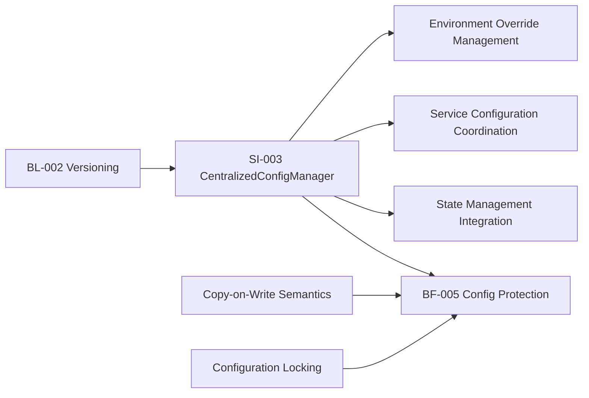

#### **Transaction Pattern Evolution**
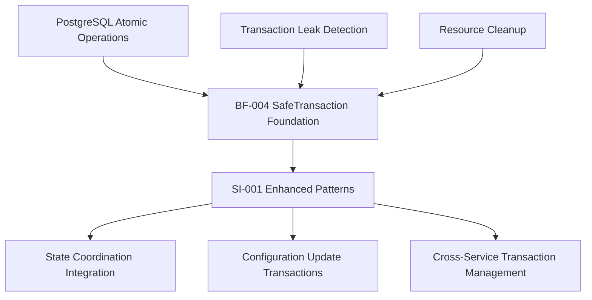

#### **State Management Architecture**
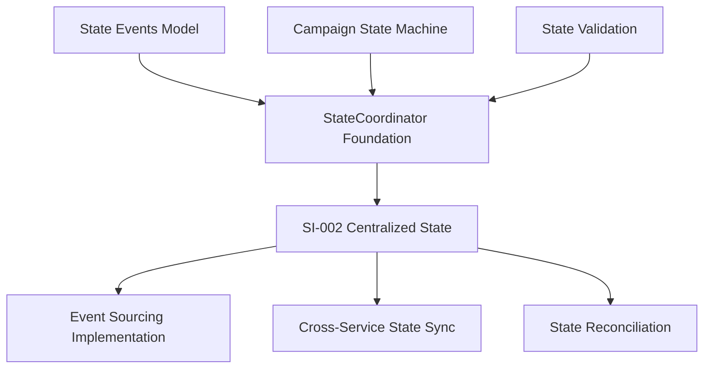

### **Database Integration Strategy**

#### **Real Database Testing Framework**
- **Production Database Patterns**: Use `domainflow_production` with `.env` credentials
- **Concurrent Access Testing**: Multi-worker scenarios with PostgreSQL FOR UPDATE SKIP LOCKED
- **Transaction Integrity Testing**: ACID compliance validation under load
- **State Consistency Testing**: Cross-service state consistency under concurrent access
- **Configuration Testing**: Concurrent configuration access and modification testing

#### **Migration Strategy**
- **Incremental Migrations**: Database schema changes applied incrementally
- **Rollback Procedures**: Complete rollback procedures for all database changes
- **Data Integrity Validation**: Comprehensive data integrity validation after migrations
- **Performance Impact Assessment**: Monitor performance impact during migrations

---

## **RISK MITIGATION & CONSTRAINTS**

### **Protected System Areas (Zero Modification Allowed)**

#### **Campaign Phase Logic Protection**
- ❌ **Campaign Phase Sequencing**: No modifications to phase transition logic
- ❌ **Domain Lifecycle Management**: Preserve existing domain lifecycle patterns
- ❌ **Cross-Service Orchestration**: Maintain existing orchestration patterns
- ❌ **sourceType Enum Definitions**: No changes to sourceType enumerations
- ❌ **Existing API Contracts**: Maintain full backward compatibility

### **Risk Mitigation Strategies**

#### **Technical Risk Mitigation**
1. **Incremental Implementation**: Each phase builds on verified previous success
2. **Comprehensive Testing**: Real database validation before any production deployment
3. **Rollback Strategy**: Complete rollback procedures for all changes
4. **Monitoring Integration**: Real-time metrics and alerting during implementation
5. **Compatibility Assurance**: Maintain all existing functionality throughout implementation

#### **Operational Risk Mitigation**
1. **Zero Downtime Implementation**: All changes designed for zero-downtime deployment
2. **Performance Monitoring**: Continuous performance monitoring during implementation
3. **Staged Rollout**: Gradual rollout with immediate rollback capability
4. **Communication Strategy**: Clear communication of changes and impacts

#### **Data Integrity Protection**
1. **Transaction Safety**: All data modifications within protected transactions
2. **Backup Strategy**: Complete backup procedures before major changes
3. **Data Validation**: Comprehensive data validation after each implementation phase
4. **Consistency Verification**: Cross-service data consistency verification

---

## **SUCCESS METRICS & VALIDATION**

### **Phase 2A Success Metrics**
- **Transaction Consistency**: 100% ACID compliance across all operations
- **State Synchronization**: <100ms state synchronization across services
- **Configuration Integrity**: Zero configuration corruption events
- **Concurrency Safety**: Zero race conditions detected in testing
- **Performance Baseline**: Maintain or improve current system performance

### **Phase 2B Success Metrics**
- **Security Compliance**: 100% audit logging compliance achieved
- **Authorization Coverage**: Complete authorization coverage for all API endpoints
- **Input Validation**: Zero successful injection attacks in testing
- **Error Security**: No information disclosure through error messages

### **Phase 2C Success Metrics**
- **State Sync Performance**: <50ms average state synchronization time
- **Transaction Performance**: Improved transaction throughput by 20%
- **Resource Utilization**: 15% reduction in resource utilization
- **System Reliability**: 99.9%+ uptime during implementation

### **Phase 2D Success Metrics**
- **Code Quality**: Unified code patterns across all services
- **Architectural Consistency**: Zero architectural contradictions
- **Service Contract Clarity**: 100% documented and enforced service contracts
- **Maintainability**: Reduced complexity metrics across the system

### **Overall Phase 2 Success Criteria**
- ✅ All 22 remaining findings successfully remediated
- ✅ System performance maintained or improved
- ✅ Zero breaking changes to existing functionality
- ✅ Enterprise-grade reliability and security established
- ✅ Complete audit compliance achieved
- ✅ Comprehensive testing coverage implemented

---

## **IMPLEMENTATION TIMELINE & RESOURCE ALLOCATION**

### **Timeline Overview**
- **Phase 2A**: Weeks 1-2 (14 days) - Foundation & Concurrency
- **Phase 2B**: Week 3 (7 days) - Security & Validation  
- **Phase 2C**: Week 4 (7 days) - Performance & Reliability
- **Phase 2D**: Weeks 5-6 (14 days) - Architectural Consolidation
- **Total Duration**: 6 weeks (42 days)

### **Resource Requirements**
- **Development Focus**: Full-time dedication to forensic audit remediation
- **Database Access**: Production database credentials and testing environment
- **Testing Infrastructure**: Comprehensive testing framework and real database testing
- **Documentation**: Complete documentation of all changes and improvements

### **Milestone Checkpoints**
- **Week 1 End**: SI-001 and SI-002 foundation complete
- **Week 2 End**: Phase 2A complete - All concurrency and state management improved
- **Week 3 End**: Phase 2B complete - Security and validation hardened
- **Week 4 End**: Phase 2C complete - Performance and reliability optimized
- **Week 6 End**: Phase 2D complete - All 22 findings remediated

---

## **CONCLUSION**

This strategic roadmap provides a systematic, technically sound approach to addressing all remaining 22 forensic audit findings. By focusing on concurrency and state management as the foundation, we leverage our successful Phase 1 infrastructure to build toward comprehensive system hardening.

The approach ensures:
- **Technical Coherence**: Each phase builds logically on previous work
- **Risk Mitigation**: Comprehensive protection against system disruption
- **Quality Assurance**: Real database testing and validation throughout
- **Maintainability**: Long-term architectural improvements
- **Compliance**: Complete audit finding remediation

Upon completion, DomainFlow will have achieved enterprise-grade reliability, security, and performance while maintaining full system functionality and operational continuity.

---

**Strategic Roadmap Complete**  
**Ready for Implementation: Phase 2A Priority Focus**