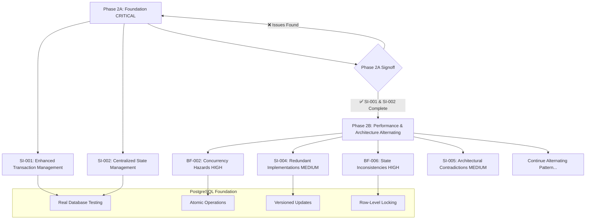

# **DOMAINFLOW PHASE 2 TACTICAL IMPLEMENTATION PLAN**
*Granular Technical Specifications for 19 Remaining Forensic Audit Findings*

**Document Version**: 1.0  
**Created**: June 22, 2025  
**Status**: READY FOR IMPLEMENTATION  
**Strategic Focus**: Foundation Completion → Performance → Architecture Alternating

---

## **EXECUTIVE SUMMARY**

This document provides copy-paste ready technical specifications for implementing all 19 remaining findings from the DomainFlow forensic audit. The plan leverages proven patterns from successful implementations (BF-001, BL-002, SI-003, BF-003, BL-008, BF-005) and mandates real PostgreSQL database testing throughout.

### **Key Implementation Principles**
- **Phase 2A Gating**: SI-001 and SI-002 must be 100% complete before Phase 2B begins
- **Real Database Testing**: All tests use `domainflow_production` - no mocks allowed
- **PostgreSQL-First**: Database-level patterns for atomicity, concurrency, and consistency
- **Pattern Reuse**: Leverage established SafeTransaction, atomic operations, and versioning patterns
- **CI/CD Compliance**: `go test ./... -race` and `golangci-lint run` must pass at every stage

### **Strategic Implementation Flow**



---

## **POSTGRESQL IMPLEMENTATION PATTERNS**

### **Pattern 1: Atomic Operations with Optimistic Locking**
*Based on successful BL-002 implementation*

```sql
-- Standard atomic update function template
CREATE OR REPLACE FUNCTION atomic_update_[entity]_state(
    p_entity_id UUID,
    p_expected_version BIGINT,
    p_new_data JSONB,
    p_operation_context TEXT
) RETURNS TABLE(
    success BOOLEAN,
    new_version BIGINT,
    conflict_version BIGINT,
    error_message TEXT
) AS $$
DECLARE
    current_version BIGINT;
    new_version_val BIGINT;
BEGIN
    -- Acquire row-level lock and get current state
    SELECT version INTO current_version
    FROM [entity_table] 
    WHERE id = p_entity_id
    FOR UPDATE;
    
    -- Check if entity exists
    IF NOT FOUND THEN
        RETURN QUERY SELECT FALSE, 0::BIGINT, 0::BIGINT, 'Entity does not exist'::TEXT;
        RETURN;
    END IF;
    
    -- Check version for optimistic locking
    IF current_version != p_expected_version THEN
        RETURN QUERY SELECT FALSE, 0::BIGINT, current_version, 'Version conflict detected'::TEXT;
        RETURN;
    END IF;
    
    -- Update with new version
    new_version_val := current_version + 1;
    
    UPDATE [entity_table] 
    SET 
        data = p_new_data,
        version = new_version_val,
        updated_at = NOW(),
        last_operation = p_operation_context
    WHERE id = p_entity_id 
      AND version = p_expected_version;
    
    -- Verify update succeeded
    IF NOT FOUND THEN
        RETURN QUERY SELECT FALSE, 0::BIGINT, current_version, 'Update failed - concurrent modification'::TEXT;
        RETURN;
    END IF;
    
    RETURN QUERY SELECT TRUE, new_version_val, 0::BIGINT, NULL::TEXT;
END;
$$ LANGUAGE plpgsql;
```

### **Pattern 2: Safe Job Claiming with FOR UPDATE SKIP LOCKED**
*Based on successful BF-001 implementation*

```go
// Template for concurrent job/task claiming
func (s *EntityStore) ClaimNextAvailableEntity(
    ctx context.Context,
    entityTypes []string,
    workerID string,
) (*models.Entity, error) {
    var entity *models.Entity
    
    err := s.txManager.SafeTransaction(ctx, nil, "ClaimEntity", func(tx *sqlx.Tx) error {
        now := time.Now().UTC()
        selectArgs := []interface{}{models.StatusAvailable, now}
        
        // Build dynamic query for entity types
        selectQuery := `SELECT id FROM [entity_table] 
                       WHERE status = $1 
                       AND (scheduled_at IS NULL OR scheduled_at <= $2)`
        
        if len(entityTypes) > 0 {
            var typePlaceholders []string
            for _, et := range entityTypes {
                typePlaceholders = append(typePlaceholders, fmt.Sprintf("$%d", len(selectArgs)+1))
                selectArgs = append(selectArgs, et)
            }
            selectQuery += fmt.Sprintf(" AND entity_type IN (%s)", strings.Join(typePlaceholders, ","))
        }
        
        selectQuery += ` ORDER BY priority DESC, created_at ASC 
                        FOR UPDATE SKIP LOCKED LIMIT 1`
        
        var entityID uuid.UUID
        err := tx.GetContext(ctx, &entityID, selectQuery, selectArgs...)
        if err == sql.ErrNoRows {
            return store.ErrNotFound
        }
        if err != nil {
            return fmt.Errorf("failed to select entity: %w", err)
        }
        
        // Atomically claim the entity
        updateQuery := `UPDATE [entity_table] SET
                       status = $1,
                       claimed_by = $2,
                       claimed_at = NOW(),
                       updated_at = NOW()
                      WHERE id = $3`
        
        result, err := tx.ExecContext(ctx, updateQuery, models.StatusClaimed, workerID, entityID)
        if err != nil {
            return fmt.Errorf("failed to claim entity %s: %w", entityID, err)
        }
        
        rowsAffected, err := result.RowsAffected()
        if err != nil || rowsAffected == 0 {
            return store.ErrNotFound
        }
        
        // Fetch complete entity details
        fetchQuery := `SELECT * FROM [entity_table] WHERE id = $1`
        entity = &models.Entity{}
        err = tx.GetContext(ctx, entity, fetchQuery, entityID)
        if err != nil {
            return fmt.Errorf("failed to fetch claimed entity: %w", err)
        }
        
        return nil
    })
    
    if err != nil {
        return nil, err
    }
    
    return entity, nil
}
```

### **Pattern 3: Enhanced Transaction Management**
*Based on successful transaction_helpers.go implementation*

```go
// Campaign-specific transaction options
type CampaignTransactionOptions struct {
    Operation       string
    CampaignID      string
    Timeout         time.Duration
    IsolationLevel  *sql.IsolationLevel
    ReadOnly        bool
    MaxRetries      int
    RetryDelay      time.Duration
}

// Safe transaction execution with retry logic
func (tm *TransactionManager) SafeCampaignTransaction(
    ctx context.Context, 
    opts *CampaignTransactionOptions, 
    fn func(*sqlx.Tx) error,
) error {
    if opts == nil {
        opts = DefaultCampaignTxOptions("unknown_operation", "unknown_campaign")
    }
    
    txCtx, cancel := context.WithTimeout(ctx, opts.Timeout)
    defer cancel()
    
    sqlOpts := &sql.TxOptions{
        ReadOnly: opts.ReadOnly,
    }
    if opts.IsolationLevel != nil {
        sqlOpts.Isolation = *opts.IsolationLevel
    }
    
    var lastErr error
    for attempt := 0; attempt <= opts.MaxRetries; attempt++ {
        if attempt > 0 {
            select {
            case <-time.After(opts.RetryDelay * time.Duration(attempt)):
            case <-txCtx.Done():
                return fmt.Errorf("transaction cancelled during retry: %w", txCtx.Err())
            }
        }
        
        operationID := fmt.Sprintf("%s_campaign_%s", opts.Operation, opts.CampaignID)
        lastErr = tm.SafeTransaction(txCtx, sqlOpts, operationID, fn)
        if lastErr == nil {
            return nil
        }
        
        if !isRetryableError(lastErr) {
            break
        }
    }
    
    return fmt.Errorf("transaction failed after %d attempts: %w", opts.MaxRetries+1, lastErr)
}
```

---

## **PHASE 2A: FOUNDATION COMPLETION**

### **SI-001: Enhanced Transaction Management Anti-patterns**

**Priority**: CRITICAL  
**Dependencies**: ✅ BF-004 SafeTransaction patterns  
**Estimated Effort**: 3-4 days  
**Pattern Reuse**: SafeTransaction, TransactionManager

#### **Database Migration**
```sql
-- File: backend/database/migrations/006_si001_transaction_monitoring.sql
BEGIN;

-- Transaction monitoring and metrics table
CREATE TABLE IF NOT EXISTS transaction_metrics (
    id UUID PRIMARY KEY DEFAULT gen_random_uuid(),
    operation_name VARCHAR(255) NOT NULL,
    campaign_id UUID REFERENCES campaigns(id),
    duration_ms INTEGER NOT NULL,
    success BOOLEAN NOT NULL,
    error_message TEXT,
    retry_count INTEGER DEFAULT 0,
    isolation_level VARCHAR(50),
    created_at TIMESTAMPTZ DEFAULT NOW()
);

CREATE INDEX idx_transaction_metrics_operation ON transaction_metrics(operation_name);
CREATE INDEX idx_transaction_metrics_campaign ON transaction_metrics(campaign_id);
CREATE INDEX idx_transaction_metrics_created_at ON transaction_metrics(created_at);

-- Function for recording transaction metrics
CREATE OR REPLACE FUNCTION record_transaction_metric(
    p_operation_name VARCHAR(255),
    p_campaign_id UUID,
    p_duration_ms INTEGER,
    p_success BOOLEAN,
    p_error_message TEXT DEFAULT NULL,
    p_retry_count INTEGER DEFAULT 0,
    p_isolation_level VARCHAR(50) DEFAULT NULL
) RETURNS UUID AS $$
DECLARE
    metric_id UUID;
BEGIN
    INSERT INTO transaction_metrics 
        (operation_name, campaign_id, duration_ms, success, error_message, retry_count, isolation_level)
    VALUES 
        (p_operation_name, p_campaign_id, p_duration_ms, p_success, p_error_message, p_retry_count, p_isolation_level)
    RETURNING id INTO metric_id;
    
    RETURN metric_id;
END;
$$ LANGUAGE plpgsql;

-- Function for transaction performance analysis
CREATE OR REPLACE FUNCTION get_transaction_performance_stats(
    p_operation_name VARCHAR(255) DEFAULT NULL,
    p_campaign_id UUID DEFAULT NULL,
    p_hours_back INTEGER DEFAULT 24
) RETURNS TABLE(
    operation_name VARCHAR(255),
    total_transactions BIGINT,
    successful_transactions BIGINT,
    failed_transactions BIGINT,
    avg_duration_ms NUMERIC,
    max_duration_ms INTEGER,
    min_duration_ms INTEGER,
    avg_retry_count NUMERIC
) AS $$
BEGIN
    RETURN QUERY
    SELECT 
        tm.operation_name,
        COUNT(*) as total_transactions,
        SUM(CASE WHEN tm.success THEN 1 ELSE 0 END) as successful_transactions,
        SUM(CASE WHEN NOT tm.success THEN 1 ELSE 0 END) as failed_transactions,
        ROUND(AVG(tm.duration_ms), 2) as avg_duration_ms,
        MAX(tm.duration_ms) as max_duration_ms,
        MIN(tm.duration_ms) as min_duration_ms,
        ROUND(AVG(tm.retry_count), 2) as avg_retry_count
    FROM transaction_metrics tm
    WHERE 
        (p_operation_name IS NULL OR tm.operation_name = p_operation_name)
        AND (p_campaign_id IS NULL OR tm.campaign_id = p_campaign_id)
        AND tm.created_at >= NOW() - INTERVAL '1 hour' * p_hours_back
    GROUP BY tm.operation_name
    ORDER BY total_transactions DESC;
END;
$$ LANGUAGE plpgsql;

COMMIT;
```

#### **Enhanced Transaction Helpers**
```go
// File: backend/internal/store/postgres/transaction_helpers.go
// ADD to existing implementation

// MetricsCollector interface for transaction monitoring
type MetricsCollector interface {
    RecordTransactionDuration(operation string, duration time.Duration, success bool, retryCount int)
    RecordTransactionError(operation string, err error)
}

// PostgreSQLMetricsCollector implements metrics collection using PostgreSQL
type PostgreSQLMetricsCollector struct {
    db         *sqlx.DB
    campaignID *uuid.UUID
}

func NewPostgreSQLMetricsCollector(db *sqlx.DB, campaignID *uuid.UUID) *PostgreSQLMetricsCollector {
    return &PostgreSQLMetricsCollector{
        db:         db,
        campaignID: campaignID,
    }
}

func (pmc *PostgreSQLMetricsCollector) RecordTransactionDuration(
    operation string, 
    duration time.Duration, 
    success bool, 
    retryCount int,
) {
    ctx, cancel := context.WithTimeout(context.Background(), 5*time.Second)
    defer cancel()
    
    query := `SELECT record_transaction_metric($1, $2, $3, $4, $5, $6, $7)`
    _, err := pmc.db.ExecContext(
        ctx, 
        query,
        operation,
        pmc.campaignID,
        int(duration.Milliseconds()),
        success,
        nil, // error_message handled separately
        retryCount,
        "READ_COMMITTED", // default isolation level
    )
    
    if err != nil {
        log.Printf("WARNING: Failed to record transaction metric: %v", err)
    }
}

// Enhanced SafeTransaction with metrics and monitoring
func (tm *TransactionManager) SafeTransactionWithMetrics(
    ctx context.Context,
    opts *sql.TxOptions,
    operation string,
    campaignID *uuid.UUID,
    fn func(*sqlx.Tx) error,
) error {
    start := time.Now()
    var success bool
    var retryCount int
    
    // Initialize metrics collector
    metrics := NewPostgreSQLMetricsCollector(tm.db, campaignID)
    
    defer func() {
        duration := time.Since(start)
        metrics.RecordTransactionDuration(operation, duration, success, retryCount)
    }()
    
    // Enhanced operation with retry logic
    campaignOpts := &CampaignTransactionOptions{
        Operation:      operation,
        CampaignID:     campaignID.String(),
        Timeout:        30 * time.Second,
        MaxRetries:     3,
        RetryDelay:     100 * time.Millisecond,
        ReadOnly:       opts != nil && opts.ReadOnly,
        IsolationLevel: opts.Isolation,
    }
    
    err := tm.SafeCampaignTransaction(ctx, campaignOpts, fn)
    success = err == nil
    
    return err
}

// Batch transaction operations
type TransactionOperation struct {
    Name        string
    Description string
    Required    bool
    Execute     func(ctx context.Context, tx *sqlx.Tx) error
    Rollback    func(ctx context.Context, tx *sqlx.Tx) error
}

func (tm *TransactionManager) SafeTransactionBatch(
    ctx context.Context,
    operations []TransactionOperation,
    campaignID *uuid.UUID,
) error {
    operationName := fmt.Sprintf("batch_%d_operations", len(operations))
    
    return tm.SafeTransactionWithMetrics(ctx, nil, operationName, campaignID, func(tx *sqlx.Tx) error {
        executedOps := make([]TransactionOperation, 0, len(operations))
        
        defer func() {
            if r := recover(); r != nil {
                // Execute rollbacks in reverse order
                for i := len(executedOps) - 1; i >= 0; i-- {
                    if executedOps[i].Rollback != nil {
                        if rollbackErr := executedOps[i].Rollback(ctx, tx); rollbackErr != nil {
                            log.Printf("ERROR: Rollback failed for operation %s: %v", executedOps[i].Name, rollbackErr)
                        }
                    }
                }
                panic(r)
            }
        }()
        
        for _, op := range operations {
            if err := op.Execute(ctx, tx); err != nil {
                // Execute rollbacks for completed operations
                for i := len(executedOps) - 1; i >= 0; i-- {
                    if executedOps[i].Rollback != nil {
                        if rollbackErr := executedOps[i].Rollback(ctx, tx); rollbackErr != nil {
                            log.Printf("ERROR: Rollback failed for operation %s: %v", executedOps[i].Name, rollbackErr)
                        }
                    }
                }
                return fmt.Errorf("batch operation %s failed: %w", op.Name, err)
            }
            executedOps = append(executedOps, op)
        }
        
        return nil
    })
}
```

#### **Campaign Orchestrator Service Updates**
```go
// File: backend/internal/services/campaign_orchestrator_service.go
// MODIFY existing methods to use enhanced transaction patterns

func (c *CampaignOrchestratorService) CreateCampaignWithAtomicOperations(
    ctx context.Context,
    campaign *models.Campaign,
) error {
    operations := []postgres.TransactionOperation{
        {
            Name:        "create_campaign",
            Description: "Create campaign record",
            Required:    true,
            Execute: func(ctx context.Context, tx *sqlx.Tx) error {
                return c.campaignStore.CreateCampaign(ctx, tx, campaign)
            },
            Rollback: func(ctx context.Context, tx *sqlx.Tx) error {
                return c.campaignStore.DeleteCampaign(ctx, tx, campaign.ID)
            },
        },
        {
            Name:        "initialize_state",
            Description: "Initialize campaign state coordination",
            Required:    true,
            Execute: func(ctx context.Context, tx *sqlx.Tx) error {
                return c.stateCoordinator.InitializeCampaignState(ctx, tx, campaign.ID)
            },
            Rollback: func(ctx context.Context, tx *sqlx.Tx) error {
                return c.stateCoordinator.CleanupCampaignState(ctx, tx, campaign.ID)
            },
        },
        {
            Name:        "setup_configuration",
            Description: "Initialize campaign configuration",
            Required:    true,
            Execute: func(ctx context.Context, tx *sqlx.Tx) error {
                return c.configManager.InitializeCampaignConfig(ctx, tx, campaign.ID)
            },
            Rollback: func(ctx context.Context, tx *sqlx.Tx) error {
                return c.configManager.CleanupCampaignConfig(ctx, tx, campaign.ID)
            },
        },
        {
            Name:        "setup_audit_context",
            Description: "Initialize audit logging context",
            Required:    false, // Optional operation
            Execute: func(ctx context.Context, tx *sqlx.Tx) error {
                return c.auditService.InitializeCampaignAudit(ctx, tx, campaign.ID)
            },
        },
    }
    
    return c.txManager.SafeTransactionBatch(ctx, operations, &campaign.ID)
}

// Enhanced campaign update with comprehensive validation
func (c *CampaignOrchestratorService) UpdateCampaignWithValidation(
    ctx context.Context,
    campaignID uuid.UUID,
    updates *models.CampaignUpdate,
    userID *uuid.UUID,
) error {
    operations := []postgres.TransactionOperation{
        {
            Name:        "validate_permissions",
            Description: "Validate user permissions for campaign",
            Required:    true,
            Execute: func(ctx context.Context, tx *sqlx.Tx) error {
                return c.accessControl.ValidateCampaignAccess(ctx, tx, campaignID, userID)
            },
        },
        {
            Name:        "validate_state_transition",
            Description: "Validate campaign state transition",
            Required:    true,
            Execute: func(ctx context.Context, tx *sqlx.Tx) error {
                return c.stateCoordinator.ValidateStateTransition(ctx, tx, campaignID, updates.Status)
            },
        },
        {
            Name:        "update_campaign",
            Description: "Update campaign data",
            Required:    true,
            Execute: func(ctx context.Context, tx *sqlx.Tx) error {
                return c.campaignStore.UpdateCampaign(ctx, tx, campaignID, updates)
            },
        },
        {
            Name:        "record_state_event",
            Description: "Record state change event",
            Required:    true,
            Execute: func(ctx context.Context, tx *sqlx.Tx) error {
                return c.stateCoordinator.RecordStateEvent(ctx, tx, campaignID, updates, userID)
            },
        },
        {
            Name:        "update_audit_log",
            Description: "Update audit log with campaign changes",
            Required:    false,
            Execute: func(ctx context.Context, tx *sqlx.Tx) error {
                return c.auditService.LogCampaignUpdate(ctx, tx, campaignID, updates, userID)
            },
        },
    }
    
    return c.txManager.SafeTransactionBatch(ctx, operations, &campaignID)
}
```

#### **Integration Test Suite**
```go
// File: backend/internal/store/postgres/si001_transaction_consistency_test.go
package postgres

import (
    "context"
    "database/sql"
    "fmt"
    "sync"
    "testing"
    "time"
    
    "github.com/stretchr/testify/suite"
    "github.com/google/uuid"
    "your-project/internal/testutil"
    "your-project/internal/models"
)

type SI001TransactionTestSuite struct {
    testutil.ServiceTestSuite
    txManager           *TransactionManager
    campaignOrchestrator *services.CampaignOrchestratorService
}

func TestSI001TransactionConsistency(t *testing.T) {
    suite.Run(t, &SI001TransactionTestSuite{
        ServiceTestSuite: testutil.ServiceTestSuite{
            UseDatabaseFromEnv: true, // MANDATORY: Real database testing
        },
    })
}

func (suite *SI001TransactionTestSuite) SetupTest() {
    suite.ServiceTestSuite.SetupTest()
    
    suite.txManager = NewTransactionManager(suite.db)
    suite.campaignOrchestrator = services.NewCampaignOrchestratorService(
        suite.db,
        suite.campaignStore,
        suite.stateCoordinator,
        suite.configManager,
        suite.auditService,
        suite.accessControl,
        suite.txManager,
    )
}

func (suite *SI001TransactionTestSuite) TestConcurrentCampaignCreation() {
    const numWorkers = 20
    const campaignsPerWorker = 5
    
    var wg sync.WaitGroup
    errors := make(chan error, numWorkers*campaignsPerWorker)
    createdCampaigns := make(chan uuid.UUID, numWorkers*campaignsPerWorker)
    
    for workerID := 0; workerID < numWorkers; workerID++ {
        wg.Add(1)
        go func(id int) {
            defer wg.Done()
            
            for campaignNum := 0; campaignNum < campaignsPerWorker; campaignNum++ {
                campaign := &models.Campaign{
                    ID:          uuid.New(),
                    Name:        fmt.Sprintf("concurrent-campaign-w%d-c%d", id, campaignNum),
                    Type:        models.CampaignTypeDNSValidation,
                    Status:      models.CampaignStatusPending,
                    UserID:      &suite.testUserID,
                }
                
                err := suite.campaignOrchestrator.CreateCampaignWithAtomicOperations(
                    context.Background(),
                    campaign,
                )
                
                if err != nil {
                    errors <- fmt.Errorf("worker %d campaign %d: %w", id, campaignNum, err)
                } else {
                    createdCampaigns <- campaign.ID
                }
            }
        }(workerID)
    }
    
    wg.Wait()
    close(errors)
    close(createdCampaigns)
    
    // Verify no errors occurred
    var errorList []error
    for err := range errors {
        errorList = append(errorList, err)
    }
    suite.Empty(errorList, "Should have no transaction errors in concurrent execution")
    
    // Verify all campaigns were created successfully
    var campaignIDs []uuid.UUID
    for campaignID := range createdCampaigns {
        campaignIDs = append(campaignIDs, campaignID)
    }
    
    expectedCount := numWorkers * campaignsPerWorker
    suite.Len(campaignIDs, expectedCount, "Should have created all expected campaigns")
    
    // Verify transaction consistency
    suite.ValidateTransactionConsistency(campaignIDs)
    
    // Verify no transaction leaks
    suite.ValidateNoTransactionLeaks()
}

func (suite *SI001TransactionTestSuite) TestTransactionTimeoutHandling() {
