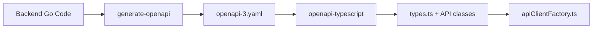
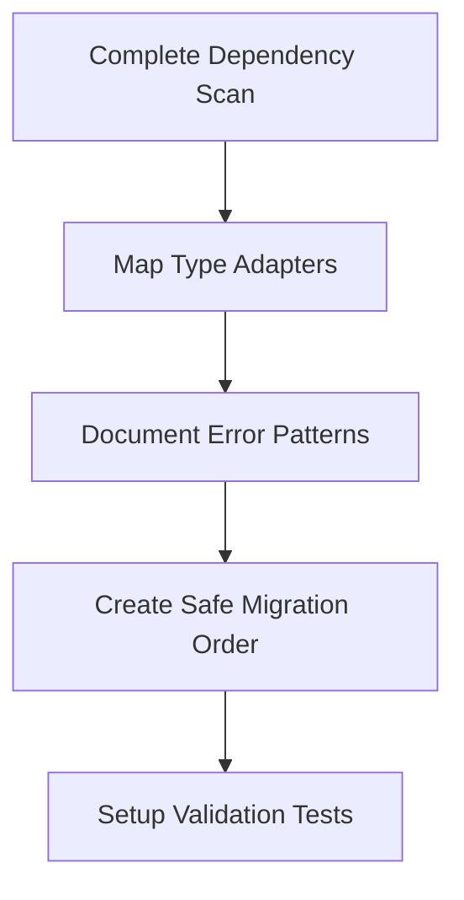
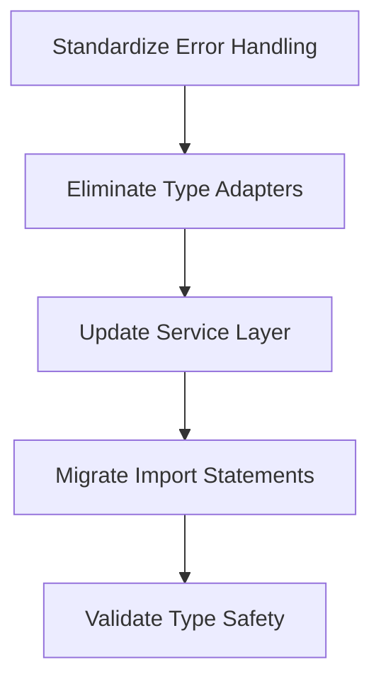
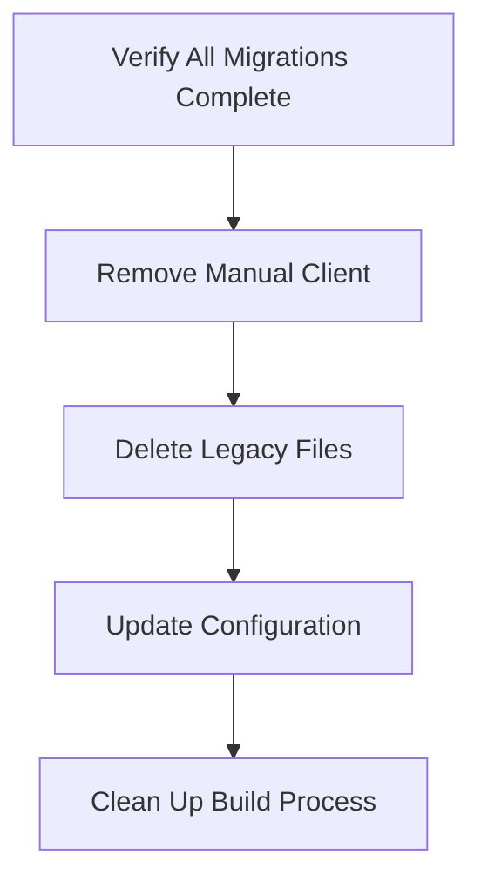
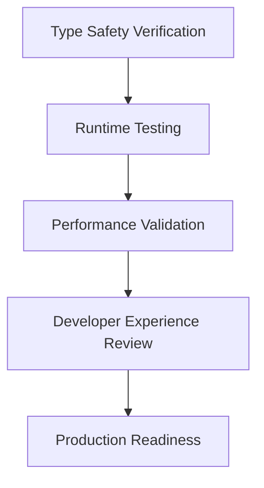

# OpenAPI3 Migration Plan: From Manual to Fully Automated API Client

## Executive Summary

This document outlines the migration strategy to eliminate legacy manual API client code and standardize on a fully automated OpenAPI3-driven architecture. The current system has a problematic hybrid approach mixing manual and auto-generated code, creating maintenance overhead and type safety issues.

**Goal**: Complete transition from manual API client code to fully automated OpenAPI3 generation with zero manual type definitions.

## Current State Analysis

### ✅ Auto-Generated System (Target Architecture)
- **Location**: `src/lib/api-client/`
- **Types**: `src/lib/api-client/types.ts` (6,206 lines of auto-generated TypeScript)
- **Factory**: `src/lib/utils/apiClientFactory.ts` (Clean factory pattern)
- **Source**: `backend/docs/openapi-3.yaml` (4,860 lines, single source of truth)
- **Generation Pipeline**: 
  - `npm run api:generate-spec` - Go backend → OpenAPI YAML
  - `npm run api:generate-client` - OpenAPI YAML → TypeScript types
  - `npm run api:generate` - Complete regeneration

### ❌ Legacy Manual System (To Be Removed)
- **Location**: `src/lib/api/client.ts` (414 lines of manual SessionApiClient)
- **Type Adapters**: Manual conversion between GeneratedUser → User
- **Mixed Usage**: 29+ files importing from both systems
- **Problems**: 
  - Type drift between manual and auto-generated types
  - Inconsistent error handling patterns
  - Maintenance overhead for manual client code

### 🔄 Current Hybrid Issues
- **Import Conflicts**: Files importing both `@/lib/api/*` and `@/lib/api-client/*`
- **Type Adapters**: Anti-patterns like `GeneratedUser` → `User` conversions
- **Error Handling**: Inconsistent error response patterns
- **Session Auth**: Duplicated authentication logic

## Migration Strategy

### Phase 1: Audit & Preparation

**Objectives:**
- Map all 29+ files using legacy imports
- Identify type adapter patterns requiring conversion
- Document manual error handling vs auto-generated patterns
- Create comprehensive test coverage for migration validation

**Key Files to Audit:**
- `src/lib/services/authService.ts` - Type adapters present
- All files importing from `@/lib/api/client`
- Components with manual error handling
- Services mixing both import patterns

**Deliverables:**
- Dependency map with migration complexity ratings
- Type adapter inventory with conversion strategies
- Error handling standardization requirements
- Test coverage plan for migration validation

### Phase 2: Standardization & Type Migration

**Objectives:**
- Align all error handling with OpenAPI `ErrorResponse` schema
- Replace manual type conversions with direct auto-generated types
- Update service layer to use pure auto-generated clients
- Migrate all imports to use `apiClientFactory.ts`

**Critical Tasks:**
1. **Error Response Standardization**
   - Replace manual error handling with OpenAPI `ErrorResponse` type
   - Update error boundaries to handle standardized responses
   - Ensure consistent error propagation patterns

2. **Type Adapter Elimination**
   - Replace `GeneratedUser` → `User` conversions with direct usage
   - Remove manual type definitions that duplicate auto-generated types
   - Update component props to use auto-generated types

3. **Service Layer Migration**
   - Update `authService.ts` to use pure auto-generated client
   - Migrate session authentication to use `apiClientFactory`
   - Ensure HTTP-only cookie authentication works properly

4. **Import Statement Updates**
   - Convert `@/lib/api/*` imports to `@/lib/api-client/*`
   - Update all service imports to use factory pattern
   - Remove unused manual client imports

### Phase 3: Legacy Code Removal

**Objectives:**
- Complete removal of manual client code
- Delete all legacy API files
- Clean up build configuration
- Update developer documentation

**Tasks:**
1. **Manual Client Removal**
   - Delete `src/lib/api/client.ts` entirely
   - Remove any remaining manual API service files
   - Clean up related utility functions

2. **Configuration Updates**
   - Ensure all API clients use `apiClientFactory.ts`
   - Verify session authentication configuration
   - Update environment variable handling

3. **Documentation Updates**
   - Update developer documentation to reference only auto-generated system
   - Create API client usage guidelines
   - Document error handling patterns

### Phase 4: Validation & Optimization

**Objectives:**
- Verify complete type safety across the application
- Validate runtime behavior matches expectations
- Ensure performance characteristics are maintained
- Confirm developer experience improvements

**Validation Tasks:**
1. **Type Safety Verification**
   - Run TypeScript compiler with strict settings
   - Verify no type errors or warnings
   - Test type inference and autocomplete functionality

2. **Runtime Testing**
   - Comprehensive API endpoint testing
   - Session authentication validation
   - Error handling verification
   - WebSocket connection testing

3. **Performance Validation**
   - Compare bundle size before/after migration
   - Measure API response handling performance
   - Validate memory usage patterns

## Implementation Guidelines

### Safe Migration Patterns

**Low Risk (Migrate First):**
- Files using only auto-generated types
- New components using `apiClientFactory`
- Utility functions with pure type operations

**Medium Risk (Careful Migration):**
- Components with mixed import patterns
- Services with error handling logic
- Files with type transformations

**High Risk (Migrate Last):**
- `authService.ts` with type adapters
- Core authentication components
- Error boundary implementations

### Testing Strategy

**Pre-Migration Testing:**
- Document current API behavior patterns
- Create baseline performance metrics
- Establish error handling test cases

**Migration Testing:**
- Unit tests for each migrated service
- Integration tests for API interactions
- End-to-end tests for critical user flows

**Post-Migration Validation:**
- Type safety verification
- Runtime behavior validation
- Performance regression testing

### Rollback Strategy

**Safety Measures:**
- Git branch per migration phase
- Feature flags for gradual rollout
- Automated tests to catch regressions

**Rollback Triggers:**
- Type safety violations
- Runtime errors in critical paths
- Performance degradation > 10%

## Benefits Realization

### 🎯 Type Safety
- **Single Source of Truth**: OpenAPI schema drives all types
- **Automatic Updates**: Backend changes propagate to frontend instantly
- **Zero Type Drift**: Auto-generated types always match backend reality

### 🔄 Development Workflow
- **Rapid Prototyping**: New endpoints instantly available in frontend
- **Consistency**: All API calls follow identical patterns
- **Reduced Errors**: Compile-time validation of API usage

### 📈 Maintainability
- **Code Reduction**: Eliminate 414+ lines of manual client code
- **Simplified Debugging**: Consistent error patterns
- **Documentation**: Auto-generated API documentation

### ⚡ Performance
- **Bundle Size**: Reduced JavaScript bundle size
- **Type Checking**: Faster TypeScript compilation
- **Runtime**: Optimized API client instantiation

## Risk Mitigation

### Technical Risks
- **Session Authentication**: Thorough testing of HTTP-only cookies
- **Error Handling**: Validation of error propagation patterns
- **Type Compatibility**: Gradual migration to avoid breaking changes

### Operational Risks
- **Deployment**: Phased rollout with feature flags
- **Monitoring**: Enhanced logging during migration period
- **Rollback**: Immediate rollback capability for each phase

## Success Metrics

### Technical Metrics
- Zero TypeScript compilation errors
- 100% test coverage for migrated code
- No performance regression
- Complete removal of manual API client code

### Developer Experience Metrics
- Reduced time to add new API endpoints
- Improved IDE autocomplete and error detection
- Simplified onboarding for new developers

## Next Steps

1. **Review and Approve Plan** - Stakeholder approval of migration strategy
2. **Setup Migration Environment** - Create feature branches and testing infrastructure  
3. **Begin Phase 1** - Start with dependency audit and type adapter mapping
4. **Iterative Implementation** - Execute phases with validation at each step
5. **Production Deployment** - Gradual rollout with monitoring and rollback capability

---

*This migration plan ensures a safe, systematic transition to a fully automated OpenAPI3-driven architecture while maintaining system stability and developer productivity.*