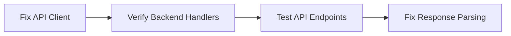
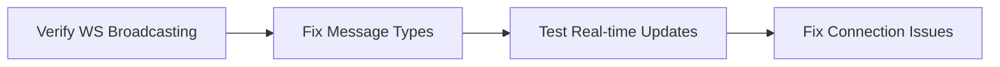

# CORRECTED Gap Analysis: Campaign Details Refactoring Implementation

**Analysis Date:** January 7, 2025  
**Status:** Partial Implementation with Critical Missing Pieces

## Executive Summary

After examining the actual codebase, the implementation is **partially complete** with significant gaps that prevent proper functionality. While modular components exist, there are critical missing integrations and backend connections.

## 1. What Actually EXISTS ✅

### Frontend Components - IMPLEMENTED
- ✅ [`CampaignHeader.tsx`](../src/components/campaigns/CampaignHeader.tsx) - 211 lines, complete
- ✅ [`CampaignControls.tsx`](../src/components/campaigns/CampaignControls.tsx) - 240 lines, complete  
- ✅ [`CampaignMetrics.tsx`](../src/components/campaigns/CampaignMetrics.tsx) - 249 lines, complete
- ✅ [`DomainStreamingTable.tsx`](../src/components/campaigns/DomainStreamingTable.tsx) - 523 lines, complete virtual table
- ✅ [`campaignDetailsStore.ts`](../src/lib/stores/campaignDetailsStore.ts) - 420 lines, complete Zustand store
- ✅ [`WebSocketStreamManager.ts`](../src/lib/websocket/WebSocketStreamManager.ts) - 471 lines, complete implementation
- ✅ [`useCampaignOperations.ts`](../src/hooks/useCampaignOperations.ts) - 331 lines, complete hook
- ✅ [`page.tsx`](../src/app/campaigns/[id]/page.tsx) - 325 lines, refactored modular page

### Backend Infrastructure - IMPLEMENTED  
- ✅ WebSocket infrastructure with `BroadcastToCampaign()` in [`backend/internal/websocket/`](../backend/internal/websocket/)
- ✅ OpenAPI 3.0 contract (1940 lines) in [`backend/api/campaigns/spec.go`](../backend/api/campaigns/spec.go)
- ✅ Campaign services broadcasting WebSocket messages
- ✅ All Go services, handlers, and interfaces

## 2. CRITICAL MISSING PIECES ❌

### Missing Backend API Endpoints
The frontend is calling API functions that may not exist or work properly:

**Missing/Broken API Functions:**
```typescript
// These are imported but may not have proper backend endpoints:
- getCampaignById(campaignId)
- getGeneratedDomainsForCampaign(campaignId, params)
- getDnsCampaignDomains(campaignId, params)  
- getHttpCampaignItems(campaignId, params)
- startCampaignPhase(campaignId)
- pauseCampaign(campaignId)
- resumeCampaign(campaignId)
- stopCampaign(campaignId)
```

**MISSING:** Backend handlers for these API client calls in [`backend/internal/api/`](../backend/internal/api/)

### Missing Backend-Frontend Integration

**MISSING:** WebSocket message broadcasting from backend services to frontend
- Services have WebSocket calls but frontend may not receive them properly
- Message type alignment between backend and frontend  
- Real-time domain generation events not flowing to UI

### Missing Database Optimizations

**MISSING:** Database performance optimizations for 2M+ domains
- Cursor-based pagination implementation
- Indexed queries for large domain sets
- Connection pooling optimizations

### Missing Component Dependencies

**MISSING:** Required shared components referenced but not found:
```typescript
// These are imported but may not exist:
- PhaseGateButton (referenced in CampaignControls)
- Progress component (referenced in CampaignMetrics) 
- ScrollArea component (referenced in DomainStreamingTable)
```

### Missing Integration Testing

**MISSING:** End-to-end integration between:
- Frontend WebSocket client ↔ Backend WebSocket server
- API client calls ↔ Backend handlers
- State management ↔ Real-time updates
- Virtual table ↔ Large dataset performance

## 3. Implementation Priority (ORDERED BY DEPENDENCY)

### Phase 1: Fix API Integration (CRITICAL)


**Actions Required:**
1. Verify backend API handlers exist for all client calls
2. Fix API response parsing in `useCampaignOperations`
3. Add proper error handling for API failures
4. Test campaign CRUD operations

### Phase 2: Fix WebSocket Integration (CRITICAL)


**Actions Required:**
1. Verify backend services are broadcasting WebSocket messages correctly
2. Align message types between backend Go and frontend TypeScript
3. Test WebSocket connection and message flow
4. Fix any connection/reconnection issues

### Phase 3: Add Missing Components (HIGH)
**Actions Required:**
1. Create `PhaseGateButton` component for campaign controls
2. Verify UI component library (Progress, ScrollArea, etc.)
3. Add missing imports and fix dependency issues
4. Test component rendering and interactions

### Phase 4: Database Optimization (MEDIUM)  
**Actions Required:**
1. Implement efficient cursor-based pagination
2. Add database indexes for domain queries
3. Optimize for 2M+ domain datasets
4. Test virtual table performance under load

### Phase 5: Integration Testing (HIGH)
**Actions Required:**
1. End-to-end testing of complete flow
2. Performance testing with large datasets  
3. WebSocket streaming performance verification
4. Error handling and recovery testing

## 4. Specific Files That Need Work

### Backend Files to Check/Create:
```
backend/internal/api/handlers/campaigns.go     # API handlers
backend/internal/api/handlers/domains.go      # Domain API handlers  
backend/internal/services/campaign_handler.go # Campaign operations
backend/internal/api/websocket_handlers.go    # WebSocket endpoints
```

### Frontend Files to Check/Create:
```
src/components/campaigns/PhaseGateButton.tsx  # Missing component
src/lib/api-client/client.ts                 # API client implementation
src/lib/utils/campaignTransforms.ts          # Data transformers
```

### Integration Files to Create:
```
src/tests/integration/campaign-flow.test.ts  # End-to-end tests
src/tests/integration/websocket.test.ts      # WebSocket tests
```

## 5. Next Steps

1. **Start with API Integration** - Verify/create backend handlers for frontend API calls
2. **Fix WebSocket Flow** - Ensure real-time messages flow from backend to frontend  
3. **Add Missing Components** - Create PhaseGateButton and verify UI library
4. **Integration Testing** - Test complete campaign lifecycle
5. **Performance Optimization** - Optimize for 2M+ domain scenarios

The architecture and components are largely in place, but the **integration layer is broken** and needs immediate attention.