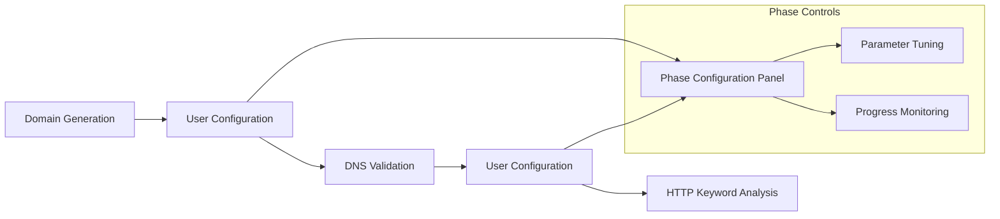
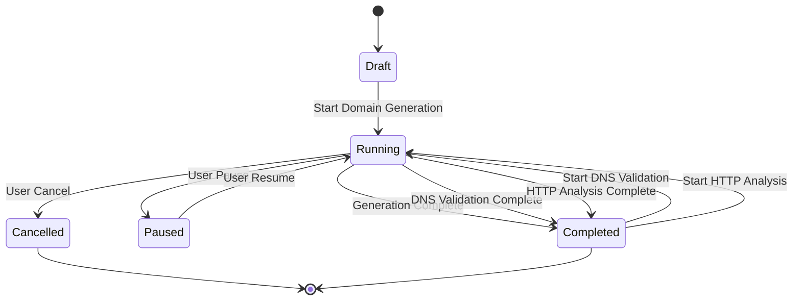
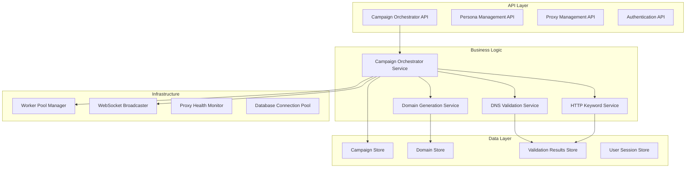
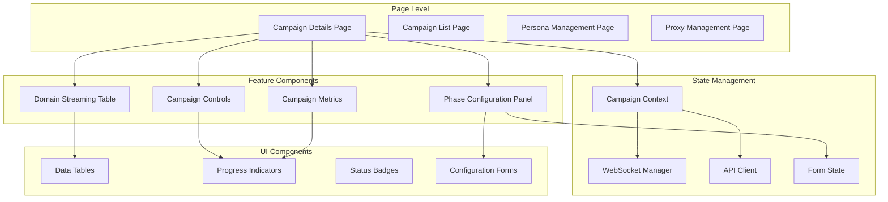
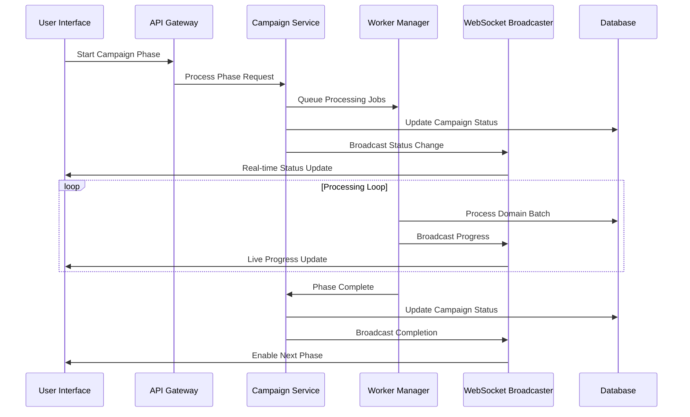

# DomainFlow V3.0 Stable Architecture

## Executive Summary

DomainFlow V3.0 is a production-ready domain intelligence platform built on a robust multi-phase campaign orchestration architecture. The system enables systematic domain generation, DNS validation, and HTTP keyword analysis through a streamlined user-controlled workflow with real-time monitoring capabilities.

## 1. System Overview

### 1.1 Architecture Principles

**Core Design Philosophy:**
- **Multi-Phase Orchestration**: User-controlled progression through domain intelligence phases
- **Single Campaign Lifecycle**: All phases operate on the same campaign record
- **Real-Time Monitoring**: WebSocket-powered live updates and progress tracking
- **Session-Based Security**: Simplified authentication without complex permission systems
- **Stateless Frontend**: Backend serves as single source of truth for all data

### 1.2 Technology Stack

**Frontend Architecture:**
- **Framework**: Next.js 14 with React 18
- **Type Safety**: TypeScript with strict configuration
- **State Management**: React Context + Zustand for complex state
- **UI Components**: Custom component library with shadcn/ui
- **Real-Time**: WebSocket integration for live updates
- **API Integration**: Type-safe OpenAPI client generation

**Backend Architecture:**
- **Language**: Go 1.21 with Gin framework
- **Database**: PostgreSQL with pgx driver
- **Authentication**: Session-based with secure cookie management
- **API Design**: OpenAPI 3.0 specification with code generation
- **Background Processing**: Worker pool architecture
- **Real-Time**: WebSocket broadcasting system

## 2. Campaign Orchestration Architecture

### 2.1 Multi-Phase Workflow



**Phase Progression Model:**
1. **Domain Generation Phase**: Create domain variations using algorithmic patterns
2. **DNS Validation Phase**: Validate DNS resolution on generated domains
3. **HTTP Analysis Phase**: Analyze content and extract keywords from validated domains

**User Control Points:**
- **Configuration Panels**: Full parameter control between phases
- **Manual Transitions**: User initiates each phase after reviewing results
- **Parameter Tuning**: Batch size, concurrency, timeout, and retry configuration
- **Real-Time Monitoring**: Live progress tracking with detailed metrics

### 2.2 Campaign State Management

**Campaign Lifecycle:**


**State Transitions:**
- **Draft → Running**: User starts domain generation
- **Running → Completed**: Phase completes successfully
- **Completed → Running**: User configures and starts next phase
- **Running → Paused**: User temporarily halts processing
- **Running → Cancelled**: User permanently stops campaign

## 3. Technical Architecture

### 3.1 Backend Services Layer

**Service Architecture:**


**Service Responsibilities:**

**Campaign Orchestrator Service:**
- Multi-phase campaign lifecycle management
- Phase transition coordination
- Progress tracking and metrics calculation
- User-initiated campaign control operations

**Domain Generation Service:**
- Algorithmic domain pattern generation (prefix, suffix, both)
- Batch processing with configurable parameters
- Domain uniqueness validation and deduplication
- Progress reporting via WebSocket

**DNS Validation Service:**
- DNS resolution testing with persona-based strategies
- Concurrent processing with proxy rotation
- Validation result storage and status updates
- Error handling and retry logic

**HTTP Keyword Service:**
- HTTP response analysis and content extraction
- Keyword matching and scoring algorithms
- Technology detection and metadata collection
- Proxy-based request distribution

### 3.2 Frontend Architecture

**Component Hierarchy:**


**State Management Strategy:**
- **React Context**: Campaign-specific state and real-time updates
- **Local State**: UI state and form handling
- **WebSocket Integration**: Live progress updates and domain streaming
- **API Client**: Type-safe backend communication

### 3.3 Data Flow Architecture

**Real-Time Data Pipeline:**


## 4. Security Architecture

### 4.1 Authentication System

**Session-Based Authentication:**
- **Secure Session Management**: HTTP-only, secure, SameSite cookies
- **Session Validation**: Middleware-based request validation
- **Automatic Expiration**: Configurable session timeout
- **Concurrent Session Control**: Multiple device support

**Security Features:**
- **Brute Force Protection**: Failed attempt monitoring and account lockout
- **Session Fingerprinting**: Device and browser validation
- **Secure Password Storage**: bcrypt hashing with salt
- **Audit Logging**: Comprehensive authentication event tracking

### 4.2 Data Security

**Encryption and Protection:**
- **Data at Rest**: PostgreSQL encryption for sensitive fields
- **Data in Transit**: TLS 1.3 for all API communications
- **WebSocket Security**: Authenticated WebSocket connections
- **API Security**: Request validation and rate limiting

**Privacy and Compliance:**
- **Data Minimization**: Only collect necessary information
- **Data Retention**: Configurable cleanup policies
- **Access Logging**: Comprehensive audit trail
- **User Data Control**: Export and deletion capabilities

## 5. Performance Architecture

### 5.1 Scalability Design

**Horizontal Scaling Capabilities:**
- **Stateless Services**: All services designed for horizontal scaling
- **Database Connection Pooling**: Efficient connection management
- **Worker Pool Architecture**: Configurable concurrency levels
- **Proxy Load Distribution**: Intelligent proxy rotation and health monitoring

**Performance Optimizations:**
- **Batch Processing**: Configurable batch sizes for optimal throughput
- **Concurrent Processing**: Multi-threaded domain validation
- **Caching Strategy**: Redis-based caching for frequently accessed data
- **Database Optimization**: Indexed queries and connection pooling

### 5.2 Real-Time Performance

**WebSocket Architecture:**
- **Campaign-Specific Channels**: Targeted message broadcasting
- **Message Queuing**: Reliable message delivery with acknowledgment
- **Connection Recovery**: Automatic reconnection with exponential backoff
- **Load Balancing**: WebSocket connection distribution across servers

**Frontend Performance:**
- **Virtual Scrolling**: Efficient rendering of large domain datasets
- **Incremental Updates**: Real-time UI updates without full re-renders
- **Memory Management**: Efficient domain caching and cleanup
- **Optimistic Updates**: Immediate UI feedback for user actions

## 6. Deployment Architecture

### 6.1 Production Environment

**Container Architecture:**
```yaml
services:
  frontend:
    image: domainflow-frontend:v3.0
    environment:
      - NEXT_PUBLIC_API_URL=https://api.domainflow.com
      - NODE_ENV=production
    
  backend:
    image: domainflow-backend:v3.0
    environment:
      - DATABASE_URL=postgresql://...
      - SESSION_SECRET=...
      - GIN_MODE=release
    
  database:
    image: postgres:15-alpine
    environment:
      - POSTGRES_DB=domainflow
      - POSTGRES_USER=domainflow
      - POSTGRES_PASSWORD=...
    
  redis:
    image: redis:7-alpine
    command: redis-server --appendonly yes
```

**Infrastructure Requirements:**
- **Compute**: Minimum 4 CPU cores, 8GB RAM for backend services
- **Storage**: SSD storage for database with regular backups
- **Network**: Load balancer with SSL termination
- **Monitoring**: Comprehensive logging and metrics collection

### 6.2 Environment Configuration

**Configuration Management:**
- **Environment Variables**: Centralized configuration via .env files
- **Feature Flags**: Runtime feature toggles for gradual rollouts
- **Health Checks**: Comprehensive health monitoring endpoints
- **Graceful Shutdown**: Proper resource cleanup on service termination

## 7. Monitoring and Observability

### 7.1 Application Monitoring

**Metrics Collection:**
- **Campaign Performance**: Processing rates, success ratios, error rates
- **System Metrics**: CPU, memory, disk usage, network throughput
- **Database Performance**: Query times, connection pool utilization
- **WebSocket Metrics**: Connection counts, message rates, latency

**Logging Strategy:**
- **Structured Logging**: JSON-formatted logs with consistent fields
- **Log Levels**: Appropriate logging levels for different environments
- **Audit Trail**: Comprehensive user action logging
- **Error Tracking**: Detailed error capture and alerting

### 7.2 User Experience Monitoring

**Frontend Metrics:**
- **Page Load Times**: Performance monitoring for all pages
- **API Response Times**: Backend service performance tracking
- **WebSocket Latency**: Real-time update performance
- **User Interaction Tracking**: Feature usage and error rates

## 8. Disaster Recovery and Backup

### 8.1 Data Protection

**Backup Strategy:**
- **Database Backups**: Automated daily backups with point-in-time recovery
- **Configuration Backups**: Environment and application configuration
- **User Data Export**: Comprehensive data export capabilities
- **System State Snapshots**: Complete system backup for disaster recovery

### 8.2 High Availability

**Redundancy Design:**
- **Service Redundancy**: Multiple instances of critical services
- **Database Replication**: Primary-replica database configuration
- **Load Balancing**: Traffic distribution across healthy instances
- **Failover Procedures**: Automated failover for critical components

## 9. Development Architecture

### 9.1 Code Organization

**Project Structure:**
```
domainflow/
├── frontend/               # Next.js application
│   ├── src/app/           # App router pages
│   ├── src/components/    # Reusable components
│   ├── src/lib/          # Utilities and services
│   └── src/types/        # TypeScript definitions
├── backend/               # Go application
│   ├── cmd/              # Application entry points
│   ├── internal/         # Internal packages
│   ├── api/              # OpenAPI specifications
│   └── database/         # Migrations and seeds
└── docs/                 # Documentation
```

### 9.2 Development Workflow

**Quality Assurance:**
- **Type Safety**: Comprehensive TypeScript coverage
- **API Contracts**: OpenAPI-driven development
- **Testing Strategy**: Unit, integration, and end-to-end tests
- **Code Review**: Pull request-based development workflow

## 10. Future Architecture Considerations

### 10.1 Scalability Roadmap

**Planned Enhancements:**
- **Microservices Migration**: Service decomposition for independent scaling
- **Event-Driven Architecture**: Asynchronous processing with message queues
- **API Rate Limiting**: Advanced rate limiting and quota management
- **Multi-Tenant Support**: Organizational isolation and resource management

### 10.2 Technology Evolution

**Technology Upgrades:**
- **Database Scaling**: Horizontal partitioning and read replicas
- **Container Orchestration**: Kubernetes deployment for production
- **Observability Enhancement**: Advanced monitoring and alerting
- **Security Hardening**: Enhanced security controls and compliance

---

## Conclusion

DomainFlow V3.0's architecture provides a solid foundation for enterprise-scale domain intelligence operations. The multi-phase orchestration system, combined with real-time monitoring and user-controlled progression, delivers a powerful yet manageable platform for systematic domain analysis.

The architecture prioritizes operational excellence, maintainability, and user experience while providing the scalability needed for growing organizational requirements. The session-based security model simplifies deployment and management while maintaining robust protection for sensitive operations.

**Key Architectural Strengths:**
- **User-Controlled Orchestration**: Flexible multi-phase campaign management
- **Real-Time Performance**: WebSocket-powered live updates and monitoring
- **Production Readiness**: Enterprise-grade security and reliability features
- **Developer Experience**: Type-safe development with comprehensive tooling
- **Operational Excellence**: Comprehensive monitoring and disaster recovery capabilities

This architectural foundation supports DomainFlow V3.0's mission to provide advanced domain intelligence capabilities while maintaining operational simplicity and user-friendly interfaces.