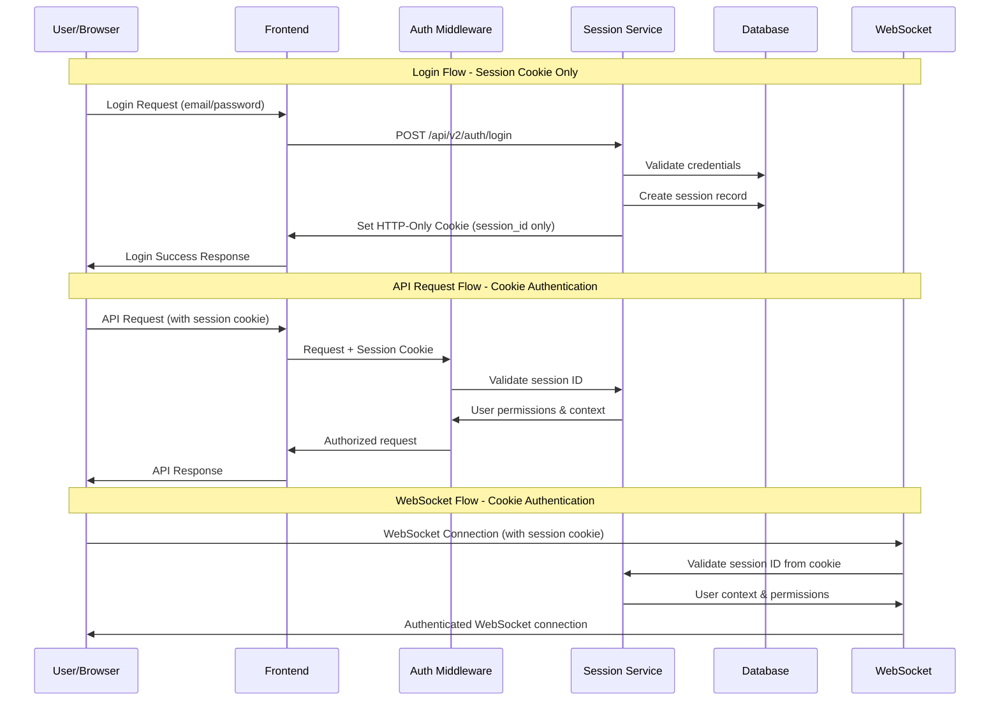

# Session-Based Authentication Architecture for DomainFlow

## Executive Summary

This document outlines a comprehensive session-based authentication system that eliminates all token-based authentication (CSRF, JWT) in favor of a pure session approach using only HTTP-only cookies. The architecture maintains security through SameSite cookies, origin validation, and robust session management while simplifying the authentication flow.

## Current State Analysis

### Existing Implementation Strengths
- ✅ Robust session management with PostgreSQL persistence
- ✅ Comprehensive RBAC system with roles and permissions
- ✅ Rate limiting and account lockout mechanisms
- ✅ Detailed audit logging and security monitoring
- ✅ Password security with bcrypt and pepper
- ✅ Session cleanup and expiration handling

### Required Changes
- ❌ Remove CSRF token requirement from all requests
- ❌ Eliminate token-based authentication headers
- ❌ Simplify frontend authentication state management
- ❌ Update WebSocket authentication to use only cookies
- ❌ Implement alternative CSRF protection mechanisms

## Authentication Flow Architecture



## Database Schema Modifications

### Updated Sessions Table
```sql
-- Remove CSRF token from sessions table
ALTER TABLE auth.sessions DROP COLUMN IF EXISTS csrf_token;

-- Simplified sessions table structure
CREATE TABLE auth.sessions (
    id VARCHAR(128) PRIMARY KEY,                    -- Secure random session ID
    user_id UUID NOT NULL REFERENCES auth.users(id) ON DELETE CASCADE,
    ip_address INET,                                -- For IP validation
    user_agent TEXT,                                -- For user agent validation
    is_active BOOLEAN DEFAULT TRUE,                 -- Session state
    expires_at TIMESTAMP NOT NULL,                  -- Hard expiration
    last_activity_at TIMESTAMP DEFAULT CURRENT_TIMESTAMP, -- Idle timeout
    created_at TIMESTAMP DEFAULT CURRENT_TIMESTAMP
);

-- Optimized indexes for session lookups
CREATE INDEX idx_sessions_user_id ON auth.sessions(user_id);
CREATE INDEX idx_sessions_expires_at ON auth.sessions(expires_at);
CREATE INDEX idx_sessions_active ON auth.sessions(is_active, expires_at);
CREATE INDEX idx_sessions_last_activity ON auth.sessions(last_activity_at);
```

### Session Metadata Enhancement
```sql
-- Add session fingerprinting for enhanced security
ALTER TABLE auth.sessions ADD COLUMN session_fingerprint VARCHAR(255);
ALTER TABLE auth.sessions ADD COLUMN browser_fingerprint TEXT;
ALTER TABLE auth.sessions ADD COLUMN screen_resolution VARCHAR(20);
```

## Backend Component Specifications

### Enhanced Session Service

```go
package services

import (
    "crypto/rand"
    "encoding/hex"
    "sync"
    "time"
    "github.com/google/uuid"
    "github.com/jmoiron/sqlx"
)

type SessionService struct {
    db              *sqlx.DB
    inMemoryStore   *InMemorySessionStore
    config          *SessionConfig
    cleanupTicker   *time.Ticker
    mutex           sync.RWMutex
}

type SessionConfig struct {
    Duration           time.Duration // 2 hours
    IdleTimeout        time.Duration // 30 minutes
    CleanupInterval    time.Duration // 5 minutes
    MaxSessionsPerUser int          // 5 concurrent sessions
    SessionIDLength    int          // 128 characters
    RequireIPMatch     bool         // Validate IP consistency
    RequireUAMatch     bool         // Validate User Agent consistency
}

type InMemorySessionStore struct {
    sessions     map[string]*SessionData  // sessionID -> SessionData
    userSessions map[uuid.UUID][]string   // userID -> []sessionIDs
    mutex        sync.RWMutex
}

type SessionData struct {
    ID               string
    UserID           uuid.UUID
    IPAddress        string
    UserAgent        string
    Fingerprint      string
    CreatedAt        time.Time
    LastActivity     time.Time
    ExpiresAt        time.Time
    Permissions      []string
    Roles            []string
    IsActive         bool
    RequiresPasswordChange bool
}

// Core session operations - NO CSRF TOKEN HANDLING
func (s *SessionService) CreateSession(userID uuid.UUID, ipAddress, userAgent string) (*SessionData, error) {
    // Generate secure session ID
    sessionID, err := s.generateSecureSessionID()
    if err != nil {
        return nil, fmt.Errorf("failed to generate session ID: %w", err)
    }

    // Check concurrent session limits
    if err := s.enforceSessionLimits(userID); err != nil {
        return nil, err
    }

    // Load user permissions
    permissions, roles, err := s.loadUserPermissions(userID)
    if err != nil {
        return nil, fmt.Errorf("failed to load user permissions: %w", err)
    }

    // Create session data
    session := &SessionData{
        ID:           sessionID,
        UserID:       userID,
        IPAddress:    ipAddress,
        UserAgent:    userAgent,
        Fingerprint:  s.generateFingerprint(ipAddress, userAgent),
        CreatedAt:    time.Now(),
        LastActivity: time.Now(),
        ExpiresAt:    time.Now().Add(s.config.Duration),
        Permissions:  permissions,
        Roles:        roles,
        IsActive:     true,
    }

    // Store in database
    if err := s.persistSession(session); err != nil {
        return nil, fmt.Errorf("failed to persist session: %w", err)
    }

    // Store in memory for fast access
    s.storeInMemory(session)

    return session, nil
}

func (s *SessionService) ValidateSession(sessionID, clientIP string) (*SessionData, error) {
    // Try memory first for performance
    session, found := s.getFromMemory(sessionID)
    if !found {
        // Fallback to database
        var err error
        session, err = s.loadFromDatabase(sessionID)
        if err != nil {
            return nil, ErrSessionNotFound
        }
        // Cache in memory
        s.storeInMemory(session)
    }

    // Validate session state
    if !session.IsActive {
        return nil, ErrSessionExpired
    }

    now := time.Now()
    
    // Check hard expiration
    if now.After(session.ExpiresAt) {
        s.invalidateSession(sessionID)
        return nil, ErrSessionExpired
    }

    // Check idle timeout
    if now.Sub(session.LastActivity) > s.config.IdleTimeout {
        s.invalidateSession(sessionID)
        return nil, ErrSessionExpired
    }

    // Optional IP validation for enhanced security
    if s.config.RequireIPMatch && session.IPAddress != clientIP {
        s.auditSuspiciousActivity(sessionID, "ip_mismatch", map[string]interface{}{
            "original_ip": session.IPAddress,
            "current_ip":  clientIP,
        })
        s.invalidateSession(sessionID)
        return nil, ErrSessionSecurityViolation
    }

    // Update last activity
    session.LastActivity = now
    s.updateLastActivity(sessionID, now)

    return session, nil
}

func (s *SessionService) InvalidateSession(sessionID string) error {
    s.removeFromMemory(sessionID)
    return s.markInactiveInDatabase(sessionID)
}

func (s *SessionService) InvalidateAllUserSessions(userID uuid.UUID) error {
    s.inMemoryStore.mutex.Lock()
    defer s.inMemoryStore.mutex.Unlock()

    // Get all user sessions
    sessionIDs, exists := s.inMemoryStore.userSessions[userID]
    if exists {
        // Remove from memory
        for _, sessionID := range sessionIDs {
            delete(s.inMemoryStore.sessions, sessionID)
        }
        delete(s.inMemoryStore.userSessions, userID)
    }

    // Mark inactive in database
    query := `UPDATE auth.sessions SET is_active = false WHERE user_id = $1`
    _, err := s.db.Exec(query, userID)
    return err
}

// Security helper methods
func (s *SessionService) generateSecureSessionID() (string, error) {
    bytes := make([]byte, s.config.SessionIDLength/2)
    if _, err := rand.Read(bytes); err != nil {
        return "", err
    }
    return hex.EncodeToString(bytes), nil
}

func (s *SessionService) generateFingerprint(ipAddress, userAgent string) string {
    hash := sha256.Sum256([]byte(ipAddress + userAgent + time.Now().String()))
    return hex.EncodeToString(hash[:16]) // First 16 bytes for fingerprint
}

func (s *SessionService) enforceSessionLimits(userID uuid.UUID) error {
    s.inMemoryStore.mutex.RLock()
    sessions, exists := s.inMemoryStore.userSessions[userID]
    s.inMemoryStore.mutex.RUnlock()

    if exists && len(sessions) >= s.config.MaxSessionsPerUser {
        // Remove oldest session
        oldestSessionID := sessions[0]
        s.InvalidateSession(oldestSessionID)
    }
    return nil
}
```

### Simplified Authentication Middleware

```go
package middleware

import (
    "net/http"
    "strings"
    "github.com/gin-gonic/gin"
)

func AuthMiddleware(sessionService *services.SessionService) gin.HandlerFunc {
    return func(c *gin.Context) {
        // Extract session ID from cookie ONLY
        sessionID, err := c.Cookie("domainflow_session")
        if err != nil {
            c.JSON(http.StatusUnauthorized, gin.H{
                "error": "Authentication required",
                "code":  "AUTH_REQUIRED",
            })
            c.Abort()
            return
        }

        // Validate request origin for CSRF protection (instead of tokens)
        if !validateRequestOrigin(c) {
            c.JSON(http.StatusForbidden, gin.H{
                "error": "Invalid request origin",
                "code":  "INVALID_ORIGIN",
            })
            c.Abort()
            return
        }

        // Validate session
        sessionData, err := sessionService.ValidateSession(sessionID, c.ClientIP())
        if err != nil {
            // Clear invalid session cookie
            clearSessionCookie(c)
            
            statusCode := http.StatusUnauthorized
            errorCode := "INVALID_SESSION"
            
            switch err {
            case services.ErrSessionExpired:
                errorCode = "SESSION_EXPIRED"
            case services.ErrSessionSecurityViolation:
                errorCode = "SECURITY_VIOLATION"
                statusCode = http.StatusForbidden
            }

            c.JSON(statusCode, gin.H{
                "error": "Session validation failed",
                "code":  errorCode,
            })
            c.Abort()
            return
        }

        // Set context for handlers - NO CSRF TOKEN
        c.Set("session_data", sessionData)
        c.Set("user_id", sessionData.UserID)
        c.Set("permissions", sessionData.Permissions)
        c.Set("roles", sessionData.Roles)
        
        c.Next()
    }
}

// CSRF protection through origin validation instead of tokens
func validateRequestOrigin(c *gin.Context) bool {
    origin := c.GetHeader("Origin")
    referer := c.GetHeader("Referer")
    host := c.Request.Host

    // Allow same-origin requests
    allowedOrigins := []string{
        fmt.Sprintf("https://%s", host),
        fmt.Sprintf("http://%s", host), // Development only
    }

    // Check origin header
    for _, allowed := range allowedOrigins {
        if origin == allowed {
            return true
        }
    }

    // Check referer header as fallback
    for _, allowed := range allowedOrigins {
        if strings.HasPrefix(referer, allowed) {
            return true
        }
    }

    // For API requests, require custom header as additional CSRF protection
    if c.GetHeader("X-Requested-With") == "XMLHttpRequest" {
        return true
    }

    return false
}

func clearSessionCookie(c *gin.Context) {
    c.SetCookie("domainflow_session", "", -1, "/", "", true, true)
}
```

### Updated Authentication Handlers

```go
package api

// Login handler - sets ONLY session cookie
func (h *AuthHandler) Login(c *gin.Context) {
    var req models.LoginRequest
    if err := c.ShouldBindJSON(&req); err != nil {
        c.JSON(http.StatusBadRequest, gin.H{
            "success": false,
            "error":   "Invalid request format",
        })
        return
    }

    // Authenticate user (existing logic)
    user, err := h.authService.AuthenticateUser(req.Email, req.Password, c.ClientIP(), c.GetHeader("User-Agent"))
    if err != nil {
        c.JSON(http.StatusUnauthorized, gin.H{
            "success": false,
            "error":   "Invalid credentials",
        })
        return
    }

    // Create session - NO CSRF TOKEN
    session, err := h.sessionService.CreateSession(user.ID, c.ClientIP(), c.GetHeader("User-Agent"))
    if err != nil {
        c.JSON(http.StatusInternalServerError, gin.H{
            "success": false,
            "error":   "Failed to create session",
        })
        return
    }

    // Set secure session cookie ONLY
    c.SetSameSite(http.SameSiteStrictMode)
    c.SetCookie(
        "domainflow_session",                    // name
        session.ID,                              // value
        int(session.ExpiresAt.Sub(time.Now()).Seconds()), // maxAge
        "/",                                     // path
        "",                                      // domain (let browser decide)
        true,                                    // secure (HTTPS only)
        true,                                    // httpOnly (no JS access)
    )

    // Return user data and session info (NO SESSION ID or CSRF TOKEN)
    c.JSON(http.StatusOK, gin.H{
        "success":    true,
        "user":       user.PublicData(),
        "expires_at": session.ExpiresAt.Format(time.RFC3339),
        "permissions": session.Permissions,
        "roles":      session.Roles,
    })
}

// Logout handler
func (h *AuthHandler) Logout(c *gin.Context) {
    sessionID, err := c.Cookie("domainflow_session")
    if err != nil {
        c.JSON(http.StatusOK, gin.H{"success": true}) // Already logged out
        return
    }

    // Invalidate session
    h.sessionService.InvalidateSession(sessionID)

    // Clear session cookie
    clearSessionCookie(c)

    c.JSON(http.StatusOK, gin.H{
        "success": true,
        "message": "Logged out successfully",
    })
}

// Session refresh - extends session without any tokens
func (h *AuthHandler) RefreshSession(c *gin.Context) {
    sessionData := c.MustGet("session_data").(*services.SessionData)
    
    // Extend session
    newExpiry := time.Now().Add(h.sessionService.GetConfig().Duration)
    err := h.sessionService.ExtendSession(sessionData.ID, newExpiry)
    if err != nil {
        c.JSON(http.StatusInternalServerError, gin.H{
            "success": false,
            "error":   "Failed to refresh session",
        })
        return
    }

    // Update cookie with new expiry
    c.SetCookie("domainflow_session", sessionData.ID, 
               int(newExpiry.Sub(time.Now()).Seconds()), "/", "", true, true)

    c.JSON(http.StatusOK, gin.H{
        "success":    true,
        "expires_at": newExpiry.Format(time.RFC3339),
    })
}

// User info endpoint - no tokens required
func (h *AuthHandler) Me(c *gin.Context) {
    sessionData := c.MustGet("session_data").(*services.SessionData)
    
    // Get fresh user data
    user, err := h.authService.GetUserByID(sessionData.UserID)
    if err != nil {
        c.JSON(http.StatusInternalServerError, gin.H{
            "error": "Failed to get user data",
        })
        return
    }

    c.JSON(http.StatusOK, gin.H{
        "user_id":                  user.ID,
        "email":                    user.Email,
        "first_name":              user.FirstName,
        "last_name":               user.LastName,
        "permissions":             sessionData.Permissions,
        "roles":                   sessionData.Roles,
        "requires_password_change": user.MustChangePassword,
        "session_expires_at":      sessionData.ExpiresAt.Format(time.RFC3339),
    })
}
```

## Frontend Component Specifications

### Simplified Authentication Service

```typescript
// Remove all CSRF token handling
export interface AuthTokens {
    sessionActive: boolean;  // Simple flag indicating session exists
    expiresAt: number;
}

export interface AuthState {
    isAuthenticated: boolean;
    user: AuthUser | null;
    tokens: AuthTokens | null;
    isLoading: boolean;
    sessionExpiry: number | null;
}

class AuthService {
    private authState: AuthState = {
        isAuthenticated: false,
        user: null,
        tokens: null,
        isLoading: false,
        sessionExpiry: null
    };

    // Login with session cookie only
    async login(credentials: LoginCredentials): Promise<{ success: boolean; error?: string }> {
        this.setLoading(true);
        
        try {
            const response = await fetch(`${await getApiBaseUrl()}/api/v2/auth/login`, {
                method: 'POST',
                headers: {
                    'Content-Type': 'application/json',
                    'X-Requested-With': 'XMLHttpRequest', // CSRF protection header
                },
                credentials: 'include', // Include session cookie
                body: JSON.stringify(credentials),
            });

            if (!response.ok) {
                const errorData = await response.json().catch(() => ({ error: 'Login failed' }));
                return { success: false, error: errorData.error || 'Invalid credentials' };
            }

            const data = await response.json();
            
            // Update auth state - no token storage needed
            this.updateAuthState({
                isAuthenticated: true,
                user: data.user,
                tokens: {
                    sessionActive: true,
                    expiresAt: new Date(data.expires_at).getTime()
                },
                isLoading: false,
                sessionExpiry: new Date(data.expires_at).getTime()
            });

            return { success: true };
        } catch (error) {
            console.error('Login error:', error);
            return { success: false, error: 'Network error during login' };
        } finally {
            this.setLoading(false);
        }
    }

    // All API calls use only cookies - no authentication headers
    async apiCall<T>(endpoint: string, options: RequestInit = {}): Promise<T> {
        const response = await fetch(`${await getApiBaseUrl()}${endpoint}`, {
            ...options,
            credentials: 'include', // Always include session cookie
            headers: {
                'Content-Type': 'application/json',
                'X-Requested-With': 'XMLHttpRequest', // CSRF protection
                ...options.headers,
                // NO authentication headers needed
            },
        });

        if (!response.ok) {
            if (response.status === 401) {
                // Session expired - clear auth state and redirect
                this.clearAuth();
                throw new Error('Session expired');
            }
            const errorData = await response.json().catch(() => ({ error: 'Request failed' }));
            throw new Error(errorData.error || `HTTP ${response.status}`);
        }

        return response.json();
    }

    // Session validation without tokens
    async validateSession(): Promise<boolean> {
        try {
            const userData = await this.apiCall<any>('/api/v2/me');
            
            // Update auth state with fresh data
            this.updateAuthState({
                isAuthenticated: true,
                user: userData,
                tokens: {
                    sessionActive: true,
                    expiresAt: new Date(userData.session_expires_at).getTime()
                },
                sessionExpiry: new Date(userData.session_expires_at).getTime()
            });
            
            return true;
        } catch (error) {
            this.clearAuth();
            return false;
        }
    }

    // Logout - just clear cookies
    async logout(): Promise<void> {
        try {
            await this.apiCall('/api/v2/auth/logout', { method: 'POST' });
        } catch (error) {
            console.warn('Logout request failed, clearing local state anyway');
        } finally {
            this.clearAuth();
        }
    }

    private clearAuth(): void {
        this.authState = {
            isAuthenticated: false,
            user: null,
            tokens: null,
            isLoading: false,
            sessionExpiry: null
        };
        this.notifyListeners();
    }

    // Initialize auth service - check existing session
    async initialize(): Promise<void> {
        this.setLoading(true);
        
        try {
            // Try to validate existing session cookie
            const isValid = await this.validateSession();
            console.log('Auth initialization:', isValid ? 'Valid session found' : 'No valid session');
        } catch (error) {
            console.log('Auth initialization failed:', error);
            this.clearAuth();
        } finally {
            this.setLoading(false);
        }
    }
}
```

### Simplified API Client

```typescript
class ApiClient {
    private baseUrl: string;

    constructor(baseUrl: string) {
        this.baseUrl = baseUrl;
    }

    async request<T>(endpoint: string, options: RequestInit = {}): Promise<T> {
        const url = `${this.baseUrl}${endpoint}`;
        
        const response = await fetch(url, {
            ...options,
            credentials: 'include', // Session cookie authentication
            headers: {
                'Content-Type': 'application/json',
                'X-Requested-With': 'XMLHttpRequest', // CSRF protection
                ...options.headers,
                // NO authentication tokens needed
            },
        });

        if (!response.ok) {
            if (response.status === 401) {
                // Session expired - let auth service handle
                window.location.href = '/login';
                throw new Error('Session expired');
            }
            
            if (response.status === 403) {
                throw new Error('Access denied');
            }

            const errorData = await response.json().catch(() => ({ error: 'Request failed' }));
            throw new Error(errorData.error || `HTTP ${response.status}`);
        }

        // Handle empty responses
        const contentType = response.headers.get('content-type');
        if (contentType && contentType.includes('application/json')) {
            return response.json();
        }
        
        return response.text() as any;
    }

    // Convenience methods
    async get<T>(endpoint: string): Promise<T> {
        return this.request<T>(endpoint, { method: 'GET' });
    }

    async post<T>(endpoint: string, data?: any): Promise<T> {
        return this.request<T>(endpoint, {
            method: 'POST',
            body: data ? JSON.stringify(data) : undefined,
        });
    }

    async put<T>(endpoint: string, data?: any): Promise<T> {
        return this.request<T>(endpoint, {
            method: 'PUT',
            body: data ? JSON.stringify(data) : undefined,
        });
    }

    async delete<T>(endpoint: string): Promise<T> {
        return this.request<T>(endpoint, { method: 'DELETE' });
    }
}
```

## WebSocket Authentication Integration

### Cookie-Based WebSocket Authentication

```go
package websocket

import (
    "net/http"
    "github.com/gin-gonic/gin"
    "github.com/gorilla/websocket"
)

var upgrader = websocket.Upgrader{
    CheckOrigin: func(r *http.Request) bool {
        // Validate origin for WebSocket connections
        origin := r.Header.Get("Origin")
        host := r.Host
        
        allowedOrigins := []string{
            fmt.Sprintf("https://%s", host),
            fmt.Sprintf("http://%s", host), // Dev only
        }
        
        for _, allowed := range allowedOrigins {
            if origin == allowed {
                return true
            }
        }
        return false
    },
}

type WebSocketHandler struct {
    sessionService *services.SessionService
    wsManager      *WebSocketManager
}

func NewWebSocketHandler(sessionService *services.SessionService, wsManager *WebSocketManager) *WebSocketHandler {
    return &WebSocketHandler{
        sessionService: sessionService,
        wsManager:      wsManager,
    }
}

func (h *WebSocketHandler) HandleWebSocket(c *gin.Context) {
    // Extract session ID from cookie
    sessionID, err := c.Cookie("domainflow_session")
    if err != nil {
        c.JSON(http.StatusUnauthorized, gin.H{
            "error": "Authentication required for WebSocket connection",
        })
        return
    }

    // Validate session
    sessionData, err := h.sessionService.ValidateSession(sessionID, c.ClientIP())
    if err != nil {
        c.JSON(http.StatusUnauthorized, gin.H{
            "error": "Invalid session for WebSocket connection",
        })
        return
    }

    // Upgrade HTTP connection to WebSocket
    conn, err := upgrader.Upgrade(c.Writer, c.Request, nil)
    if err != nil {
        log.Printf("WebSocket upgrade failed: %v", err)
        return
    }

    // Create authenticated WebSocket client
    client := &Client{
        conn:           conn,
        send:           make(chan []byte, 256),
        userID:         sessionData.UserID,
        sessionID:      sessionID,
        permissions:    sessionData.Permissions,
        roles:          sessionData.Roles,
        subscriptions:  make(map[string]bool),
        lastPing:       time.Now(),
        authenticated:  true,
    }

    // Register client with WebSocket manager
    h.wsManager.RegisterClient(client)

    // Start client message handlers
    go client.writePump()
    go client.readPump(h.wsManager, h.sessionService)
}
```

### Enhanced WebSocket Client with Session Validation

```go
type Client struct {
    conn          *websocket.Conn
    send          chan []byte
    userID        uuid.UUID
    sessionID     string
    permissions   []string
    roles         []string
    subscriptions map[string]bool
    lastPing      time.Time
    authenticated bool
    mutex         sync.RWMutex
}

// WebSocket message types
type WebSocketMessage struct {
    Type      string                 `json:"type"`
    Payload   map[string]interface{} `json:"payload"`
    Timestamp time.Time              `json:"timestamp"`
}

func (c *Client) readPump(wsManager *WebSocketManager, sessionService *services.SessionService) {
    defer func() {
        wsManager.UnregisterClient(c)
        c.conn.Close()
    }()

    // Set read deadline and pong handler
    c.conn.SetReadDeadline(time.Now().Add(60 * time.Second))
    c.conn.SetPongHandler(func(string) error {
        c.lastPing = time.Now()
        c.conn.SetReadDeadline(time.Now().Add(60 * time.Second))
        return nil
    })

    // Periodic session validation
    sessionTicker := time.NewTicker(30 * time.Second)
    defer sessionTicker.Stop()

    go func() {
        for range sessionTicker.C {
            if !c.validateSession(sessionService) {
                c.conn.Close()
                return
            }
        }
    }()

    for {
        var message WebSocketMessage
        err := c.conn.ReadJSON(&message)
        if err != nil {
            if websocket.IsUnexpectedCloseError(err, websocket.CloseGoingAway, websocket.CloseAbnormalClosure) {
                log.Printf("WebSocket error: %v", err)
            }
            break
        }

        // Validate session for each message
        if !c.validateSession(sessionService) {
            c.sendErrorMessage("Session expired")
            break
        }

        // Process message based on type
        c.handleMessage(&message, wsManager)
    }
}

func (c *Client) validateSession(sessionService *services.SessionService) bool {
    c.mutex.RLock()
    sessionID := c.sessionID
    c.mutex.RUnlock()

    _, err := sessionService.ValidateSession(sessionID, c.conn.RemoteAddr().String())
    if err != nil {
        c.mutex.Lock()
        c.authenticated = false
        c.mutex.Unlock()
        return false
    }
    return true
}

func (c *Client) handleMessage(message *WebSocketMessage, wsManager *WebSocketManager) {
    switch message.Type {
    case "subscribe_campaign":
        campaignID, ok := message.Payload["campaign_id"].(string)
        if ok && c.hasPermission("campaigns:read") {
            c.mutex.Lock()
            c.subscriptions[campaignID] = true
            c.mutex.Unlock()
            
            c.sendMessage(WebSocketMessage{
                Type: "subscription_confirmed",
                Payload: map[string]interface{}{
                    "campaign_id": campaignID,
                },
                Timestamp: time.Now(),
            })
        }
        
    case "unsubscribe_campaign":
        campaignID, ok := message.Payload["campaign_id"].(string)
        if ok {
            c.mutex.Lock()
            delete(c.subscriptions, campaignID)
            c.mutex.Unlock()
        }
        
    case "ping":
        c.sendMessage(WebSocketMessage{
            Type:      "pong",
            Timestamp: time.Now(),
        })
    }
}

func (c *Client) hasPermission(permission string) bool {
    c.mutex.RLock()
    defer c.mutex.RUnlock()
    
    for _, perm := range c.permissions {
        if perm == permission {
            return true
        }
    }
    return false
}

func (c *Client) IsSubscribedToCampaign(campaignID string) bool {
    c.mutex.RLock()
    defer c.mutex.RUnlock()
    return c.subscriptions[campaignID]
}
```

## Security Implementation

### CSRF Protection Without Tokens

```go
// Double Submit Cookie Pattern (alternative to CSRF tokens)
func DoubleSubmitCookieMiddleware() gin.HandlerFunc {
    return func(c *gin.Context) {
        // Skip for GET requests (read-only)
        if c.Request.Method == "GET" {
            c.Next()
            return
        }

        sessionID, err := c.Cookie("domainflow_session")
        if err != nil {
            c.JSON(http.StatusUnauthorized, gin.H{"error": "Authentication required"})
            c.Abort()
            return
        }

        // Use session ID as CSRF value in custom header
        csrfValue := c.GetHeader("X-Session-ID")
        if csrfValue != sessionID {
            c.JSON(http.StatusForbidden, gin.H{"error": "CSRF validation failed"})
            c.Abort()
            return
        }

        c.Next()
    }
}

// Content-Type validation for additional security
func ContentTypeValidationMiddleware() gin.HandlerFunc {
    return func(c *gin.Context) {
        if c.Request.Method != "GET" && c.Request.Method != "OPTIONS" {
            contentType := c.GetHeader("Content-Type")
            if !strings.Contains(contentType, "application/json") {
                c.JSON(http.StatusUnsupportedMediaType, gin.H{
                    "error": "Invalid content type",
                })
                c.Abort()
                return
            }
        }
        c.Next()
    }
}
```

### Session Hijacking Prevention

```go
// Enhanced session validation with fingerprinting
func (s *SessionService) ValidateSessionWithFingerprint(sessionID, clientIP, userAgent string) (*SessionData, error) {
    session, err := s.ValidateSession(sessionID, clientIP)
    if err != nil {
        return nil, err
    }

    // Enhanced security checks
    securityChecks := []func(*SessionData, string, string) error{
        s.validateIPConsistency,
        s.validateUserAgentConsistency,
        s.detectSessionHijacking,
    }

    for _, check := range securityChecks {
        if err := check(session, clientIP, userAgent); err != nil {
            s.auditSuspiciousActivity(sessionID, "security_violation", map[string]interface{}{
                "check_failed": err.Error(),
                "client_ip":    clientIP,
                "user_agent":   userAgent,
            })
            s.invalidateSession(sessionID)
            return nil, err
        }
    }

    return session, nil
}

func (s *SessionService) validateIPConsistency(session *SessionData, clientIP, userAgent string) error {
    if s.config.RequireIPMatch && session.IPAddress != clientIP {
        return fmt.Errorf("IP address mismatch: expected %s, got %s", session.IPAddress, clientIP)
    }
    return nil
}

func (s *SessionService) validateUserAgentConsistency(session *SessionData, clientIP, userAgent string) error {
    if s.config.RequireUAMatch && session.UserAgent != userAgent {
        return fmt.Errorf("User agent mismatch")
    }
    return nil
}

func (s *SessionService) detectSessionHijacking(session *SessionData, clientIP, userAgent string) error {
    // Simple heuristics for detecting session hijacking
    if session.IPAddress != clientIP && session.UserAgent != userAgent {
        return fmt.Errorf("multiple session inconsistencies detected")
    }
    return nil
}
```

## Performance Optimization

### In-Memory Session Caching

```go
type PerformantSessionStore struct {
    sessions     *sync.Map  // sessionID -> *SessionData
    userSessions *sync.Map  // userID -> []sessionID
    cleanup      *time.Ticker
    metrics      *SessionMetrics
}

type SessionMetrics struct {
    TotalSessions    int64
    ActiveSessions   int64
    CacheHitRate     float64
    AvgLookupTime    time.Duration
    CleanupCount     int64
}

func (s *PerformantSessionStore) Get(sessionID string) (*SessionData, bool) {
    start := time.Now()
    defer func() {
        s.metrics.AvgLookupTime = time.Since(start)
    }()

    value, exists := s.sessions.Load(sessionID)
    if !exists {
        return nil, false
    }

    session := value.(*SessionData)
    
    // Check if session is still valid
    if time.Now().After(session.ExpiresAt) {
        s.sessions.Delete(sessionID)
        return nil, false
    }

    return session, true
}

func (s *PerformantSessionStore) Set(session *SessionData) {
    s.sessions.Store(session.ID, session)
    
    // Update user sessions mapping
    userSessionsInterface, _ := s.userSessions.LoadOrStore(session.UserID, make([]string, 0))
    userSessions := userSessionsInterface.([]string)
    userSessions = append(userSessions, session.ID)
    s.userSessions.Store(session.UserID, userSessions)
    
    atomic.AddInt64(&s.metrics.TotalSessions, 1)
    atomic.AddInt64(&s.metrics.ActiveSessions, 1)
}
```

## Migration Strategy

### Phase 1: Backend Preparation (Week 1)
```sql
-- Database migration script
BEGIN;

-- Remove CSRF token column
ALTER TABLE auth.sessions DROP COLUMN IF EXISTS csrf_token;

-- Add session fingerprinting
ALTER TABLE auth.sessions ADD COLUMN IF NOT EXISTS session_fingerprint VARCHAR(255);
ALTER TABLE auth.sessions ADD COLUMN IF NOT EXISTS browser_fingerprint TEXT;

-- Update indexes for performance
DROP INDEX IF EXISTS idx_sessions_csrf;
CREATE INDEX idx_sessions_fingerprint ON auth.sessions(session_fingerprint);

COMMIT;
```

### Phase 2: Backend Implementation (Week 2)
- Update session service to remove CSRF token handling
- Implement alternative CSRF protection mechanisms
- Add enhanced session validation
- Update authentication middleware

### Phase 3: Frontend Refactoring (Week 3)
- Remove CSRF token from auth service
- Simplify API client authentication
- Update authentication state management
- Remove token storage mechanisms

### Phase 4: WebSocket Integration (Week 4)
- Implement cookie-based WebSocket authentication
- Add session validation for WebSocket connections
- Update client management and message handling

### Phase 5: Testing & Validation (Week 5)
- Comprehensive security testing
- Performance testing with in-memory caching
- CSRF protection validation
- Session management testing

## Security Considerations Summary

### Enhanced Security Measures
1. **SameSite Cookies**: Primary CSRF protection mechanism
2. **Origin Validation**: Verify request origin and referer headers
3. **Custom Headers**: Require X-Requested-With header for API calls
4. **Double Submit Pattern**: Use session ID as CSRF value in headers
5. **Session Fingerprinting**: Detect session hijacking attempts
6. **IP/UA Validation**: Optional strict session binding
7. **Concurrent Session Limits**: Prevent session proliferation
8. **Automatic Cleanup**: Remove expired sessions regularly

### Performance Benefits
1. **Simplified Authentication**: No token management overhead
2. **In-Memory Caching**: Fast session lookups
3. **Reduced Network Traffic**: No CSRF tokens in requests
4. **Simplified Frontend**: Less complex authentication logic

### Backward Compatibility
```go
// Gradual migration support
func (s *SessionService) ValidateSessionCompat(sessionID string, legacyCSRF string) (*SessionData, error) {
    if legacyCSRF != "" {
        // Log deprecation warning
        log.Warn("Legacy CSRF token usage detected - please update client to session-only auth")
    }
    
    // Use new session-only validation
    return s.ValidateSession(sessionID, "")
}
```

This architecture provides a robust, secure, and simplified session-based authentication system that eliminates token dependencies while maintaining security through proven alternative mechanisms.