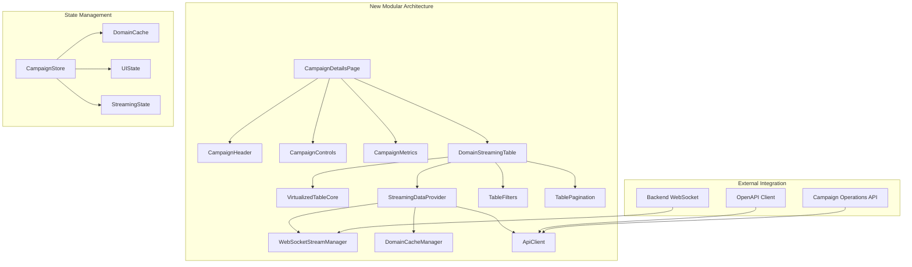
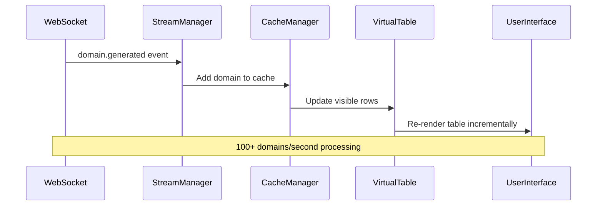

# Campaign Details Page Architectural Refactoring Plan

## Executive Summary

This document provides a comprehensive architectural blueprint for refactoring `src/app/campaigns/[id]/page.tsx` from a monolithic 1869-line component into a scalable, enterprise-grade solution capable of handling 2+ million domains with real-time WebSocket streaming. The refactoring addresses critical performance bottlenecks, eliminates redundant code patterns, and implements a stateless frontend architecture with the Golang backend as the single source of truth.

## 1. Current State Analysis

### 1.1 Component Structure Issues

**Monolithic Architecture Problems:**
- **1869 lines of code** in a single component file
- **25+ useEffect hooks** causing excessive re-renders and memory leaks
- **Mixed state management** combining local React state, polling, and WebSocket updates
- **Redundant API calls** with overlapping data fetching patterns
- **Performance bottlenecks** when handling large domain datasets

**Code Patterns to Remove:**
```typescript
// ❌ REMOVE: Excessive debugging logs scattered throughout
console.log('🔍 [RELOAD_LOOP_DEBUG] loadCampaignData called...')

// ❌ REMOVE: Complex nested useEffect dependencies
useEffect(() => {
  // Complex polling logic with multiple conditions
}, [campaign?.id, campaign?.status, campaign?.campaignType, campaignTypeFromQuery, currentPage, pageSize, toast, campaign]);

// ❌ REMOVE: Inline response parsing logic
if (Array.isArray(rawResponse)) {
  // 50+ lines of response structure detection
}
```

### 1.2 Performance Bottlenecks

**Memory Inefficiency:**
- Loading entire domain datasets into component state
- No virtualization for large tables (2M+ domains)
- Redundant data transformations on every render
- Memory leaks from uncleaned WebSocket connections

**Rendering Issues:**
- **useMemo** recalculating `campaignDomainDetails` on every state change
- Table re-rendering all rows instead of virtual scrolling
- Excessive component re-renders from polling updates

**Network Problems:**
- **Polling every 30 seconds** causing rate limiting
- **Multiple concurrent API calls** for the same data
- **WebSocket connection management** scattered across component lifecycle

### 1.3 State Management Complexity

**Current State Structure:**
```typescript
// ❌ PROBLEMATIC: Scattered state across multiple useState calls
const [campaign, setCampaign] = useState<CampaignViewModel | null>(null);
const [generatedDomains, setGeneratedDomains] = useState<GeneratedDomain[]>([]);
const [dnsCampaignItems, setDnsCampaignItems] = useState<CampaignValidationItem[]>([]);
const [httpCampaignItems, setHttpCampaignItems] = useState<CampaignValidationItem[]>([]);
const [actionLoading, setActionLoading] = useState<Record<string, boolean>>({});
const [campaignChain, setCampaignChain] = useState<CampaignViewModel[]>([]);
```

## 2. Backend Integration Analysis

### 2.1 WebSocket Streaming Capabilities

**Backend WebSocket Architecture:**
- **Campaign-specific broadcasting** via `BroadcastToCampaign(campaignID, message)`
- **Standardized message types**: `domain.generated`, `dns.validation.result`, `http.validation.result`
- **Sequence numbering** for message ordering and deduplication
- **High-frequency streaming** support (100+ domains/second)

**WebSocket Message Structure:**
```typescript
interface StandardizedWebSocketMessage {
  type: string;
  timestamp: time.Time;
  data: json.RawMessage;
}

interface DomainGenerationPayload {
  campaignId: string;
  domainId: string;
  domain: string;
  offset: int64;
  batchSize: int;
  totalGenerated: int64;
}
```

### 2.2 OpenAPI 3.0 Contract Alignment

**Campaign Operations (backend/api/campaigns/spec.go):**
- `POST /api/v2/campaigns/{campaignId}/start` - Start campaign
- `POST /api/v2/campaigns/{campaignId}/pause` - Pause campaign  
- `POST /api/v2/campaigns/{campaignId}/resume` - Resume campaign
- `POST /api/v2/campaigns/{campaignId}/cancel` - Cancel campaign

**Results Endpoints:**
- `GET /api/v2/campaigns/{campaignId}/results/generated-domains?limit={limit}&cursor={cursor}`
- `GET /api/v2/campaigns/{campaignId}/results/dns-validation?limit={limit}&cursor={cursor}`
- `GET /api/v2/campaigns/{campaignId}/results/http-keyword?limit={limit}&cursor={cursor}`

**Pagination Support:**
```typescript
interface PaginationParams {
  limit: number;    // Max items per page
  cursor: string;   // Offset or continuation token
}
```

## 3. Architectural Design

### 3.1 Component Decomposition Strategy



### 3.2 Stateless Frontend Architecture

**Core Principle:** Treat Golang backend as single source of truth

**State Management Strategy:**
```typescript
// ✅ NEW: Centralized state with Zustand
interface CampaignDetailsStore {
  // Campaign metadata (source of truth: backend)
  campaign: Campaign | null;
  campaignStatus: CampaignStatus;
  
  // Domain data (source of truth: WebSocket + API)
  domains: Map<string, Domain>; // Efficient lookup by domain ID
  totalDomainCount: number;
  
  // Real-time streaming state
  streamingStats: {
    domainsPerSecond: number;
    lastMessageTime: number;
    connectionStatus: 'connected' | 'disconnected' | 'reconnecting';
  };
  
  // UI state (frontend-only)
  filters: TableFilters;
  pagination: PaginationState;
  selectedDomains: Set<string>;
  
  // Actions
  updateFromWebSocket: (message: StreamingMessage) => void;
  updateFromAPI: (data: ApiResponse) => void;
  updateFilters: (filters: TableFilters) => void;
}
```

### 3.3 Real-Time WebSocket Integration

**WebSocket Stream Manager:**
```typescript
interface WebSocketStreamManager {
  // Connection management
  connect(campaignId: string): Promise<void>;
  disconnect(): void;
  getConnectionStatus(): ConnectionStatus;
  
  // Message handling
  subscribeToEvents(handlers: StreamEventHandlers): () => void;
  getLastSequenceNumber(): number;
  
  // Streaming configuration
  enableHighFrequencyMode(): void; // 100+ domains/second
  configureBatchSize(size: number): void;
}

interface StreamEventHandlers {
  onDomainGenerated: (payload: DomainGenerationPayload) => void;
  onDNSValidation: (payload: DNSValidationPayload) => void;
  onHTTPValidation: (payload: HTTPValidationPayload) => void;
  onCampaignProgress: (payload: CampaignProgressPayload) => void;
  onCampaignStatus: (payload: CampaignStatusPayload) => void;
  onError: (error: WebSocketError) => void;
}
```

### 3.4 Memory-Efficient Domain Caching

**Sliding Window Cache Strategy:**
```typescript
interface DomainCacheManager {
  // Efficient memory management for 2M+ domains
  setWindowSize(size: number): void; // e.g., 10,000 domains in memory
  updateDomains(domains: Domain[], operation: 'add' | 'update' | 'remove'): void;
  
  // Virtual scrolling support
  getDomainsBatch(offset: number, limit: number): Domain[];
  getFilteredDomains(filters: TableFilters): Domain[];
  
  // Cache management
  getTotalCount(): number;
  clearCache(): void;
  pruneOldEntries(): void;
}
```

## 4. Technical Specifications

### 4.1 Virtual Table Implementation

**High-Performance Rendering:**
```typescript
interface VirtualizedTableCore {
  // Viewport management
  renderWindow: { start: number; end: number };
  rowHeight: number;
  bufferSize: number; // Extra rows to render for smooth scrolling
  
  // Real-time updates
  updateVisibleRows(newData: Domain[]): void;
  scrollToIndex(index: number): void;
  
  // Performance optimization
  memoizeRowRenderer(): ReactNode;
  enableRowRecycling(): void;
}
```

**React Optimization Patterns:**
```typescript
// ✅ NEW: Memoized table row component
const DomainTableRow = React.memo(({ domain, index }: DomainRowProps) => {
  return (
    <TableRow key={domain.id}>
      <TableCell>{domain.domainName}</TableCell>
      <TableCell><StatusBadge status={domain.dnsStatus} /></TableCell>
      <TableCell><StatusBadge status={domain.httpStatus} /></TableCell>
    </TableRow>
  );
});

// ✅ NEW: Selective store subscriptions
const useCampaignData = () => useCampaignStore(
  useCallback((state) => ({
    campaign: state.campaign,
    totalDomains: state.totalDomainCount,
    streamingStats: state.streamingStats
  }), [])
);
```

### 4.2 Error Handling and Recovery

**WebSocket Resilience:**
```typescript
interface WebSocketErrorRecovery {
  // Connection recovery
  retryConnection(maxAttempts: number): Promise<void>;
  exponentialBackoff(attempt: number): number;
  
  // Message recovery
  requestMissedMessages(lastSequenceNumber: number): Promise<void>;
  queueFailedMessages(): void;
  
  // Fallback mechanisms
  fallbackToPolling(): void;
  resumeStreamingWhenAvailable(): void;
}
```

**API Error Handling:**
```typescript
interface ApiErrorStrategy {
  // Request retry logic
  retryFailedRequests(request: ApiRequest): Promise<ApiResponse>;
  handleRateLimiting(retryAfter: number): Promise<void>;
  
  // Data consistency
  validateResponseData(data: unknown): boolean;
  reconcileWithCache(apiData: Domain[], cacheData: Domain[]): Domain[];
  
  // User feedback
  showRecoverableErrors(error: ApiError): void;
  showCriticalErrors(error: CriticalError): void;
}
```

### 4.3 OpenAPI Type Safety

**Generated Type Definitions:**
```typescript
// ✅ AUTO-GENERATED from OpenAPI spec
interface CampaignOperationsApi {
  startCampaign(campaignId: string): Promise<StartCampaignResponse>;
  pauseCampaign(campaignId: string): Promise<PauseCampaignResponse>;
  resumeCampaign(campaignId: string): Promise<ResumeCampaignResponse>;
  cancelCampaign(campaignId: string): Promise<CancelCampaignResponse>;
}

interface CampaignResultsApi {
  getGeneratedDomains(
    campaignId: string, 
    params: PaginationParams
  ): Promise<GeneratedDomainsResponse>;
  
  getDNSValidationResults(
    campaignId: string,
    params: PaginationParams
  ): Promise<DNSValidationResponse>;
  
  getHTTPValidationResults(
    campaignId: string,
    params: PaginationParams
  ): Promise<HTTPValidationResponse>;
}
```

## 5. Implementation Strategy

### 5.1 Phase 1: Component Decomposition

**Immediate Actions:**
1. **Extract CampaignHeader component** - Campaign title, status, and basic info
2. **Extract CampaignControls component** - Start/pause/resume/cancel buttons
3. **Extract CampaignMetrics component** - Progress bars and statistics
4. **Create DomainStreamingTable component** - Replace monolithic table logic

**State Migration:**
```typescript
// ❌ REMOVE: Scattered useState calls
// ✅ ADD: Centralized Zustand store
const useCampaignStore = create<CampaignDetailsStore>((set, get) => ({
  // Store implementation
}));
```

### 5.2 Phase 2: WebSocket Streaming Implementation

**Real-Time Data Flow:**


**Implementation Steps:**
1. **Replace polling with WebSocket streaming** for domain generation events
2. **Implement message deduplication** using sequence numbers
3. **Add connection recovery logic** with exponential backoff
4. **Create streaming statistics monitoring** for performance tracking

### 5.3 Phase 3: Performance Optimization

**Virtual Scrolling Integration:**
```typescript
// ✅ NEW: Virtual table implementation
const VirtualDomainTable = () => {
  const { domains, totalCount } = useCampaignStore();
  const [scrollTop, setScrollTop] = useState(0);
  
  const visibleRange = useMemo(() => {
    const startIndex = Math.floor(scrollTop / ROW_HEIGHT);
    const endIndex = Math.min(startIndex + VISIBLE_ROWS, totalCount);
    return { startIndex, endIndex };
  }, [scrollTop, totalCount]);
  
  const visibleDomains = domains.slice(
    visibleRange.startIndex, 
    visibleRange.endIndex
  );
  
  return (
    <VirtualScrollContainer
      totalHeight={totalCount * ROW_HEIGHT}
      onScroll={setScrollTop}
    >
      {visibleDomains.map((domain, index) => (
        <DomainTableRow 
          key={domain.id}
          domain={domain}
          index={visibleRange.startIndex + index}
        />
      ))}
    </VirtualScrollContainer>
  );
};
```

**Memory Management:**
1. **Implement sliding window cache** for large domain datasets
2. **Add automatic cache pruning** to prevent memory leaks
3. **Enable row recycling** in virtual table for smooth scrolling
4. **Optimize React rendering** with memoization and selective updates

### 5.4 Phase 4: API Integration Enhancement

**OpenAPI Contract Alignment:**
1. **Generate TypeScript clients** from OpenAPI specifications
2. **Implement request/response validation** for data consistency
3. **Add optimistic updates** for immediate UI feedback
4. **Create error boundary components** for graceful failure handling

**Pagination Strategy:**
```typescript
// ✅ NEW: Server-side pagination
const usePaginatedDomains = (campaignId: string) => {
  const [currentPage, setCurrentPage] = useState(1);
  const [pageSize, setPageSize] = useState(50);
  
  const { data, isLoading, error } = useQuery({
    queryKey: ['domains', campaignId, currentPage, pageSize],
    queryFn: () => api.getGeneratedDomains(campaignId, {
      limit: pageSize,
      cursor: String((currentPage - 1) * pageSize)
    }),
    keepPreviousData: true
  });
  
  return {
    domains: data?.domains || [],
    totalCount: data?.totalCount || 0,
    currentPage,
    setCurrentPage,
    pageSize,
    setPageSize,
    isLoading,
    error
  };
};
```

## 6. Code Patterns and Standards

### 6.1 Patterns to Adopt

**Composition over Inheritance:**
```typescript
// ✅ ADOPT: Composable domain table
interface DomainTableProps {
  domains: Domain[];
  onDomainSelect: (domain: Domain) => void;
  filters?: TableFilters;
  sorting?: TableSorting;
}

const DomainTable = ({ domains, onDomainSelect, filters, sorting }: DomainTableProps) => {
  return (
    <VirtualizedTable>
      <TableFilters filters={filters} />
      <TableHeader sorting={sorting} />
      <TableBody domains={domains} onSelect={onDomainSelect} />
    </VirtualizedTable>
  );
};
```

**Custom Hooks for Logic Separation:**
```typescript
// ✅ ADOPT: Domain-specific hooks
const useCampaignWebSocket = (campaignId: string) => {
  const updateStore = useCampaignStore(state => state.updateFromWebSocket);
  
  useEffect(() => {
    const cleanup = websocketService.connect(campaignId, {
      onDomainGenerated: updateStore,
      onCampaignProgress: updateStore,
      onError: (error) => console.error('WebSocket error:', error)
    });
    
    return cleanup;
  }, [campaignId, updateStore]);
};

const useCampaignOperations = (campaignId: string) => {
  const { mutate: startCampaign, isLoading: isStarting } = useMutation({
    mutationFn: () => api.startCampaign(campaignId),
    onSuccess: () => toast.success('Campaign started'),
    onError: (error) => toast.error(`Failed to start: ${error.message}`)
  });
  
  return { startCampaign, isStarting };
};
```

### 6.2 Patterns to Avoid

**Anti-Patterns to Remove:**
```typescript
// ❌ AVOID: Massive useEffect with complex dependencies
useEffect(() => {
  // 100+ lines of complex logic
}, [campaign?.id, campaign?.status, /* 10+ other dependencies */]);

// ❌ AVOID: Inline API response parsing
if (Array.isArray(rawResponse)) {
  // 50+ lines of response structure detection
}

// ❌ AVOID: Scattered state updates
setCampaign(/* ... */);
setGeneratedDomains(/* ... */);
setDnsCampaignItems(/* ... */);
setHttpCampaignItems(/* ... */);
```

## 7. Testing Strategy

### 7.1 Component Testing

**Unit Tests:**
```typescript
describe('DomainStreamingTable', () => {
  it('should handle high-frequency domain updates', async () => {
    const { rerender } = render(<DomainStreamingTable campaignId="test" />);
    
    // Simulate 100 domain updates per second
    for (let i = 0; i < 100; i++) {
      act(() => {
        mockWebSocket.emit('domain.generated', {
          domain: `test${i}.com`,
          campaignId: 'test'
        });
      });
    }
    
    expect(screen.getByText('100 domains')).toBeInTheDocument();
  });
  
  it('should maintain virtual scrolling performance', () => {
    const domains = Array.from({ length: 10000 }, (_, i) => ({
      id: `domain-${i}`,
      domainName: `test${i}.com`
    }));
    
    const { container } = render(
      <VirtualDomainTable domains={domains} />
    );
    
    // Should only render visible rows, not all 10,000
    expect(container.querySelectorAll('[data-testid="domain-row"]')).toHaveLength(50);
  });
});
```

### 7.2 Integration Testing

**WebSocket Integration:**
```typescript
describe('WebSocket Streaming', () => {
  it('should handle connection recovery', async () => {
    const websocketManager = new WebSocketStreamManager();
    
    // Simulate connection loss
    mockWebSocket.disconnect();
    
    // Should automatically reconnect
    await waitFor(() => {
      expect(websocketManager.getConnectionStatus()).toBe('connected');
    });
  });
  
  it('should process domain events in correct order', async () => {
    const domains: Domain[] = [];
    const handler = (payload: DomainGenerationPayload) => {
      domains.push({ id: payload.domainId, domainName: payload.domain });
    };
    
    websocketManager.subscribeToEvents({ onDomainGenerated: handler });
    
    // Send domains out of order
    mockWebSocket.emit('domain.generated', { domain: 'test2.com', sequenceNumber: 2 });
    mockWebSocket.emit('domain.generated', { domain: 'test1.com', sequenceNumber: 1 });
    
    await waitFor(() => {
      expect(domains).toEqual([
        { domainName: 'test1.com' },
        { domainName: 'test2.com' }
      ]);
    });
  });
});
```

### 7.3 Performance Testing

**Load Testing:**
```typescript
describe('Performance', () => {
  it('should handle 2M domain dataset efficiently', () => {
    const start = performance.now();
    
    const largeDomainSet = Array.from({ length: 2_000_000 }, (_, i) => ({
      id: `domain-${i}`,
      domainName: `test${i}.com`
    }));
    
    render(<VirtualDomainTable domains={largeDomainSet} />);
    
    const renderTime = performance.now() - start;
    expect(renderTime).toBeLessThan(1000); // Should render in under 1 second
  });
  
  it('should maintain 60fps during streaming', async () => {
    const frameRates: number[] = [];
    let lastFrameTime = performance.now();
    
    const measureFrameRate = () => {
      const currentTime = performance.now();
      const fps = 1000 / (currentTime - lastFrameTime);
      frameRates.push(fps);
      lastFrameTime = currentTime;
    };
    
    // Stream 100 domains and measure frame rate
    for (let i = 0; i < 100; i++) {
      act(() => {
        mockWebSocket.emit('domain.generated', { domain: `test${i}.com` });
        measureFrameRate();
      });
    }
    
    const averageFps = frameRates.reduce((a, b) => a + b) / frameRates.length;
    expect(averageFps).toBeGreaterThan(60);
  });
});
```

## 8. Migration Strategy

### 8.1 Incremental Migration Plan

**Phase 1: Extract Components (Week 1)**
1. Create new component files for extracted components
2. Move UI rendering logic out of main component
3. Maintain existing state management temporarily

**Phase 2: Implement State Management (Week 2)**
1. Create Zustand store for campaign data
2. Migrate useState calls to centralized store
3. Add WebSocket integration to store

**Phase 3: Add Virtual Scrolling (Week 3)**
1. Implement virtual table component
2. Replace existing table with virtual implementation
3. Add performance monitoring

**Phase 4: Optimize WebSocket (Week 4)**
1. Replace polling with real-time streaming
2. Add connection recovery mechanisms
3. Implement message deduplication

**Phase 5: Final Optimization (Week 5)**
1. Remove legacy code and debugging statements
2. Add comprehensive error handling
3. Optimize bundle size and performance

### 8.2 Backward Compatibility

**Feature Flags:**
```typescript
interface FeatureFlags {
  enableWebSocketStreaming: boolean;
  enableVirtualScrolling: boolean;
  enableOptimizedRendering: boolean;
  enableMemoryOptimization: boolean;
}

const useFeatureFlags = () => {
  return {
    enableWebSocketStreaming: process.env.NEXT_PUBLIC_ENABLE_WS_STREAMING === 'true',
    enableVirtualScrolling: process.env.NEXT_PUBLIC_ENABLE_VIRTUAL_SCROLL === 'true',
    enableOptimizedRendering: process.env.NEXT_PUBLIC_ENABLE_OPTIMIZED_RENDER === 'true',
    enableMemoryOptimization: process.env.NEXT_PUBLIC_ENABLE_MEMORY_OPT === 'true'
  };
};
```

## 9. Success Criteria

### 9.1 Performance Metrics

**Quantitative Goals:**
- **Page load time**: < 2 seconds for campaign details
- **Table rendering**: < 500ms for 10,000 domains
- **Memory usage**: < 500MB for 2M domain dataset
- **WebSocket latency**: < 100ms for domain updates
- **Streaming throughput**: 100+ domains/second without UI blocking

**Qualitative Goals:**
- **Code maintainability**: Reduced component complexity from 1869 to <200 lines per component
- **Developer experience**: Clear component boundaries and reusable patterns
- **User experience**: Smooth real-time updates without performance degradation
- **Error resilience**: Graceful handling of network issues and edge cases

### 9.2 Technical Debt Reduction

**Code Quality Improvements:**
- Remove 25+ useEffect hooks and replace with focused custom hooks
- Eliminate scattered console.log statements and implement structured logging
- Replace complex inline logic with composable utility functions
- Achieve 90%+ test coverage for critical user flows

**Architecture Benefits:**
- **Scalability**: Support for enterprise-scale domain processing
- **Maintainability**: Modular components with clear responsibilities
- **Performance**: Optimized rendering and memory management
- **Reliability**: Robust error handling and recovery mechanisms

## 10. Conclusion

This architectural refactoring plan transforms the campaign details page from a monolithic, performance-constrained component into a modern, scalable solution capable of handling enterprise requirements. The new architecture prioritizes real-time user experience, efficient resource utilization, and maintainable code patterns.

The implementation strategy provides a clear path forward with incremental migration phases, comprehensive testing coverage, and measurable success criteria. The resulting system will deliver significant improvements in performance, maintainability, and user experience while establishing patterns for future enterprise-scale feature development.

**Key Deliverables:**
1. **Modular component architecture** with clear separation of concerns
2. **Real-time WebSocket streaming** for instant domain updates  
3. **Virtual table rendering** for handling 2M+ domain datasets
4. **Centralized state management** with the backend as single source of truth
5. **Comprehensive error handling** and recovery mechanisms
6. **Performance monitoring** and optimization strategies

This blueprint serves as the foundation for implementation teams to execute the refactoring with confidence in the architectural decisions and technical approach.