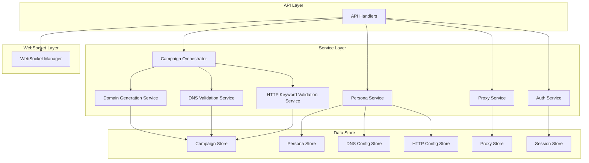

# DomainFlow Backend Improvement Plan

This document outlines a comprehensive plan for improving the quality, maintainability, performance, and security of the DomainFlow backend.

## 1. API Clarification

My analysis of the codebase has revealed that the application is using `gin-swagger` to serve a Swagger 2.0 specification. The `API_SPEC.md` file, on the other hand, describes an OpenAPI 3.0 specification. This is a major discrepancy that needs to be addressed.

The `gin-swagger` library is an old implementation that should be removed. The application should be updated to use a modern OpenAPI 3.0 library, and the `API_SPEC.md` file should be used as the single source of truth for the API specification.

## 2. Roadmap

This roadmap outlines a series of steps to improve the quality, maintainability, performance, and security of the DomainFlow backend.

### 2.1. API Contract & Implementation Alignment

*   **Issue:** The API documentation in `API_SPEC.md` is not complete and does not accurately reflect the full scope of the API.
*   **Fix:**
    *   **Action:** Manually update the `API_SPEC.md` file to include all missing endpoints, including the `GET /auth/status` endpoint.
    *   **Action:** Implement a more robust process for keeping the API documentation in sync with the codebase, such as using a tool that can generate the documentation from the code.
*   **Benefit:** A complete and accurate API specification will improve the developer experience, reduce integration issues, and provide a clear source of truth for the API contract.

### 2.2. Data Model Refactoring

*   **Issue:** The use of JSON blobs for storing persona configuration is not type-safe and makes querying difficult. The `Address` field in the `Proxy` model is a single string that is difficult to parse. There may also be unused or redundant models among the 80 data models in the codebase.
*   **Fix:**
    *   **Action:** Create dedicated tables for `DNS` and `HTTP` persona configurations, and migrate the existing data from the JSON blobs to the new tables.
    *   **Action:** Refactor the `Proxy` model to use separate fields for the protocol, host, port, username, and password.
    *   **Action:** Conduct a thorough analysis of all 80 data models to identify any that are unused or redundant.
    *   **Action:** Remove any unused or redundant models to simplify the codebase and reduce maintenance overhead.
*   **Benefit:** This will improve the type safety and queryability of the data, and it will simplify the codebase by removing unnecessary models.

### 2.3. Code Refactoring & Consolidation

*   **Issue:** There is redundant code in the campaign and persona handlers.
*   **Fix:**
    *   **Action:** Refactor the `CreateCampaign` methods in the `DNSCampaignService` and `HTTPKeywordCampaignService` to reduce code duplication.
    *   **Action:** Consolidate the persona handlers into a single set of handlers that use a `personaType` parameter to distinguish between the different types of personas.
*   **Benefit:** This will reduce code duplication, improve maintainability, and make the codebase easier to understand.

### 2.4. Naming & Consistency

*   **Issue:** There are inconsistencies in the naming of campaign and persona types across the codebase.
*   **Fix:**
    *   **Action:** Standardize the naming of campaign and persona types to ensure consistency across the entire application.
*   **Benefit:** This will improve the readability and maintainability of the code.

### 2.5. Security Hardening

*   **Issue:** The `proxyToProxyConfigEntry` function does not pass the proxy password to the `TestProxy` function, which could be a security vulnerability. The CSRF protection is not complete. The WebSocket implementation does not have any authentication or authorization.
*   **Fix:**
    *   **Action:** Update the `proxyToProxyConfigEntry` function to securely pass the proxy password to the `TestProxy` function.
    *   **Action:** Implement a CSRF token to protect against all types of CSRF attacks.
    *   **Action:** Add authentication and authorization to the WebSocket implementation.
    *   **Action:** Conduct a thorough security audit of the entire codebase to identify and address any other potential vulnerabilities.
*   **Benefit:** This will improve the security of the application and protect sensitive data.

### 2.6. Error Handling & Logging

*   **Issue:** The logging is not always consistent, and there is no centralized logging layer or use of log levels. The `BroadcastToCampaign` function does not handle errors from `json.Marshal`.
*   **Fix:**
    *   **Action:** Implement a centralized logging layer that supports structured logging and log levels.
    *   **Action:** Update the `BroadcastToCampaign` function to handle errors from `json.Marshal`.
*   **Benefit:** This will improve the visibility of the application's behavior and make it easier to debug issues.

### 2.7. Configuration Management

*   **Issue:** The configuration is complex and there is no validation at load time. The application must be restarted to pick up any changes to the configuration.
*   **Fix:**
    *   **Action:** Implement validation of the configuration at load time.
    *   **Action:** Implement hot reloading of the configuration to allow changes to be applied without restarting the application.
*   **Benefit:** This will improve the reliability and manageability of the application.

### 2.8. Business Logic & Workflow Discovery

*   **Issue:** The `get_business_rules` and `get_workflows` tools were not able to extract all of the business logic from the codebase.
*   **Fix:**
    *   **Action:** Manually document the business rules and workflows to ensure that they are clearly defined and understood.
    *   **Action:** Consider refactoring the code to make the business logic more explicit and easier to extract with automated tools.
*   **Benefit:** This will improve the visibility of the business logic and make it easier to maintain and evolve the application.

### 2.9. Tooling Improvements

*   **Issue:** The available tools have some limitations that make it difficult to perform a comprehensive analysis of the codebase.
*   **Fix:**
    *   **Action:** Improve the `get_api_schema` tool to accurately parse the route definitions in the `main.go` file.
    *   **Action:** Improve the `contract_drift_check` tool to identify missing endpoints in the OpenAPI specification.
    *   **Action:** Improve the `get_business_rules` and `get_workflows` tools to better extract business logic from the codebase.
*   **Benefit:** This will improve the effectiveness of the analysis and make it easier to identify and address issues in the future.

### 2.10. Mermaid Diagram of Proposed Architecture

## 3. Tactical Plan

This tactical plan breaks down the roadmap into a series of phases, each with a clear set of goals and deliverables.

### Phase 1: Foundation & Alignment

*   **Goal:** To establish a solid foundation for the project by aligning the API documentation with the implementation and improving the tooling.
*   **Tasks:**
    1.  Remove the `gin-swagger` library from the project.
    2.  Implement a new OpenAPI 3.0 library that can serve the `API_SPEC.md` file.
    3.  Update the `API_SPEC.md` file to include all missing endpoints, including the `GET /auth/status` endpoint.
    4.  Improve the `get_api_schema`, `contract_drift_check`, `get_business_rules`, and `get_workflows` tools.
*   **Timeline:** 1 week

### Phase 2: Data Model & Code Refactoring

*   **Goal:** To improve the quality and maintainability of the codebase by refactoring the data models and consolidating redundant code.
*   **Tasks:**
    1.  Create dedicated tables for `DNS` and `HTTP` persona configurations.
    2.  Migrate the existing data from the JSON blobs to the new tables.
    3.  Refactor the `Proxy` model to use separate fields for the protocol, host, port, username, and password.
    4.  Conduct a thorough analysis of all 80 data models to identify any that are unused or redundant.
    5.  Remove any unused or redundant models.
    6.  Refactor the `CreateCampaign` methods in the `DNSCampaignService` and `HTTPKeywordCampaignService` to reduce code duplication.
    7.  Consolidate the persona handlers into a single set of handlers that use a `personaType` parameter to distinguish between the different types of personas.
    8.  Standardize the naming of campaign and persona types.
*   **Timeline:** 2 weeks

### Phase 3: Security Hardening

*   **Goal:** To improve the security of the application by addressing known vulnerabilities and conducting a thorough security audit.
*   **Tasks:**
    1.  Update the `proxyToProxyConfigEntry` function to securely pass the proxy password to the `TestProxy` function.
    2.  Implement a CSRF token to protect against all types of CSRF attacks.
    3.  Add authentication and authorization to the WebSocket implementation.
    4.  Conduct a thorough security audit of the entire codebase.
*   **Timeline:** 2 weeks

### Phase 4: Error Handling, Logging & Configuration Management

*   **Goal:** To improve the reliability and manageability of the application by improving the error handling, logging, and configuration management.
*   **Tasks:**
    1.  Implement a centralized logging layer that supports structured logging and log levels.
    2.  Update the `BroadcastToCampaign` function to handle errors from `json.Marshal`.
    3.  Implement validation of the configuration at load time.
    4.  Implement hot reloading of the configuration.
*   **Timeline:** 2 weeks

### Phase 5: Business Logic & Workflow Discovery

*   **Goal:** To improve the visibility of the business logic and make it easier to maintain and evolve the application.
*   **Tasks:**
    1.  Manually document the business rules and workflows.
    2.  Refactor the code to make the business logic more explicit and easier to extract with automated tools.
*   **Timeline:** 1 week