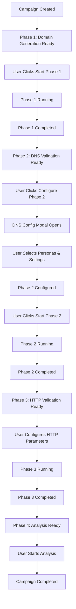

# User-Driven Phase Lifecycle Implementation Plan

## Architecture Overview

### New Phase State Model
```
Phase States: ready → configured → running → completed → failed
```

### User Experience Flow


## Implementation Plan

### Priority 1: Fix Critical Issues (Immediate)
1. **Fix Domain Config Storage**: Store `req.DomainConfig` in campaign metadata during `CreateCampaign`
2. **Fix InitializePhase1**: Retrieve domain config from metadata instead of legacy table
3. **Remove Legacy Dependencies**: Stop looking up `domain_generation_campaign_params`

### Priority 2: Core Phase State Management
4. **Add Phase State Enum**: `ready`, `configured`, `running`, `completed`, `failed`
5. **Phase Readiness Validation**: Prevent starting unconfigured phases
6. **Phase Transition Guards**: Prevent skipping incomplete phases

### Priority 3: API Design
7. **Configuration Endpoint**: `POST /campaigns/{id}/phases/{phase}/configure`
8. **Start Phase Endpoint**: `POST /campaigns/{id}/phases/{phase}/start`
9. **Phase Status Endpoint**: `GET /campaigns/{id}/phases/{phase}/status`

### Priority 4: Backend Phase Implementation
10. **DNS Phase Configuration**: Store DNS validation params in metadata
11. **HTTP Phase Configuration**: Store HTTP validation params in metadata  
12. **Analysis Phase Configuration**: Store analysis params in metadata
13. **Update Phase Starters**: Use metadata configs instead of stubs

### Priority 5: Frontend User Experience
14. **Phase Configuration Modals**: DNS, HTTP, Analysis parameter collection
15. **Phase Status Dashboard**: Show current phase state and available actions
16. **Progress Tracking**: Real-time phase progress and status updates

## Data Models

### Campaign Metadata Structure
```json
{
  "domain_generation_config": {
    "pattern_type": "suffix_variable",
    "variable_length": 4,
    "character_set": "abcdefghijklmnopqrstuvwxyz",
    "constant_string": "test",
    "tld": "com",
    "num_domains_to_generate": 1000
  },
  "dns_validation_config": {
    "persona_ids": ["uuid1", "uuid2"],
    "rotation_interval_seconds": 300,
    "processing_speed_per_minute": 100,
    "batch_size": 50,
    "retry_attempts": 3
  },
  "http_validation_config": {
    "persona_ids": ["uuid3", "uuid4"],
    "keyword_set_ids": ["set1", "set2"],
    "ad_hoc_keywords": ["keyword1", "keyword2"],
    "proxy_ids": ["proxy1", "proxy2"],
    "target_http_ports": [80, 443, 8080],
    "processing_speed_per_minute": 50
  },
  "analysis_config": {
    "analysis_type": "comprehensive",
    "include_screenshots": true,
    "generate_report": true
  }
}
```

### API Request Models
```go
type PhaseConfigureRequest struct {
    PhaseType string      `json:"phase_type"`
    Config    interface{} `json:"config"`
}

type DNSValidationConfig struct {
    PersonaIDs                []string `json:"persona_ids"`
    RotationIntervalSeconds   int      `json:"rotation_interval_seconds"`
    ProcessingSpeedPerMinute  int      `json:"processing_speed_per_minute"`
    BatchSize                 int      `json:"batch_size"`
    RetryAttempts            int      `json:"retry_attempts"`
}

type HTTPValidationConfig struct {
    PersonaIDs               []string `json:"persona_ids"`
    KeywordSetIDs           []string `json:"keyword_set_ids"`
    AdHocKeywords           []string `json:"ad_hoc_keywords"`
    ProxyIDs                []string `json:"proxy_ids"`
    TargetHTTPPorts         []int    `json:"target_http_ports"`
    ProcessingSpeedPerMinute int      `json:"processing_speed_per_minute"`
}
```

## Smart Defaults Strategy

### Phase 2: DNS Validation
- **Default Personas**: Use user's active DNS personas
- **Default Settings**: Rotation 300s, Speed 100/min, Batch 50, Retry 3
- **User Override**: Allow full customization via configuration modal

### Phase 3: HTTP Validation  
- **Default Personas**: Use user's active HTTP personas
- **Default Keywords**: Use campaign's detected keywords or empty
- **Default Proxies**: Use user's default proxy pool
- **User Override**: Allow full customization via configuration modal

### Phase 4: Analysis
- **Default Type**: Comprehensive analysis with screenshots
- **Default Report**: Auto-generate final report
- **User Override**: Allow analysis type selection

## WebSocket Events

### Phase State Changes
```json
{
  "type": "phase.state.changed",
  "data": {
    "campaign_id": "uuid",
    "phase": "dns_validation",
    "old_state": "ready",
    "new_state": "configured",
    "timestamp": "2024-01-01T00:00:00Z"
  }
}
```

### Phase Configuration Required
```json
{
  "type": "phase.configuration.required",
  "data": {
    "campaign_id": "uuid", 
    "phase": "dns_validation",
    "message": "Phase 2 is ready. Please configure DNS validation parameters to proceed."
  }
}
```

## Frontend Component Structure

### Phase Dashboard Component
- Phase progress stepper UI
- Current phase status indicator
- Available actions (Configure, Start, View Results)
- Phase-specific configuration modals
- Real-time progress updates

### Configuration Modals
- DNS Validation: Persona selection, timing parameters
- HTTP Validation: Persona, keyword, proxy selection
- Analysis: Analysis type and report options

This plan provides clear user control while maintaining system efficiency through smart defaults and guided workflows.